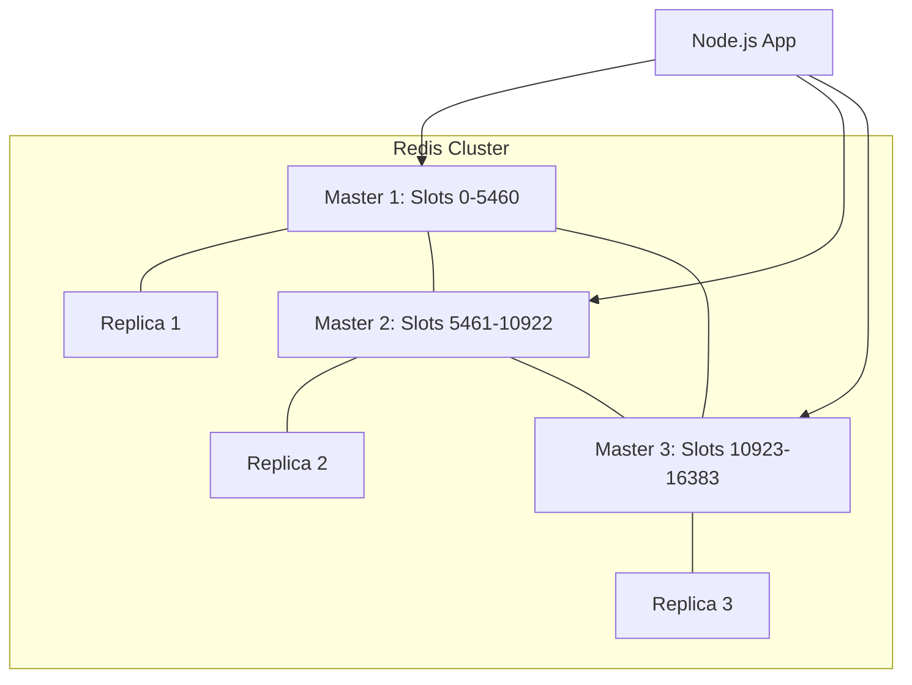

# 🕸️ Redis Cluster and High Availability: Scale Without Limits
> **Objective:** Design resilient and distributed caching systems for massive traffic | **Language:** Hinglish | **Standard:** 2026 Expert Framework

---

## 🧭 1. Beginner-Friendly Hinglish Explanation
Redis Cluster ka matlab hai "Bahut saare Redis servers ko milkar ek giant memory banana".

- **The Problem:** Ek akela Redis server sirf utna hi data store kar sakta hai jitni uski RAM hai. Aur agar wo server crash ho gaya, toh aapka poora cache khatam.
- **The Solution:**
  1. **Replication (High Availability):** Ek "Master" server hota hai aur uske "Slaves" (Replicas). Agar Master down hua, toh ek Replica automatic Master ban jata hai (Sentinel).
  2. **Sharding (Scaling):** Data ko alag-alag servers mein baant diya jata hai (e.g., Users A-L on Server 1, M-Z on Server 2). 
- **The Result:** Aap TBs (Terabytes) of data cache kar sakte hain aur aapka system kabhi "Down" nahi hota.

---

## 🧠 2. Deep Technical Explanation
### 1. Redis Sentinel (Legacy HA):
A monitoring system that manages failover. It doesn't scale data, just ensures one server is always available.

### 2. Redis Cluster (Modern Scaling):
- **Slots:** Redis Cluster uses 16,384 hash slots. Every key is hashed and mapped to a slot, and every slot is assigned to a node.
- **No Proxy:** The client talks directly to the nodes. If it hits the wrong node, the node tells the client: "Go to Node B for this key" (MOVED redirection).
- **Gossip Protocol:** Nodes talk to each other to detect failures.

### 3. Eviction Policies:
When RAM is full, what should Redis delete?
- **LRU (Least Recently Used):** Delete items not used for the longest time. (Standard).
- **LFU (Least Frequently Used):** Delete items used the least number of times.

---

## 🏗️ 3. Architecture Diagrams (Redis Cluster Topology)


---

## 💻 4. Production-Ready Examples (Connecting to a Cluster)
```typescript
// 2026 Standard: Connecting to Redis Cluster in Node.js

import { createCluster } from 'redis';

const cluster = createCluster({
  rootNodes: [
    { url: 'redis://node-1:6379' },
    { url: 'redis://node-2:6379' },
    { url: 'redis://node-3:6379' },
  ],
  defaults: {
    password: process.env.REDIS_PASSWORD
  }
});

cluster.on('error', (err) => console.log('Redis Cluster Error', err));

await cluster.connect();

// Using the cluster (automatically handles slot redirection)
await cluster.set('user:session:123', 'active');
const val = await cluster.get('user:session:123');

// 💡 Pro Tip: Use 'Pipeline' to send multiple commands to 
// the same node in one go for 10x speed.
```

---

## 🌍 5. Real-World Use Cases
- **Gaming Leaderboards:** Millions of updates per second across a global cluster.
- **E-commerce Cart:** Keeping user carts alive even if one data center goes down.
- **AdTech:** Sub-millisecond budget checks for billions of ad auctions.

---

## ❌ 6. Failure Cases
- **Split Brain:** Two nodes both thinking they are the "Master" because they lost network connection to each other. **Fix: Use Quorum (Odd number of nodes).**
- **Data Loss during Failover:** Since Redis replication is asynchronous, a few milliseconds of data might be lost when a master dies.
- **Large Keys:** A single 500MB key being stored in one node can cause that node to lag while others are idle. **Fix: Break large objects into smaller keys.**

---

## 🛠️ 7. Debugging Section
| Command | Purpose | Tip |
| :--- | :--- | :--- |
| **`CLUSTER NODES`** | Health Check | See the status of all nodes and their slots. |
| **`CLUSTER INFO`** | General Stats | Check if the cluster is 'ok' or 'fail'. |
| **`redis-cli --cluster check`** | Verification | Run from terminal to find inconsistent slots. |

---

## ⚖️ 8. Tradeoffs
- **Complexity vs Reliability:** A cluster is much harder to set up and monitor than a single instance.
- **Network Overhead:** Redirections (MOVED) add a tiny bit of latency.

---

## 🛡️ 9. Security Concerns
- **AUTH:** Always enable passwords.
- **mTLS:** Encrypt traffic between nodes if they are on an open network.
- **Port 16379:** Redis uses this for cluster communication (Bus). Ensure it's blocked from the public internet.

---

## 📈 10. Scaling Challenges
- **Resharding:** Adding a 4th node to the cluster. Redis has to move thousands of slots from old nodes to the new one while the app is running.

---

## 💸 11. Cost Considerations
- **Memory Cost:** You need $2x$ the memory for replicas. If you have 100GB of data, you need 200GB of RAM across the cluster.

---

## ✅ 12. Best Practices
- **Use at least 3 Masters** for a minimal cluster.
- **Use Replicas** for high availability.
- **Avoid 'Keys *' command** as it blocks the cluster.
- **Monitor memory fragmentation.**

---

## ⚠️ 13. Common Mistakes
- **Running a Cluster with only 2 nodes.** (If one dies, you can't reach a majority).
- **Putting Replicas on the same physical machine** as the Masters.

---

## 📝 14. Interview Questions
1. "What is Redis Sharding and how does it work?"
2. "How does Redis Cluster handle a Master node failure?"
3. "What are 'Slots' in Redis Cluster?"

---

## 🚀 15. Latest 2026 Production Patterns
- **Redis on Flash:** Storing 'Warm' data on NVMe SSDs and 'Hot' data in RAM to save $80\%$ cost.
- **Active-Active Replication:** Syncing data across multiple regions (Asia <-> US) with conflict resolution.
- **Serverless Redis (Upstash):** A cluster that you don't manage, it scales automatically for you.
漫
