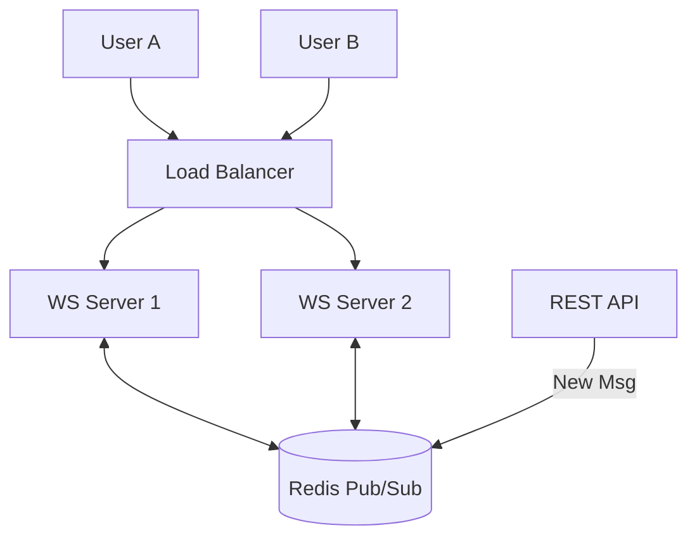

# 🏗️ Real-time Architecture: Building the Live Web
> **Objective:** Design robust, event-driven systems for instant data delivery | **Language:** Hinglish | **Standard:** 2026 Expert Framework

---

## 🧭 1. Beginner-Friendly Hinglish Explanation
Real-time Architecture ka matlab hai "Data ko bina kisi deri (delay) ke deliver karna".

- **The Problem:** Purana tarika ye tha ki "Pucho aur Paao" (Request/Response). Isme user ko baar-baar refresh karna padta tha.
- **The Solution:** Naya tarika hai "Suno aur Push Karo" (Event-Driven). Backend ko pata hota hai ki kaunsa user kis cheez mein interested hai.
- **Intuition:** Ye ek "Radio Station" ki tarah hai. Aap ek frequency (Channel/Room) par tune-in karte hain, aur jab bhi koi gaana (Event) bajta hai, aapko sunayi deta hai. Aapko baar-baar RJ ko phone karke nahi puchna padta ki "Kaunsa gana baj raha hai?".

---

## 🧠 2. Deep Technical Explanation
### 1. Architectural Components:
- **Client:** Connects via WebSocket/SSE.
- **WebSocket Server:** Manages open connections.
- **Event Bus (Redis/Kafka):** Coordinates events between different server instances.
- **Database:** Stores the history of events.

### 2. Push Models:
- **Unicast:** Send to one specific user (e.g., DM).
- **Multicast:** Send to a group of users (e.g., Chat Group/Room).
- **Broadcast:** Send to every connected user (e.g., System Maintenance Alert).

### 3. State Management:
Maintaining the "Presence" (Who is online?) and "Subscription" (Who is in which room?) state is the biggest challenge in real-time systems.

---

## 🏗️ 3. Architecture Diagrams (The Real-time Stack)


---

## 💻 4. Production-Ready Examples (The Redis Sync Pattern)
```typescript
// 2026 Standard: Syncing events across microservices

import { createClient } from 'redis';

const pubClient = createClient({ url: 'redis://localhost:6379' });
const subClient = pubClient.duplicate();

async function initRealtime() {
  await pubClient.connect();
  await subClient.connect();

  // 1. Listen for events from ANY service
  subClient.subscribe('ORDER_UPDATED', (message) => {
    const order = JSON.parse(message);
    // Push to the specific user via Socket.io
    io.to(`user:${order.userId}`).emit('order-status', order.status);
  });
}

// 2. Triggering an event from another part of the app
const onOrderShip = async (orderId: string, userId: string) => {
  await pubClient.publish('ORDER_UPDATED', JSON.stringify({ orderId, userId, status: 'SHIPPED' }));
};
```

---

## 🌍 5. Real-World Use Cases
- **Collaborative Editing:** Figma/Google Docs where multiple cursors move in real-time.
- **Gaming:** Syncing game state (HP, Mana, Positions) across 100 players.
- **Financial Dashboards:** Real-time stock tickers and candle charts.
- **Ride Hailing:** Showing the driver's car moving on the map in real-time.

---

## ❌ 6. Failure Cases
- **The "Dead Connection" Problem:** A user's phone dies, but the server keeps the connection "Open" for 10 minutes, wasting RAM.
- **Message Out-of-Order:** User receives Message #3 before Message #2 because of network routing. **Fix: Use Sequence IDs.**
- **Event Storm:** A viral post generates 1 million 'Like' events per second, crashing the WebSocket server. **Fix: Debouncing/Throttling.**

---

## 🛠️ 7. Debugging Section
| Problem | Diagnostic | Solution |
| :--- | :--- | :--- |
| **User not receiving events** | Check Pub/Sub | Verify if the event was published to Redis and if the server is subscribed to the right channel. |
| **High Latency** | WebSocket Queue | Check if the server is doing heavy CPU work on the same thread as the WebSocket handling. |

---

## ⚖️ 8. Tradeoffs
- **WebSocket vs Server-Sent Events (SSE):** WebSockets are bidirectional (Two-way); SSE is unidirectional (Server to Client only). SSE is easier to implement for news feeds.

---

## 🛡️ 9. Security Concerns
- **Namespace Injection:** Maliciously joining a room you don't belong to. **Fix: Validate room membership on every `join` attempt.**
- **Large Payloads:** Attackers sending 10MB strings via WebSockets to crash the server.

---

## 📈 10. Scaling Challenges
- **Max Connections:** Linux has a limit on the number of open file descriptors (connections). You need to tune `ulimit`.
- **Fan-out:** If a room has 100,000 users, 1 message becomes 100,000 outgoing packets. This can saturate the network bandwidth.

---

## 💸 11. Cost Considerations
- **Managed vs Self-hosted:** Using Ably/Pusher is expensive but zero-maintenance. Hosting your own Redis/Socket.io cluster is cheaper but needs DevOps expertise.

---

## ✅ 12. Best Practices
- **Use Redis for cross-server communication.**
- **Keep the payload small.**
- **Implement 'Acknowledge' for critical messages.**
- **Use Heartbeats.**

---

## ⚠️ 13. Common Mistakes
- **Putting complex business logic** inside the WebSocket event handler.
- **Not handling the 'Reconnect' state** on the frontend.

---

## 📝 14. Interview Questions
1. "How do you scale a real-time chat app to 1 million concurrent users?"
2. "When would you choose SSE over WebSockets?"
3. "What is the role of Redis in a multi-server real-time system?"

---

## 🚀 15. Latest 2026 Production Patterns
- **Edge WebSockets:** Handling the connection at the CDN edge (Cloudflare Workers) to reduce latency to <20ms globally.
- **GraphQL Subscriptions:** Using GraphQL to define real-time event schemas.
- **Binary Protocols (Protobuf):** Using Protobuf instead of JSON to reduce message size by $60-80\%$.
漫
