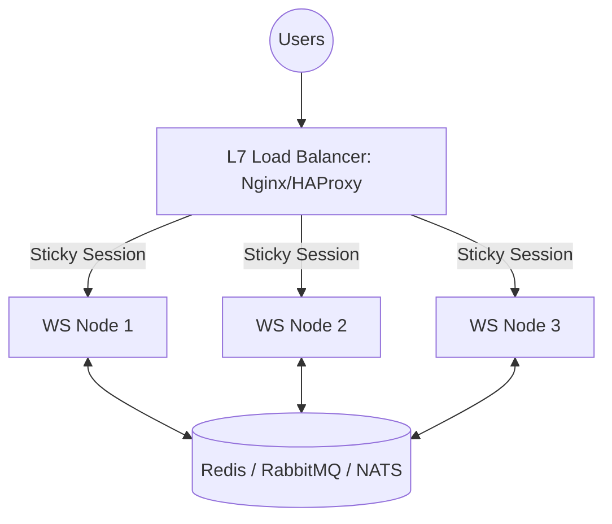

# 🌋 Real-time Scaling Challenges: Handling Millions of Connections
> **Objective:** Overcome the technical hurdles of high-concurrency real-time systems | **Language:** Hinglish | **Standard:** 2026 Expert Framework

---

## 🧭 1. Beginner-Friendly Hinglish Explanation
Real-time scaling ka matlab hai "Jab ek sath 10 lakh log site par hon, toh system ko crash hone se bachana".

- **The Problem:** Standard Web servers (like Express) 1000-5000 requests easily handle kar lete hain. Par real-time mein connections "Open" rehte hain. 
- **The Challenge:** 10 lakh open connections ka matlab hai 10 lakh open TCP sockets. Itni memory aur CPU kahan se aayegi?
- **Intuition:** Ye ek "Stadium" ki tarah hai. Agar 100 log hain, toh ek security guard kafi hai. Agar 50,000 log hain, toh aapko alag gates, bheed control, aur bahut saare guards (Servers) chahiye.

---

## 🧠 2. Deep Technical Explanation
### 1. The C10k (and C1M) Problem:
Handling 10,000 (or 1,000,000) concurrent connections. 
- **Memory:** Each open connection consumes RAM (approx 4KB to 50KB depending on the library). 1 million connections can easily take 40GB+ RAM.
- **File Descriptors:** Linux limits the number of open files per process. Sockets are treated as files. You must increase `ulimit -n`.

### 2. The Fan-out Problem:
If a celebrity (like Virat Kohli) goes live, and 1 million people are in his "Room", sending 1 message from him requires the server to send 1,000,000 outgoing messages. This can saturate the network card (NIC) of the server.

### 3. Load Balancing WebSockets:
Standard LBs don't always support persistent connections well. You need **Sticky Sessions** (so the HTTP handshake and WS upgrade happen on the same server).

---

## 🏗️ 3. Architecture Diagrams (Horizontal WS Scaling)


---

## 💻 4. Production-Ready Examples (Tuning Linux for WS)
```bash
# 2026 Standard: Linux Kernel Tuning for High Concurrency

# 1. Increase max open file descriptors
ulimit -n 1000000

# 2. Edit /etc/sysctl.conf for network tuning
# Max number of open files
fs.file-max = 2097152

# Port range for outgoing connections
net.ipv4.ip_local_port_range = 1024 65535

# TCP Memory limits
net.ipv4.tcp_mem = 786432 1048576 1572864

# 3. Apply changes
sysctl -p
```

---

## 🌍 5. Real-World Use Cases
- **IPL Live Streaming:** Millions of users getting "Ball-by-ball" updates.
- **WhatsApp/Telegram:** Delivering messages to millions of users across thousands of servers.
- **Stock Exchanges:** Syncing the "Order Book" across thousands of high-frequency traders.

---

## ❌ 6. Failure Cases
- **Connection Storm:** After a server restart, 100,000 clients all try to reconnect at the exact same millisecond. This crashes the server again. **Fix: Exponential Backoff + Jitter on the client.**
- **Redis Bottleneck:** Using a single Redis instance to sync events for 100 WS servers. Redis becomes the bottleneck. **Fix: Redis Cluster.**
- **Zombie Connections:** Half-open connections that aren't closed by the client but still occupy memory on the server.

---

## 🛠️ 7. Debugging Section
| Metric | Diagnostic | Solution |
| :--- | :--- | :--- |
| **Out of Memory** | `node --inspect` | Look for many small objects (Socket instances). Use **Worker Threads** to distribute load. |
| **High Latency** | Network saturation | Check `ifconfig` for dropped packets or high TX/RX load. |
| **Connection Refused** | Ulimit reached | Check `cat /proc/sys/fs/file-nr`. |

---

## ⚖️ 8. Tradeoffs
- **Polling vs WebSockets:** WebSockets are faster but harder to scale; Long Polling is slower but works with standard load balancers without stickiness.

---

## 🛡️ 9. Security Concerns
- **DDoS via WS:** An attacker opening 50,000 connections just to sit idle and consume RAM. **Fix: Implement idle-timeout and per-IP connection limits.**

---

## 📈 10. Scaling Challenges
- **State Synchronization:** Keeping track of "Who is online" across 50 servers without querying a database on every message.

---

## 💸 11. Cost Considerations
- **Bandwidth is the killer:** Sending 100KB JSON to 1 million users is 100GB of egress. This can cost thousands of dollars in one hour on AWS.

---

## ✅ 12. Best Practices
- **Use Binary protocols (MessagePack/Protobuf)** to save bandwidth.
- **Optimize the OS kernel.**
- **Implement 'Sticky Sessions' at the LB.**
- **Use a high-performance message broker (NATS or Redis Cluster).**

---

## ⚠️ 13. Common Mistakes
- **Ignoring the Client-side reconnection logic.**
- **Using heavy frameworks** for simple real-time needs.

---

## 📝 14. Interview Questions
1. "What is the C10k problem?"
2. "How do you handle a 'Celebrity' fan-out in a live chat?"
3. "Why do we need 'Sticky Sessions' for WebSockets?"

---

## 🚀 15. Latest 2026 Production Patterns
- **WebTransport over HTTP/3:** Eliminating the 'Head-of-line blocking' problem of TCP.
- **Micro-frontends with Shared Sockets:** Multiple frontend apps sharing a single WebSocket connection to the backend.
- **Rust-based WS Gateways:** Writing the connection manager in Rust/Go and the logic in Node.js for maximum performance.
漫
