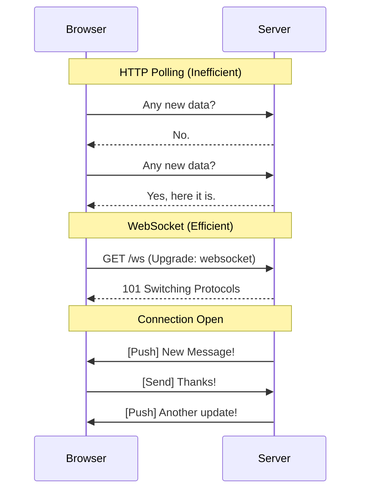

# 🔌 WebSockets Fundamentals: Full-Duplex Communication
> **Objective:** Master persistent, two-way communication between client and server | **Language:** Hinglish | **Standard:** 2026 Expert Framework

---

## 🧭 1. Beginner-Friendly Hinglish Explanation
WebSockets ka matlab hai "Ek baar haath milaya (Handshake), aur darwaza khula rakha".

- **The Problem:** HTTP ek "Request-Response" model hai. Browser puchtah hai "Koi naya message hai?", Server kehtah hai "Nahi". 5 second baad Browser fir puchtah hai. Ise **Polling** kehte hain, jo bahut inefficient hai.
- **The Solution:** WebSocket ek persistent connection hai. Ek baar connection ban gaya, toh Server khud "Push" kar sakta hai data jab bhi kuch naya ho.
- **The Difference:**
  - **HTTP:** Ek "Letters" bhejnewala system (Slow, formal).
  - **WebSocket:** Ek "Phone Call" (Instant, double-sided).

---

## 🧠 2. Deep Technical Explanation
### 1. The Upgrade Handshake:
WebSocket starts with a standard HTTP GET request with an `Upgrade: websocket` header. If the server supports it, it returns a `101 Switching Protocols` status code.

### 2. Full-Duplex:
Both client and server can send data simultaneously over a single TCP connection.

### 3. Binary vs Text:
WebSockets support both text (JSON) and binary (ArrayBuffer/Blob) data, making them efficient for images or audio streams.

### 4. Framing:
Unlike HTTP where you send headers every time, WebSockets use small "Frames" (minimal overhead) once the connection is established.

---

## 🏗️ 3. Architecture Diagrams (HTTP vs WebSocket)


---

## 💻 4. Production-Ready Examples (Native WS in Node.js)
```typescript
// 2026 Standard: Native WebSocket Server with 'ws' library

import { WebSocketServer } from 'ws';

const wss = new WebSocketServer({ port: 8080 });

wss.on('connection', (ws, req) => {
  console.log(`New connection from ${req.socket.remoteAddress}`);

  // 1. Handle incoming messages
  ws.on('message', (data) => {
    console.log('Received:', data.toString());
    
    // Broadcast to all connected clients
    wss.clients.forEach((client) => {
      if (client.readyState === ws.OPEN) {
        client.send(`User said: ${data}`);
      }
    });
  });

  // 2. Handle disconnection
  ws.on('close', () => console.log('Client disconnected'));

  // 3. Send initial welcome
  ws.send('Welcome to the Susa Real-time Hub!');
});
```

---

## 🌍 5. Real-World Use Cases
- **Stock Market Apps:** Instant price updates.
- **Multiplayer Games:** Syncing player positions every 16ms.
- **Collaboration Tools:** Google Docs-style real-time editing.
- **Live Sports Scores:** Updating scores without page refresh.

---

## ❌ 6. Failure Cases
- **Stale Connections:** A user goes through a tunnel (loses internet), but the server still thinks they are connected. **Fix: Use Pings/Pongs.**
- **Proxy Blocking:** Some corporate firewalls block WebSockets. **Fix: Use Port 443 (WSS) which looks like standard HTTPS.**
- **Memory Leaks:** Forgetting to remove event listeners when a client disconnects.

---

## 🛠️ 7. Debugging Section
| Tool | Purpose | Tip |
| :--- | :--- | :--- |
| **Chrome DevTools** | Network Tab | Filter by 'WS'. You can see the actual messages (Frames) in real-time. |
| **Postman** | Testing | Postman now supports WebSocket requests for easy manual testing. |
| **wscat** | CLI Client | `wscat -c ws://localhost:8080` for quick command-line testing. |

---

## ⚖️ 8. Tradeoffs
- **Real-time vs Complexity:** WebSockets are great for speed but harder to scale horizontally than standard REST APIs.

---

## 🛡️ 9. Security Concerns
- **WSS (WebSocket Secure):** Always use `wss://` (encrypted) to prevent man-in-the-middle attacks.
- **Authentication:** Send a token (JWT) during the initial handshake (Query param or Header) to verify the user.

---

## 📈 10. Scaling Challenges
- **The 65k Limit:** A single server has a limit on open TCP connections. **Fix: Use Load Balancers and Redis Pub/Sub.**
- **Stickiness:** Users must stay connected to the same server for the duration of the session.

---

## 💸 11. Cost Considerations
- **Open Connections:** Keeping 1 million connections open uses a lot of RAM. Standard servers might need 1-2GB of RAM just to manage the idle connections.

---

## ✅ 12. Best Practices
- **Implement Heartbeats** (Ping/Pong) every 30 seconds.
- **Use JSON** for structured data.
- **Always use WSS.**
- **Authenticate during the handshake.**

---

## ⚠️ 13. Common Mistakes
- **Forgetting to close connections.**
- **Sending too much data** in every frame (Keep it tiny!).

---

## 📝 14. Interview Questions
1. "Explain the WebSocket Handshake process."
2. "Why is WSS preferred over WS?"
3. "How do you handle horizontal scaling for a WebSocket server?"

---

## 🚀 15. Latest 2026 Production Patterns
- **WebTransport:** A new web API built on top of HTTP/3 (QUIC) that provides low-latency, bidirectional communication, intended as a successor to WebSockets for high-performance needs.
- **Serverless WebSockets:** Using services like **AWS API Gateway WebSockets** or **Pusher** to handle the heavy lifting of connection management.
漫
