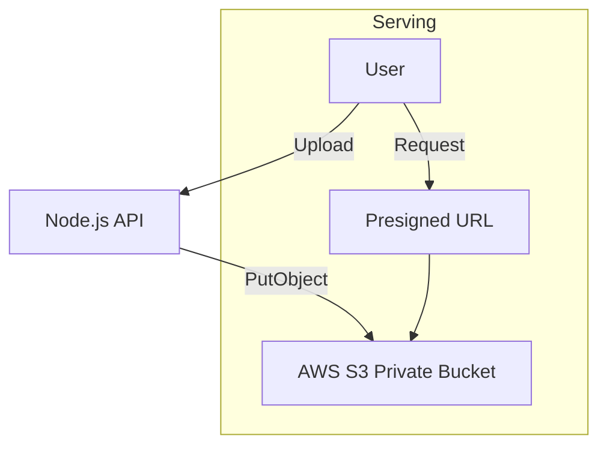

# 🪣 AWS S3: Industrial Grade Object Storage
> **Objective:** Store and serve petabytes of data with 99.999999999% durability | **Language:** Hinglish | **Standard:** 2026 Expert Framework

---

## 🧭 1. Beginner-Friendly Hinglish Explanation
AWS S3 (Simple Storage Service) ka matlab hai "Internet ka hard drive".

- **The Problem:** Aap apne server (EC2/VPS) par millions of files nahi rakh sakte. Disk bhar jayegi aur server slow ho jayega.
- **The Solution:** S3 ek dedicated storage service hai. Isme aap jitna chahe data bhar sakte hain, ye kabhi "Full" nahi hoti.
- **The Concept:** Data ko "Buckets" mein rakha jata hai. Har file ko "Object" kehte hain.
- **Intuition:** Ye ek "Unlimited Digital Godown" ki tarah hai. Aap bas apna saman (Files) wahan phenk do aur bhul jao. Wo humesha wahan milengi.

---

## 🧠 2. Deep Technical Explanation
### 1. Buckets and Objects:
- **Bucket:** A top-level container (e.g., `my-app-uploads`). Names must be globally unique.
- **Object:** The file itself, plus its metadata (Content-Type, Size, etc.).
- **Key:** The unique "Path" to the object (e.g., `users/avatars/123.jpg`).

### 2. Storage Classes:
- **S3 Standard:** Frequent access (Fast, expensive storage).
- **S3 IA (Infrequent Access):** For data not needed often (Cheaper storage, more expensive retrieval).
- **S3 Glacier:** Long-term backup (Very cheap, takes minutes/hours to retrieve).

### 3. Permissions (IAM & Bucket Policies):
S3 is private by default. You need IAM users with specific permissions or Bucket Policies to allow public access.

---

## 🏗️ 3. Architecture Diagrams (Private vs Public Access)


---

## 💻 4. Production-Ready Examples (AWS SDK v3)
```typescript
// 2026 Standard: S3 Client with SDK v3

import { S3Client, PutObjectCommand } from "@aws-sdk/client-s3";

const s3Client = new S3Client({
  region: process.env.AWS_REGION,
  credentials: {
    accessKeyId: process.env.AWS_ACCESS_KEY_ID!,
    secretAccessKey: process.env.AWS_SECRET_ACCESS_KEY!
  }
});

export const uploadToS3 = async (file: Express.Multer.File) => {
  const command = new PutObjectCommand({
    Bucket: process.env.AWS_S3_BUCKET,
    Key: `uploads/${Date.now()}-${file.originalname}`,
    Body: file.buffer,
    ContentType: file.mimetype
  });

  try {
    await s3Client.send(command);
    return `https://${process.env.AWS_S3_BUCKET}.s3.${process.env.AWS_REGION}.amazonaws.com/${command.input.Key}`;
  } catch (err) {
    console.error("S3 Upload Error", err);
    throw err;
  }
};
```

---

## 🌍 5. Real-World Use Cases
- **Static Asset Hosting:** Hosting images, CSS, and JS for a website.
- **Data Backups:** Nightly DB dumps stored for recovery.
- **User Media:** Hosting millions of user-uploaded videos/photos.
- **Log Archiving:** Storing years of system logs cheaply in Glacier.

---

## ❌ 6. Failure Cases
- **Public Bucket Breach:** Accidentally making a bucket "Public" and leaking user data. **Fix: Use "Block Public Access" feature.**
- **Missing Content-Type:** Uploading a file without a MIME type, causing the browser to download it instead of showing it.
- **Version Overload:** Enabling versioning and never deleting old versions, leading to a massive bill.

---

## 🛠️ 7. Debugging Section
| Tool | Purpose | Tip |
| :--- | :--- | :--- |
| **AWS Console** | S3 Browser | Manually check if the file is in the bucket. |
| **AWS CLI** | Command Line | `aws s3 ls s3://my-bucket` for quick checks. |
| **S3 Browser / Cyberduck** | GUI Tools | For easy drag-and-drop management of files. |

---

## ⚖️ 8. Tradeoffs
- **S3 vs Local Disk:** S3 is slower to write to (network call) but infinite and highly durable. Local is fast but volatile.

---

## 🛡️ 9. Security Concerns
- **Presigned URLs:** Never make your bucket public. Use **Presigned URLs** to give users temporary (e.g., 5 min) access to view or upload a file.
- **Encryption at Rest:** Use SSE-S3 or SSE-KMS to encrypt files on AWS disks.

---

## 📈 10. Scaling Challenges
- **Request Limits:** S3 can handle 3,500 PUT and 5,500 GET requests per second per prefix. If you exceed this, you need to use different prefixes (folders).

---

## 💸 11. Cost Considerations
- **Egress Fees:** Data leaving AWS to the internet is expensive. **Fix: Use AWS CloudFront (CDN) in front of S3 to lower costs.**

---

## ✅ 12. Best Practices
- **Enable "Block Public Access"** on all buckets.
- **Use Lifecycle Rules** to move old files to Glacier.
- **Use Presigned URLs** for sensitive data.
- **Enable Versioning** for critical data.

---

## ⚠️ 13. Common Mistakes
- **Using 'Root' AWS keys** in the backend code. (Use IAM Users with 'Least Privilege').
- **Not setting the `ACL` properly.**

---

## 📝 14. Interview Questions
1. "What is an S3 Presigned URL and when do we use it?"
2. "Explain the difference between S3 Standard and Glacier."
3. "How do you ensure that a private S3 file is accessible to an authenticated user?"

---

## 🚀 15. Latest 2026 Production Patterns
- **S3 Object Lambda:** Running a small function *during the request* to transform the file (e.g., blurring a face or adding a watermark) before it's delivered.
- **Multipart Uploads:** Splitting a 1GB file into 100 parts and uploading them in parallel for speed and reliability.
漫
