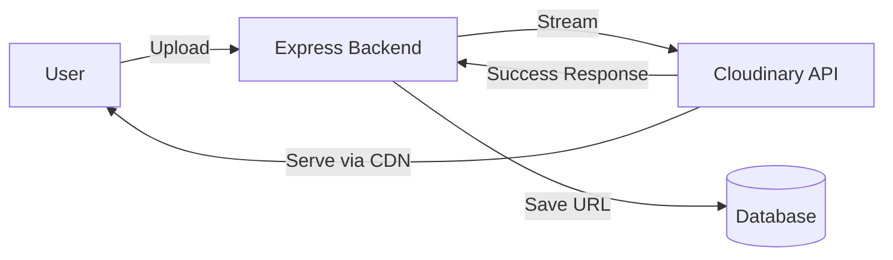

# ☁️ Cloudinary: Managed Media Management
> **Objective:** Offload image/video storage and transformation to a cloud-native platform | **Language:** Hinglish | **Standard:** 2026 Expert Framework

---

## 🧭 1. Beginner-Friendly Hinglish Explanation
Cloudinary ka matlab hai "Images aur Videos ke liye ek smart cloud".

- **The Problem:** Sirf file save karna kafi nahi hota. Aapko image ko "Resize" karna padta hai, "Format" badalna padta hai (e.g., JPG to WebP), aur unhe fast deliver karne ke liye CDN chahiye.
- **The Solution:** Cloudinary ek service hai jo ye sab handle karti hai. Aap file upload karo, aur wo aapko ek dynamic URL deta hai.
- **The Magic:** Aap URL mein hi likh sakte hain ki aapko image kitni badi chahiye (e.g., `/w_300,h_300/photo.jpg`), aur Cloudinary use on-the-fly bana deta hai.
- **Intuition:** Ye ek "Smart Warehouse" ki tarah hai. Aap use raw material dete hain, aur wo aapko final product (Optimized Image) turant de deta hai.

---

## 🧠 2. Deep Technical Explanation
### 1. The Workflow:
`Frontend (File) -> Backend (Multer) -> Cloudinary (Upload) -> Cloudinary (URL) -> Database (Save URL)`.

### 2. Transformations:
Cloudinary uses URL-based transformations. 
- **Auto Format (`f_auto`):** Delivers WebP to Chrome, JPEG to older browsers.
- **Auto Quality (`q_auto`):** Compresses the image without losing visual quality.
- **Crop/Resize (`c_fill`):** Smart cropping that focuses on the 'face' or main object.

### 3. Upload API:
Cloudinary provides a robust SDK for Node.js. It supports direct uploads, base64 uploads, and even remote URL uploads.

---

## 🏗️ 3. Architecture Diagrams (Cloudinary Integration)


---

## 💻 4. Production-Ready Examples (Cloudinary Upload Utility)
```typescript
// 2026 Standard: Cloudinary Service with SDK v2

import { v2 as cloudinary } from 'cloudinary';
import streamifier from 'streamifier';

cloudinary.config({
  cloud_name: process.env.CLOUDINARY_NAME,
  api_key: process.env.CLOUDINARY_KEY,
  api_secret: process.env.CLOUDINARY_SECRET
});

export const uploadToCloudinary = (fileBuffer: Buffer): Promise<any> => {
  return new Promise((resolve, reject) => {
    const uploadStream = cloudinary.uploader.upload_stream(
      { folder: 'user_profiles' },
      (error, result) => {
        if (result) resolve(result);
        else reject(error);
      }
    );

    streamifier.createReadStream(fileBuffer).pipe(uploadStream);
  });
};

// Usage in controller:
// const result = await uploadToCloudinary(req.file.buffer);
// const imageUrl = result.secure_url;
```

---

## 🌍 5. Real-World Use Cases
- **Dynamic Profile Pics:** Automatically cropping user faces into circles.
- **E-commerce:** Generating 4 different sizes of a product image for desktop/mobile/thumbnails.
- **Watermarking:** Automatically adding your logo to every uploaded image.
- **Video Transcoding:** Converting an uploaded `.mov` into `.mp4` for web streaming.

---

## ❌ 6. Failure Cases
- **Missing API Keys:** The backend crashes if the environment variables aren't set correctly.
- **Network Latency:** Uploading to Cloudinary adds extra time to the request. **Fix: Use Background Jobs (BullMQ).**
- **Over-billing:** Not setting a transformation limit, leading to thousands of versions being generated and billed.

---

## 🛠️ 7. Debugging Section
| Tool | Purpose | Tip |
| :--- | :--- | :--- |
| **Cloudinary Media Library** | Dashboard | Log in to see if the files are actually appearing in your account. |
| **Console Logs** | Errors | Catch and log the `result` or `error` from the upload SDK. |

---

## ⚖️ 8. Tradeoffs
- **Managed vs S3:** Cloudinary is much more feature-rich (transformations) but more expensive at high volumes than raw AWS S3.

---

## 🛡️ 9. Security Concerns
- **Secure URLs:** Always use `secure_url` (HTTPS).
- **Signed Uploads:** Prevent unauthorized uploads by using signed signatures from the backend.

---

## 📈 10. Scaling Challenges
- **Rate Limits:** Cloudinary has limits on how many uploads you can do per minute on the free/low tiers.

---

## 💸 11. Cost Considerations
- **Transformation Credits:** Cloudinary bills based on storage, bandwidth, and "Transformations" (Each new size/format counts).

---

## ✅ 12. Best Practices
- **Use `q_auto` and `f_auto` in every URL.**
- **Store the `public_id`** along with the URL in your DB (useful for deleting/renaming).
- **Upload in the background** for a better UX.
- **Use Folders** to organize media.

---

## ⚠️ 13. Common Mistakes
- **Uploading massive images** without any initial compression.
- **Not handling the upload error** in the backend (User gets a 500 with no explanation).

---

## 📝 14. Interview Questions
1. "What is on-the-fly transformation in Cloudinary?"
2. "Why is `f_auto` important for frontend performance?"
3. "How do you stream a file buffer to Cloudinary in Node.js?"

---

## 🚀 15. Latest 2026 Production Patterns
- **Cloudinary Assets API:** Using AI to automatically generate descriptions and tags for uploaded images.
- **Add-ons:** Using Cloudinary's "Remove Background" or "Face Blur" add-ons during the upload process.
漫
