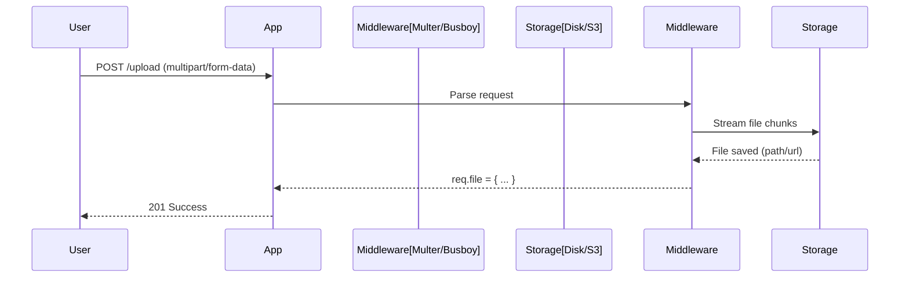

# 📁 File Uploads: Handling Multipart Data
> **Objective:** Master the art of securely and efficiently receiving files in a Node.js backend | **Language:** Hinglish | **Standard:** 2026 Expert Framework

---

## 🧭 1. Beginner-Friendly Hinglish Explanation
File Uploads ka matlab hai "User se image, PDF, ya video apne server par lena".

- **The Problem:** Standard JSON requests files ke liye nahi hoti. Files bahut "Bhari" (Large) hoti hain aur unhe "Multipart/Form-Data" format mein bhejna padta hai.
- **The Solution:** Humein ek middleware chahiye jo is "Multipart" stream ko samajh sake aur file ko chunks mein download kare.
- **The Concept:** Kabhi bhi puri file ko RAM mein mat load karo (crash ho jayega). File ko seedha temporary folder mein save karo ya cloud (S3) par stream karo.
- **Intuition:** Ye ek "Heavy Cargo" delivery ki tarah hai. Aap ise jeb mein nahi la sakte, aapko ek truck (Multipart) aur unloading staff (Middleware) chahiye.

---

## 🧠 2. Deep Technical Explanation
### 1. Multipart/Form-Data:
A specific type of HTTP request where the body is split into multiple parts, each separated by a "Boundary" string. One part could be a JSON field, another could be binary file data.

### 2. Buffering vs Streaming:
- **Buffering:** Waiting for the whole file to arrive in RAM before saving. (Dangerous for large files).
- **Streaming:** Saving chunks of data to the disk as they arrive. (Scalable and Safe).

### 3. File Validation:
- **Size Limit:** Preventing users from uploading 10GB files and crashing your disk.
- **MIME Type:** Ensuring that if you expect an image, you don't get a `.exe` virus.

---

## 🏗️ 3. Architecture Diagrams (The Upload Flow)


---

## 💻 4. Production-Ready Examples (Basic Express Upload)
```typescript
// 2026 Standard: Secure File Upload Logic

import express from 'express';
import multer from 'multer';
import path from 'path';

const app = express();

// 1. Configure storage
const storage = multer.diskStorage({
  destination: 'uploads/',
  filename: (req, file, cb) => {
    const uniqueSuffix = Date.now() + '-' + Math.round(Math.random() * 1E9);
    cb(null, file.fieldname + '-' + uniqueSuffix + path.extname(file.originalname));
  }
});

// 2. Setup limits and filters
const upload = multer({ 
  storage,
  limits: { fileSize: 5 * 1024 * 1024 }, // 5MB Limit
  fileFilter: (req, file, cb) => {
    if (file.mimetype.startsWith('image/')) cb(null, true);
    else cb(new Error('Only images are allowed!'), false);
  }
});

app.post('/profile-pic', upload.single('avatar'), (req, res) => {
  res.json({ message: 'Uploaded!', path: req.file?.path });
});
```

---

## 🌍 5. Real-World Use Cases
- **Social Media:** Uploading profile pictures and stories.
- **LMS:** Students uploading PDF assignments.
- **E-commerce:** Sellers uploading 4K product photos.
- **KYC:** Users uploading high-res Aadhaar/PAN card images.

---

## ❌ 6. Failure Cases
- **Disk Full:** Not checking available disk space before accepting a huge file.
- **Filename Collision:** Two users uploading `my-photo.jpg` at the same time and overwriting each other. **Fix: Use unique IDs (UUID/Timestamp).**
- **DoS Attack:** An attacker sending a never-ending stream of data. **Fix: Set strict timeouts.**

---

## 🛠️ 7. Debugging Section
| Problem | Diagnostic | Solution |
| :--- | :--- | :--- |
| **`req.file` is undefined** | Missing Middleware | Ensure `upload.single()` is added as a middleware. |
| **"Unexpected field"** | Field Name Mismatch | Ensure the frontend `FormData` key matches the middleware key (e.g., 'avatar'). |
| **Empty File** | Interrupted Stream | Check server logs for network errors during upload. |

---

## ⚖️ 8. Tradeoffs
- **Local Storage vs Cloud Storage:** Local is free but hard to scale (can't share between servers); Cloud (S3) is paid but infinite and shared.

---

## 🛡️ 9. Security Concerns
- **Remote Code Execution (RCE):** User uploads a `.php` or `.js` file and executes it on your server. **Fix: Never serve files from the same folder where they are uploaded without strict routing.**
- **MIME Sniffing:** A file that looks like an image but contains a virus. **Fix: Use `file-type` library to check magic bytes.**

---

## 📈 10. Scaling Challenges
- **Horizontal Scaling:** Server A has the file, but Server B (Load Balanced) doesn't. **Fix: Use a shared S3 bucket.**
- **Network Bandwidth:** Handling 1000 parallel 10MB uploads will saturate your server's network card.

---

## 💸 11. Cost Considerations
- **Egress Fees:** If you serve files directly from your server, you pay for data transfer. Use a CDN to save costs.

---

## ✅ 12. Best Practices
- **Always validate file size and type.**
- **Rename files to unique strings.**
- **Stream directly to Cloud Storage for large files.**
- **Use a dedicated temporary folder.**

---

## ⚠️ 13. Common Mistakes
- **Storing files in the Database (BLOB).** (Horrible performance).
- **Not handling the 'Error' callback in Multer.**

---

## 📝 14. Interview Questions
1. "How do you prevent a user from crashing your server with a 50GB file upload?"
2. "What is the difference between Buffering and Streaming uploads?"
3. "Why should we avoid storing files on the local disk of a production server?"

---

## 🚀 15. Latest 2026 Production Patterns
- **Presigned URLs:** The backend gives the user a temporary "Permission Key" (URL), and the user uploads **directly to S3**, bypassing your backend entirely to save server resources.
- **Edge Media Processing:** Cloudinary/Fastly automatically resizing the image at the CDN level as soon as it's uploaded.
漫
