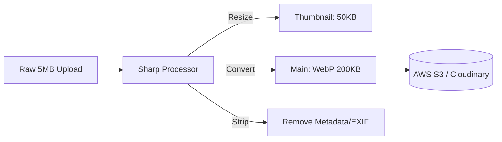

# 🖼️ Image Optimization: Performance for the Visual Web
> **Objective:** Deliver high-quality visuals with minimum byte size | **Language:** Hinglish | **Standard:** 2026 Expert Framework

---

## 🧭 1. Beginner-Friendly Hinglish Explanation
Image Optimization ka matlab hai "Image ko slim aur fast banana".

- **The Problem:** Ek raw 4K image 5MB ki hoti hai. Agar aapka user 4G/3G par hai, toh page load hone mein 10 second lagenge. User bhaag jayega.
- **The Solution:** Humein images ko "Compress" karna hai, sahi "Format" (WebP/AVIF) use karna hai, aur user ki screen ke hisaab se sahi "Size" bhejna hai.
- **The Goal:** 5MB ki image ko 50KB-100KB tak lana bina quality kharab kiye.
- **Intuition:** Ye ek "Packing" ki tarah hai. Agar aapko ek bada sofa (Image) bhejna hai, toh aap use "Fold" (Compress) karke ya "Disassemble" karke bhejte hain taaki transport cost (Bandwidth) kam lage.

---

## 🧠 2. Deep Technical Explanation
### 1. Modern Formats:
- **WebP:** Google's format. $25-35\%$ smaller than JPEG. Supported by all modern browsers.
- **AVIF:** The latest standard. Even better than WebP ($50\%$ smaller than JPEG).
- **SVG:** For icons and logos. Infinite resolution with tiny file size.

### 2. Resolution vs Display Size:
If a user is on a phone (300px wide), don't send a 2000px image. Use **Responsive Images** via the backend by generating multiple versions.

### 3. Lossy vs Lossless Compression:
- **Lossy:** Deletes some visual data that the human eye can't see (Much smaller size).
- **Lossless:** Reconstructs the exact data (Larger size, used for medical/pro photos).

---

## 🏗️ 3. Architecture Diagrams (The Optimization Pipeline)


---

## 💻 4. Production-Ready Examples (Sharp in Node.js)
```typescript
// 2026 Standard: Image Processing with Sharp

import sharp from 'sharp';

export const optimizeImage = async (buffer: Buffer) => {
  // 1. Resize to a max width of 1200px
  // 2. Convert to WebP with 80% quality
  // 3. Remove EXIF data (location/camera info) to save bytes
  
  const optimizedBuffer = await sharp(buffer)
    .resize(1200, null, { withoutEnlargement: true })
    .webp({ quality: 80 })
    .toBuffer();

  return optimizedBuffer;
};

// Usage: 
// const processed = await optimizeImage(req.file.buffer);
```

---

## 🌍 5. Real-World Use Cases
- **E-commerce:** Showing sharp but fast-loading product galleries.
- **Social Media:** Generating low-res "Blur" placeholders while the main image loads.
- **News Sites:** Delivering optimized photos for mobile users globally.

---

## ❌ 6. Failure Cases
- **Over-compression:** The image becomes "Blocky" or pixelated. **Fix: Set a quality floor of 70-80.**
- **CPU Spikes:** Processing thousands of images at once can freeze the Node.js event loop. **Fix: Use Worker Threads or a separate Microservice.**
- **Metadata Leak:** Uploading an image with GPS location data still in it. **Fix: Use `.withMetadata(false)` in Sharp.**

---

## 🛠️ 7. Debugging Section
| Tool | Purpose | Tip |
| :--- | :--- | :--- |
| **Squoosh.app** | Manual Test | Upload an image and see how different formats affect size/quality. |
| **Lighthouse** | Audit | Will yell at you if you serve unoptimized images. |
| **ImageMagick** | CLI | Powerful command-line tool for batch processing and debugging. |

---

## ⚖️ 8. Tradeoffs
- **CPU vs Bandwidth:** Real-time optimization saves bandwidth but uses more CPU. Pre-optimization uses disk space but is faster for the user.

---

## 🛡️ 9. Security Concerns
- **Image Bombs:** A tiny file that expands to 10GB in RAM during processing (Zip bomb equivalent). **Fix: Limit max pixel dimensions (e.g., 5000x5000).**

---

## 📈 10. Scaling Challenges
- **Dynamic Resizing:** If you have millions of images, pre-generating every size is impossible. Use an **Image Proxy** (like Cloudinary or imgix).

---

## 💸 11. Cost Considerations
- **CDN Savings:** Optimized images mean less data transfer, which can lower your CloudFront/Cloudflare bill by $50-70\%$.

---

## ✅ 12. Best Practices
- **Always strip EXIF metadata.**
- **Default to WebP/AVIF.**
- **Implement Lazy Loading** on the frontend (Backend helps by providing dimensions).
- **Use a dedicated library like Sharp.**

---

## ⚠️ 13. Common Mistakes
- **Upscaling small images** (makes them look blurry).
- **Not setting a max file size** before processing.

---

## 📝 14. Interview Questions
1. "What is the difference between WebP and JPEG?"
2. "How do you prevent 'Image Bombs' in a Node.js backend?"
3. "Why should we avoid resizing images on the fly during the main request cycle?"

---

## 🚀 15. Latest 2026 Production Patterns
- **LCP-First Delivery:** Serving the top-most image of the page with 100% quality and the rest with lower quality to pass Core Web Vitals.
- **AI Upscaling:** Automatically enhancing low-res user uploads before saving.
漫
