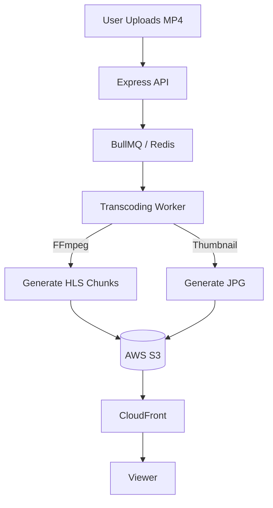

# 🎬 Media Processing: Videos and Beyond
> **Objective:** Handle heavy media tasks like transcoding, watermarking, and clipping | **Language:** Hinglish | **Standard:** 2026 Expert Framework

---

## 🧭 1. Beginner-Friendly Hinglish Explanation
Media Processing ka matlab hai "Video ya Audio files ke saath chhed-chhad (manipulation) karna".

- **The Problem:** Video files bahut badi hoti hain. Ek user 4K video upload karta hai, par dusra user use 2G internet par dekhna chahta hai.
- **The Solution:** Humein video ko alag-alag formats (MP4, HLS) aur alag-alag qualities (1080p, 720p, 480p) mein badalna padta hai.
- **The Process:** Is heavy kaam ko "Transcoding" kehte hain.
- **Intuition:** Ye ek "Translation" service ki tarah hai. Ek insaan Chinese mein bol raha hai (4K MOV), aur aap use Hindi, English, aur French mein translate kar rahe hain taaki har koi samajh sake.

---

## 🧠 2. Deep Technical Explanation
### 1. FFmpeg:
The industry-standard Swiss army knife for media. It's a command-line tool that Node.js interacts with via `fluent-ffmpeg`.

### 2. Transcoding vs Transmuxing:
- **Transcoding:** Changing the actual video data (Codec). E.g., H.264 to H.265. (Heavy CPU).
- **Transmuxing:** Changing just the container. E.g., MKV to MP4. (Light CPU).

### 3. Adaptive Bitrate Streaming (HLS/DASH):
Breaking a video into small 2-10 second chunks. The player (Video.js) automatically picks the best quality chunk based on the user's current internet speed.

---

## 🏗️ 3. Architecture Diagrams (Video Processing Pipeline)


---

## 💻 4. Production-Ready Examples (FFmpeg in Node.js)
```typescript
// 2026 Standard: Video Processing with fluent-ffmpeg

import ffmpeg from 'fluent-ffmpeg';

export const processVideo = (inputPath: string, outputPath: string) => {
  return new Promise((resolve, reject) => {
    ffmpeg(inputPath)
      .setFfmpegPath('/usr/bin/ffmpeg') // Path to binary
      .videoCodec('libx264')
      .size('1280x720')
      .on('progress', (progress) => {
        console.log(`Processing: ${progress.percent}% done`);
      })
      .on('error', (err) => reject(err))
      .on('end', () => resolve('Done!'))
      .save(outputPath);
  });
};

// 💡 Pro Tip: Never run this in the main API thread. 
// Always use a Worker Process or a Cloud Service.
```

---

## 🌍 5. Real-World Use Cases
- **YouTube Clone:** Generating multiple qualities for every upload.
- **Instagram Stories:** Clipping videos and adding watermarks.
- **Audio Apps:** Converting `.wav` to `.mp3` for smaller downloads.
- **Security Cameras:** Generating a GIF preview of a long surveillance video.

---

## ❌ 6. Failure Cases
- **CPU Starvation:** Running FFmpeg on the same server as your API. It will consume 100% CPU and stop the API from responding.
- **Disk Exhaustion:** Video files are huge. If the worker's disk fills up during transcoding, the process will fail.
- **Timeout:** Long videos can take hours to process. Standard HTTP timeouts will kill the connection. **Fix: Use Webhooks.**

---

## 🛠️ 7. Debugging Section
| Tool | Purpose | Tip |
| :--- | :--- | :--- |
| **`ffprobe`** | Inspection | Use this to see the codec, bitrate, and metadata of any video file. |
| **VLC Media Player** | Playback | Test your generated chunks in VLC to ensure they are valid. |
| **AWS MediaConvert Logs** | Managed Debugging | If using cloud services, check their detailed logs for codec errors. |

---

## ⚖️ 8. Tradeoffs
- **Self-hosted (FFmpeg) vs Cloud (AWS Elemental):** Self-hosted is cheap but complex to scale and manage. Cloud is expensive but "Serverless" and handles millions of videos automatically.

---

## 🛡️ 9. Security Concerns
- **FFmpeg Vulnerabilities:** Since FFmpeg is a complex C library, it can have security holes. **Fix: Run FFmpeg in a Docker container with limited permissions.**
- **Malicious Media:** Files designed to crash the decoder (Exploit).

---

## 📈 10. Scaling Challenges
- **Parallel Processing:** Handling 1000 simultaneous video uploads. You need a cluster of workers that scale up based on the queue size.

---

## 💸 11. Cost Considerations
- **Storage:** Storing a 1GB video in 5 different qualities takes 5GB of S3 space.
- **Compute:** High-end GPUs are often needed for fast 4K transcoding.

---

## ✅ 12. Best Practices
- **Always use a background queue.**
- **Notify the user via Webhooks/Sockets** when processing is done.
- **Use HLS for better web streaming.**
- **Keep a 'Raw' backup** of the original file.

---

## ⚠️ 13. Common Mistakes
- **Hardcoding paths** for FFmpeg.
- **Not setting a time limit** for the transcoding process.

---

## 📝 14. Interview Questions
1. "What is HLS and why is it better than serving a raw MP4?"
2. "Why should media processing happen in a background worker?"
3. "What is the difference between transcoding and transmuxing?"

---

## 🚀 15. Latest 2026 Production Patterns
- **Serverless Transcoding (AWS Lambda + FFmpeg):** Using small, short-lived functions to process small video clips.
- **GPU Acceleration:** Using NVIDIA GPUs (NVENC) in the cloud to speed up transcoding by $10x$.
- **AI-Based Clipping:** Automatically detecting the "Best parts" of a video and creating a 15-second teaser.
漫
