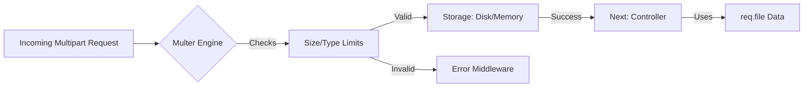

# 📦 Multer: The Ultimate Guide for Node.js Uploads
> **Objective:** Master the industry-standard middleware for handling multipart/form-data | **Language:** Hinglish | **Standard:** 2026 Expert Framework

---

## 🧭 1. Beginner-Friendly Hinglish Explanation
Multer ka matlab hai "Node.js ka delivery boy jo heavy packets (files) handle karta hai".

- **The Problem:** Jab hum form se images bhejte hain, toh Express ka default `body-parser` use nahi samajh pata.
- **The Solution:** Multer ek middleware hai jo requests ko scan karta hai aur files ko nikal kar aapke bataye huye folder mein rakh deta hai.
- **The Process:** 
  1. Define karo kahan save karna hai (`Storage`).
  2. Rule banao (Sirf images, max 2MB).
  3. Route mein as a middleware use karo.
- **Intuition:** Multer ek gatekeeper ki tarah hai. Wo packets check karta hai, agar sahi hain toh unhe warehouse (Folder) mein bhej deta hai aur unka "Receipt" (req.file) aapko de deta hai.

---

## 🧠 2. Deep Technical Explanation
### 1. Storage Engines:
- **DiskStorage:** Files are saved to your server's hard drive. Gives full control over filenames.
- **MemoryStorage:** Files are kept as Buffers in RAM. Use this if you want to process the file (like resizing) before saving it somewhere else.

### 2. Multer Methods:
- **`.single('field')`:** For one file.
- **`.array('field', count)`:** For multiple files with the same name.
- **`.fields([{name: 'avatar'}, {name: 'gallery'}])`:** For multiple files with different names.
- **`.none()`:** Only parse text fields from a multipart form.

### 3. The `req` object:
Multer adds a `file` (or `files`) object and a `body` object to your `req`.

---

## 🏗️ 3. Architecture Diagrams (Multer Middleware Logic)


---

## 💻 4. Production-Ready Examples (Advanced Multer Setup)
```typescript
// 2026 Standard: Robust Multer Utility

import multer from 'multer';
import { AppError } from '../utils/AppError';

// 1. Memory Storage (Preferred for processing/cloud upload)
const storage = multer.memoryStorage();

// 2. Strong File Filter
const fileFilter = (req: any, file: any, cb: any) => {
  if (file.mimetype.startsWith('image/')) {
    cb(null, true);
  } else {
    cb(new AppError('Not an image! Please upload only images.', 400), false);
  }
};

// 3. Initialize Multer
const upload = multer({
  storage,
  fileFilter,
  limits: {
    fileSize: 2 * 1024 * 1024, // 2MB
    files: 5 // Max 5 files
  }
});

// 4. Usage in Routes
// router.post('/gallery', upload.array('images', 5), controller.uploadGallery);
```

---

## 🌍 5. Real-World Use Cases
- **Portfolio Websites:** Uploading multiple project screenshots at once.
- **Product Forms:** Uploading a main image and multiple detail shots.
- **Document Verification:** Uploading a PDF of an ID and a JPG of a selfie.

---

## ❌ 6. Failure Cases
- **Memory Overload:** Using `MemoryStorage` for 100MB files. (Server will crash). **Fix: Use `DiskStorage` or Stream directly.**
- **Race Conditions:** Multiple files with the same name if the filename generator isn't unique enough.
- **Mismatched Fields:** Frontend sends `image` but backend expects `photo`.

---

## 🛠️ 7. Debugging Section
| Problem | Diagnostic | Solution |
| :--- | :--- | :--- |
| **"Unexpected field"** | Check field name | Ensure `upload.single('X')` matches the form field name. |
| **"File too large"** | Check `limits` | Increase `fileSize` or inform the user to compress. |
| **No body in req** | Middleware Order | Ensure Multer is placed BEFORE any logic that needs `req.body`. |

---

## ⚖️ 8. Tradeoffs
- **Disk vs Memory:** Disk is safer for large files; Memory is faster for small files that need processing (like Sharp for resizing).

---

## 🛡️ 9. Security Concerns
- **Directory Traversal:** Attackers trying to save files in sensitive folders. **Fix: Never use `file.originalname` directly for the path.**
- **Malware:** Scanning files for viruses before they are saved (using ClamAV).

---

## 📈 10. Scaling Challenges
- **Temporary Files:** If you use DiskStorage, old files in the `tmp/` folder can eat up GBs of space if not cleaned up regularly.

---

## 💸 11. Cost Considerations
- **Disk Space:** High-res images take a lot of space. Always compress before saving.

---

## ✅ 12. Best Practices
- **Use a custom filename generator.**
- **Set strict `fileSize` limits.**
- **Always handle errors** using the Multer error callback or a global error handler.
- **Use `req.file` metadata** to store the file path in the database.

---

## ⚠️ 13. Common Mistakes
- **Forgetting to create the 'uploads' directory.** (Multer will fail).
- **Putting Multer on every route.** (Use it only where needed).

---

## 📝 14. Interview Questions
1. "What are the different storage engines available in Multer?"
2. "How do you handle multiple files with different field names?"
3. "What happens if you don't call the `cb` (callback) in `fileFilter`?"

---

## 🚀 15. Latest 2026 Production Patterns
- **Direct S3 Upload with `multer-s3`:** A storage engine that streams data directly to AWS S3 without saving it to your local disk first.
- **Multer + Sharp Pipeline:** Using MemoryStorage to resize images to multiple formats (WebP, Thumbnails) before any saving happens.
漫
