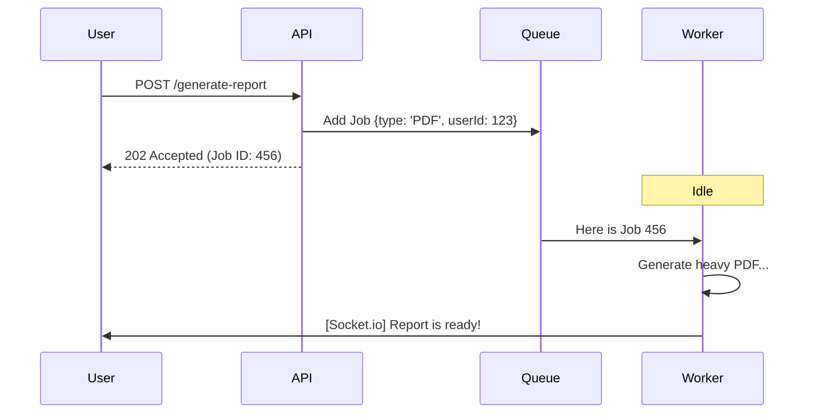

# ⏳ Background Jobs: Decoupling Time-Consuming Tasks
> **Objective:** Improve application responsiveness by offloading heavy work | **Language:** Hinglish | **Standard:** 2026 Expert Framework

---

## 🧭 1. Beginner-Friendly Hinglish Explanation
Background Jobs ka matlab hai "Baad mein hone wala kaam".

- **The Problem:** Jab aap Swiggy par order karte hain, toh kya app tab tak "Loading" dikhata hai jab tak restaurant khana pakana shuru na karde? Nahi.
- **The Solution:** Backend order receive karte hi aapko "Order Placed" bol deta hai, aur piche se background mein restaurant ko notify karna, delivery partner dhundhna, aur billing generate karna shuru kar deta hai.
- **The Result:** User experience fast hota hai aur server heavy tasks se jam (block) nahi hota.
- **Intuition:** Ye ek "Secretariat" ki tarah hai. Aap form jama karte hain aur chale jate hain. Clerk baad mein file process karta hai aur aapko SMS bhej deta hai.

---

## 🧠 2. Deep Technical Explanation
### 1. Synchronous vs Asynchronous:
- **Synchronous:** Wait for completion before responding (e.g., Checking login password).
- **Asynchronous:** Hand off the task and respond immediately (e.g., Sending a newsletter).

### 2. Job Lifecycle:
- **Enqueue:** Putting the task metadata into a storage (Redis/DB).
- **Polling/Pushing:** A worker checking for new tasks.
- **Execution:** Performing the actual logic.
- **Result Handling:** Saving the outcome or retrying if it fails.

### 3. Messaging Patterns:
- **Fire and Forget:** Hand off and don't care about the result.
- **Callback/Webhook:** The worker notifies the main app when finished.

---

## 🏗️ 3. Architecture Diagrams (Request vs Background Job)


---

## 💻 4. Production-Ready Examples (Conceptual Job Logic)
```typescript
// 2026 Standard: Background Job Pattern

// 1. The Controller (Fast Response)
app.post('/api/import-contacts', async (req, res) => {
  const { fileUrl } = req.body;
  
  // Hand off to the queue
  await contactQueue.add('process-contacts', { fileUrl });
  
  // Respond immediately
  res.status(202).json({ 
    message: 'Import started. We will notify you when done.',
    statusUrl: '/api/jobs/123'
  });
});

// 2. The Job Handler (Heavy Lifting)
const processContacts = async (job) => {
  const { fileUrl } = job.data;
  // Download 100k rows, validate, and save to DB
  // This can take 5 minutes, but the user doesn't wait!
};
```

---

## 🌍 5. Real-World Use Cases
- **Data Migration:** Moving millions of records from one DB to another.
- **Third-party Sync:** Fetching data from an external API (like Shopify) every hour.
- **Social Media:** Processing a "Follow" request (Updating followers, notifications, feed logic).
- **Security:** Running an automatic audit on suspicious user behavior.

---

## ❌ 6. Failure Cases
- **Lost Jobs:** Storing jobs in memory, then the server restarts. **Fix: Use Persistent Storage (Redis).**
- **Overwhelming the Queue:** Adding 1 million jobs in 1 second. **Fix: Rate Limiting and Backpressure.**
- **Stale Data:** The background job uses data that has already changed in the DB.

---

## 🛠️ 7. Debugging Section
| Tool | Purpose | Tip |
| :--- | :--- | :--- |
| **Log Tracing** | Tracking | Pass a `correlationId` from the API to the Job so you can see the full journey in logs. |
| **Status API** | Monitoring | Create an endpoint for the user to check the progress percentage of their job. |

---

## ⚖️ 8. Tradeoffs
- **Complexity vs Performance:** Background jobs add infrastructure complexity (Redis, Workers) but give massive performance gains.

---

## 🛡️ 9. Security Concerns
- **Job Poisoning:** An attacker adding malicious jobs to your queue. **Fix: Use Signed tokens or internal-only queues.**

---

## 📈 10. Scaling Challenges
- **The Database Bottleneck:** 100 workers trying to write to the same Database at once. **Fix: Connection Pooling and Batching.**

---

## 💸 11. Cost Considerations
- **Compute Time:** Long-running jobs in the cloud (AWS Lambda) can be expensive. **Fix: Use Spot Instances for non-critical jobs.**

---

## ✅ 12. Best Practices
- **Idempotency is king.**
- **Keep job data small (Store IDs, not objects).**
- **Always set retries and timeouts.**
- **Monitor the 'Queue Depth' (Backlog).**

---

## ⚠️ 13. Common Mistakes
- **Putting small, fast tasks in a background job** (Adds unnecessary latency).
- **Not logging failures.**

---

## 📝 14. Interview Questions
1. "When should a task be moved to the background?"
2. "How do you handle a job that fails 50% of the time?"
3. "What is the difference between a Cron Job and a Background Job?"

---

## 🚀 15. Latest 2026 Production Patterns
- **Event-Driven Workflows (Temporal):** Using specialized engines to manage complex, multi-step background jobs that can last for weeks.
- **Serverless Workers:** Using "Scale to Zero" workers that only run when there's a job in the queue.
漫
