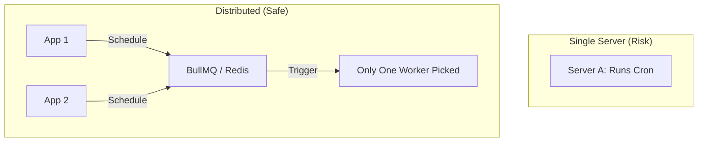

# ⏰ Cron Jobs: Scheduling Recurring Tasks
> **Objective:** Automate periodic operations like backups, emails, and cleanup | **Language:** Hinglish | **Standard:** 2026 Expert Framework

---

## 🧭 1. Beginner-Friendly Hinglish Explanation
Cron Jobs ka matlab hai "Digital Alarm Clock".

- **The Problem:** Aapko har raat 12 baje database ka backup lena hai. Kya aap roz raat ko uthkar button dabayenge? Nahi.
- **The Solution:** Humein ek aisi system chahiye jo calendar aur clock ko follow kare aur specific time par apne aap "Run" ho jaye.
- **The Concept:** Aap batate hain: "Har Monday ko subah 9 baje" ya "Har 5 minute mein".
- **Intuition:** Ye aapke phone ke "Alarm" ki tarah hai. Aap ek baar set karte hain, aur wo apne aap bajta rehta hai jab tak aap use band na karein.

---

## 🧠 2. Deep Technical Explanation
### 1. The Cron Syntax:
A string of 5 or 6 fields representing: `minute hour day-of-month month day-of-week`.
- `* * * * *`: Every minute.
- `0 0 * * *`: Every day at midnight.
- `0 9 * * 1`: Every Monday at 9 AM.

### 2. Node.js Implementations:
- **`node-cron`:** Simple, runs inside your app process. (Good for small apps).
- **`node-schedule`:** Similar but supports Date objects.
- **`BullMQ Repeatable Jobs`:** Uses Redis. (Standard for production).

### 3. Distributed Crons:
If you have 5 servers running the same code, and you set a cron for "Midnight", all 5 servers will run it at once. **Problem:** You might send 5 duplicate emails! **Fix: Use a centralized lock (Redis).**

---

## 🏗️ 3. Architecture Diagrams (Single vs Distributed Cron)


---

## 💻 4. Production-Ready Examples (BullMQ Repeatable Job)
```typescript
// 2026 Standard: Centralized Cron with BullMQ

import { Queue } from 'bullmq';

const reportQueue = new Queue('daily-reports');

// Add a job that repeats every day at midnight
await reportQueue.add('generate-summary', 
  { scope: 'all' }, 
  {
    repeat: {
      pattern: '0 0 * * *' // Standard Cron Syntax
    }
  }
);

// 💡 Pro Tip: This way, even if you have 100 servers, 
// Redis ensures the job is only triggered ONCE per day.
```

---

## 🌍 5. Real-World Use Cases
- **Database Backups:** Exporting data to S3 every night.
- **Subscription Billing:** Checking who needs to be charged today.
- **Daily Newsletters:** Sending a "Summary of the day" at 8 PM.
- **Cleanup:** Deleting expired sessions or temporary files every hour.

---

## ❌ 6. Failure Cases
- **Overlapping Crons:** A job takes 10 minutes to run, but you scheduled it to run every 5 minutes. Now 2 instances are running at once. **Fix: Implement 'Concurrency: 1'.**
- **Server Downtime:** If the server was off at midnight, did the job run later? **Fix: Check 'Last Run' on startup.**
- **Timezone Confusion:** Server is in UTC, but you wanted 9 AM IST. **Fix: Always use UTC or explicit timezones.**

---

## 🛠️ 7. Debugging Section
| Problem | Diagnostic | Solution |
| :--- | :--- | :--- |
| **Job didn't run** | Check Cron Syntax | Use a tool like **crontab.guru** to verify your string. |
| **Duplicate Runs** | Multi-server Check | Verify if you're using a distributed scheduler (Redis/DB) or local `node-cron`. |
| **Silent Fail** | Missing Logs | Ensure every cron job logs `[START]` and `[FINISH]` with timestamps. |

---

## ⚖️ 8. Tradeoffs
- **Local (`node-cron`) vs Centralized (BullMQ):** Local is zero-config but dangerous for scaling; Centralized is rock-solid but needs Redis.

---

## 🛡️ 9. Security Concerns
- **Sensitive Tasks:** If a cron job deletes data, ensure it has strict validation. You don't want a bug in your cron to wipe your production database.

---

## 📈 10. Scaling Challenges
- **The 1-Minute Limit:** Standard Crons can't run faster than once per minute. For sub-minute tasks, use a loop with `sleep` or a specialized high-frequency scheduler.

---

## 💸 11. Cost Considerations
- **Peak Hour Load:** If all your cron jobs run at midnight, your database might crash due to a sudden spike. **Fix: Stagger the times (e.g., Job A at 12:00, Job B at 12:15).**

---

## ✅ 12. Best Practices
- **Use UTC for everything.**
- **Use a centralized scheduler for production.**
- **Implement 'Idempotency'.**
- **Log the output/status of every run.**

---

## ⚠️ 13. Common Mistakes
- **Hardcoding local timezones.**
- **Not handling long-running crons.**

---

## 📝 14. Interview Questions
1. "What is the Cron syntax for 'Every Sunday at 4 PM'?"
2. "How do you prevent duplicate cron executions in a multi-server environment?"
3. "What happens if a cron job fails? How do you monitor it?"

---

## 🚀 15. Latest 2026 Production Patterns
- **Serverless Crons:** Using **AWS EventBridge** or **GitHub Actions** to trigger a webhook in your backend. No need to manage a running process.
- **Dynamic Scheduling:** Allowing users to set their own crons (e.g., "Remind me every 2 days") via the UI and saving it to a database-backed scheduler.
漫
