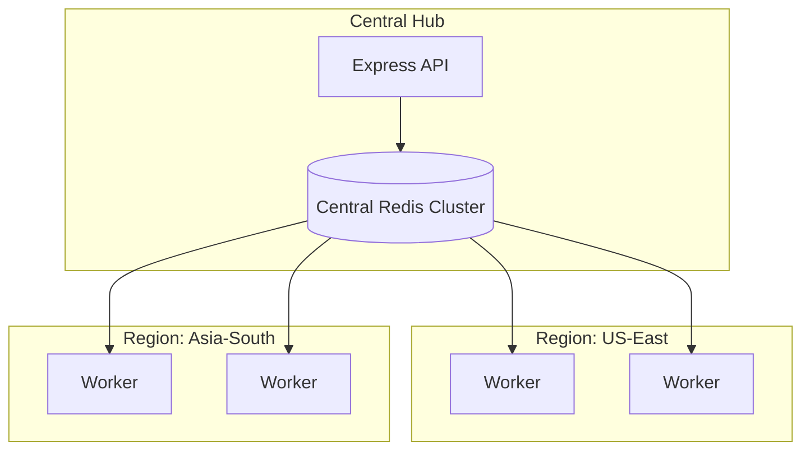

# 🌐 Distributed Workers: Scaling across the Cloud
> **Objective:** Scale background processing across multiple servers and regions | **Language:** Hinglish | **Standard:** 2026 Expert Framework

---

## 🧭 1. Beginner-Friendly Hinglish Explanation
Distributed Workers ka matlab hai "Apni 'Workforce' (Labors) ko poori duniya mein phailana".

- **The Problem:** Ek akela server heavy processing (jaise video conversion) ki limit tak jaldi pahuch jayega. Aapko 10 servers chahiye jo milkar kaam karein.
- **The Solution:** Humein ek aisi system chahiye jahan "Kaam" (Queue) ek jagah ho, aur "Workers" kahin bhi (Server A, Server B, AWS, GCP).
- **The Concept:** Redis ya RabbitMQ ek central broker bante hain, aur workers kisi bhi kone se unhe "Join" kar sakte hain.
- **Intuition:** Ye ek "Call Center" ki tarah hai. Calls ek central queue mein aati hain, aur agents (Workers) jo kahin bhi baithe ho sakte hain, unhe ek-ek karke uthate hain.

---

## 🧠 2. Deep Technical Explanation
### 1. The Shared Broker Pattern:
All workers connect to the same Redis/Message Broker instance. The broker ensures that a job is only given to ONE worker at a time (Locking/Leasing).

### 2. Heterogeneous Workers:
Workers don't have to be identical.
- **Machine A (GPU):** Only processes Video jobs.
- **Machine B (High RAM):** Processes Data Analytics jobs.
- **Machine C (General):** Processes Emails.

### 3. Service Discovery:
Workers need to find the broker. In a distributed cloud, we use **Environment Variables** or **Consul/Vault** to provide the broker's connection string securely.

---

## 🏗️ 3. Architecture Diagrams (Global Distributed Workers)


---

## 💻 4. Production-Ready Examples (Connecting Remote Workers)
```typescript
// 2026 Standard: Distributed Worker Configuration

// 💡 The key is to NOT hardcode 'localhost'. 
// Use a secure, external Redis URI.

import { Worker } from 'bullmq';

const REMOTE_REDIS_URL = process.env.REDIS_PRIVATE_URL;

const worker = new Worker('global-tasks', async job => {
  // Processing logic...
}, {
  connection: {
    url: REMOTE_REDIS_URL,
    // Add SSL/TLS for cross-region security
    tls: { rejectUnauthorized: false } 
  },
  concurrency: 20
});

console.log('👷 Worker is active and waiting for global tasks...');
```

---

## 🌍 5. Real-World Use Cases
- **Content Delivery:** Automatically generating thumbnails across 5 different AWS regions.
- **Web Scraping:** Distributing scraping tasks across 100 small "Spot" instances to avoid IP bans.
- **Financial Processing:** Handling billions of stock market events using a cluster of 50 workers.

---

## ❌ 6. Failure Cases
- **Network Latency:** A worker in India trying to talk to a Redis in US. The 300ms delay can slow down everything. **Fix: Use Regional Redis Clusters.**
- **Version Mismatch:** Worker A has version 1.0 of the code, Worker B has version 2.0. They process the same job differently. **Fix: Use Docker Tags and CI/CD.**
- **Broker Downtime:** If the central Redis dies, all 100 workers become useless. **Fix: Redis Sentinel / Cluster.**

---

## 🛠️ 7. Debugging Section
| Problem | Diagnostic | Solution |
| :--- | :--- | :--- |
| **Worker not picking jobs** | Broker Connection | Check if the worker can `ping` the Redis server. Check for Firewall/Security Group issues (Port 6379). |
| **Outdated code running** | `git log` | Ensure your deployment script pulled the latest code and restarted the worker process. |

---

## ⚖️ 8. Tradeoffs
- **Centralized Broker (Simple)** vs **De-centralized (Fast but Complex).**

---

## 🛡️ 9. Security Concerns
- **VPN / VPC Peering:** Never expose your Redis to the public internet. Use a **Private VPC** so workers and brokers talk over a secure, internal network.
- **TLS/SSL:** Always encrypt the connection between the worker and the broker.

---

## 📈 10. Scaling Challenges
- **Queue Partitioning:** If 100 workers are hitting one Redis, the Redis CPU might max out. **Fix: Use Sharding.**

---

## 💸 11. Cost Considerations
- **Data Transfer (Inter-region):** AWS charges for data moving between regions. Keeping workers and brokers in the same region is much cheaper.

---

## ✅ 12. Best Practices
- **Use Docker** to ensure all workers are identical.
- **Run workers in the same VPC as the broker.**
- **Monitor individual worker health.**
- **Implement 'Health Checks'** for worker processes.

---

## ⚠️ 13. Common Mistakes
- **Assuming 'localhost'** will work in production.
- **Not handling the 'Disconnect' event** gracefully in the worker.

---

## 📝 14. Interview Questions
1. "How do you coordinate work between 10 different servers?"
2. "What are the risks of running workers in a different region than the database?"
3. "How do you handle worker versioning in a distributed system?"

---

## 🚀 15. Latest 2026 Production Patterns
- **KEDA (Kubernetes Event-driven Autoscaling):** The gold standard. If your Redis queue grows to 1000 items, KEDA spins up 50 new pods (Workers) instantly.
- **NATS JetStream:** A modern, high-performance replacement for Redis/RabbitMQ specifically designed for distributed messaging.
漫
