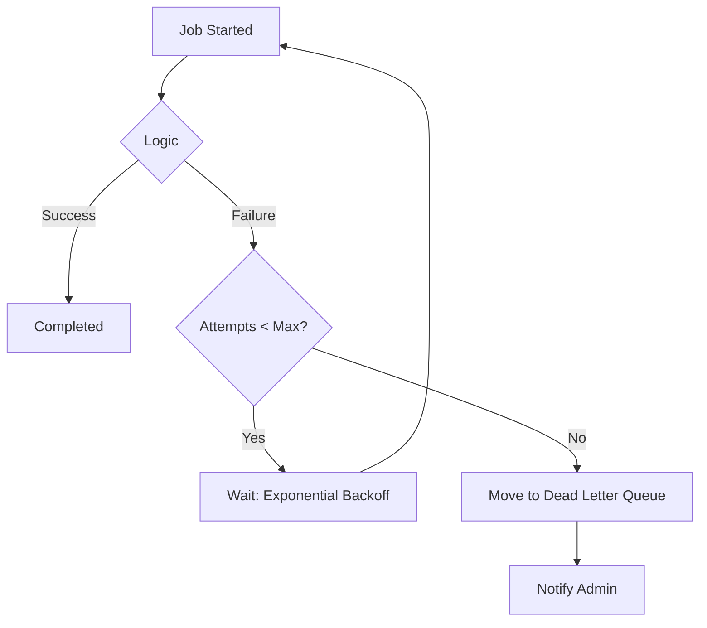

# 🛡️ Retry and Failure Handling: Building Resilient Workers
> **Objective:** Ensure background tasks complete successfully even in unstable environments | **Language:** Hinglish | **Standard:** 2026 Expert Framework

---

## 🧭 1. Beginner-Friendly Hinglish Explanation
Retry aur Failure Handling ka matlab hai "Haar na maanna" (Never give up).

- **The Problem:** Maan lijiye aapka worker email bhej raha hai. Achanak internet chala gaya ya Email API down ho gayi. Kya wo job humesha ke liye khatam ho gayi?
- **The Solution:** Humein system ko sikhana hai ki "Agar fail ho jao, toh thodi der baad fir koshish karo".
- **The Concept:** 
  1. **Retry:** Dobara koshish karna.
  2. **Exponential Backoff:** Har baar intezar (waiting time) badhana (taaki system par load na bade).
  3. **Dead Letter Queue (DLQ):** Agar 10 baar fail ho gaya, toh use ek alag 'Dustbin' (DLQ) mein daal do taaki hum use manually check kar sakein.

---

## 🧠 2. Deep Technical Explanation
### 1. Types of Failures:
- **Transient (Temporary):** Network glitch, DB connection timeout, API rate limit. (Safe to retry).
- **Permanent (Fatal):** Invalid email address, Database constraint error, Syntax error in code. (Retrying is useless).

### 2. Exponential Backoff:
If you retry every 1 second, you might crash a struggling server. Instead, use:
- Attempt 1: 5s
- Attempt 2: 25s
- Attempt 3: 125s
This gives the external system time to recover.

### 3. Circuit Breaker Pattern:
If a worker sees that the external API has failed 100 times in a row, it should "Open the Circuit" and stop trying for a few minutes to save resources.

---

## 🏗️ 3. Architecture Diagrams (Retry Lifecycle)


---

## 💻 4. Production-Ready Examples (BullMQ Retry Config)
```typescript
// 2026 Standard: Robust Retry Configuration

await myQueue.add('send-notification', { data }, {
  // 1. Max retries
  attempts: 5,
  
  // 2. The Backoff Strategy
  backoff: {
    type: 'exponential',
    delay: 10000, // Start with 10s
  },
  
  // 3. Remove on completion (save memory)
  removeOnComplete: true,
  
  // 4. Move to fail after all attempts (Default in BullMQ)
  removeOnFail: false 
});

// Worker side error handling
worker.on('failed', (job, err) => {
  if (job.attemptsMade >= job.opts.attempts) {
    console.error(`❌ CRITICAL: Job ${job.id} failed after ALL retries.`);
    // Send Slack/Sentry alert
  }
});
```

---

## 🌍 5. Real-World Use Cases
- **Payment Gateways:** Retrying a transaction if the bank's server is busy.
- **Third-party APIs:** Retrying a post to Instagram if their API is down.
- **Database Writes:** Retrying a record save if there's a temporary deadlock.

---

## ❌ 6. Failure Cases
- **Infinite Loops:** Not setting a `maxAttempts` and retrying forever.
- **Double Action:** A job fails *after* charging the customer but *before* marking it as success. Retrying charges them again! **Fix: Use IDEMPOTENCY.**
- **Log Noise:** Every retry creates an "Error" log, filling up your monitoring dashboard. **Fix: Use 'Warning' level for retries and 'Error' only for final failure.**

---

## 🛠️ 7. Debugging Section
| Status | Meaning | Tip |
| :--- | :--- | :--- |
| **`stalled`** | Worker crashed | BullMQ will automatically put this back in the queue. Check for OOM errors. |
| **`failed`** | Logic errored | Check the `stacktrace` property of the job object to see the exact line of failure. |

---

## ⚖️ 8. Tradeoffs
- **Immediate Retry (Fast recovery)** vs **Delayed Retry (Safe for servers).**

---

## 🛡️ 9. Security Concerns
- **Sensitive Data in Failures:** Sometimes the error log contains the full request body (including passwords). Ensure your logger strips sensitive fields.

---

## 📈 10. Scaling Challenges
- **The Thundering Herd:** When an API comes back online, and 100,000 "Retrying" jobs all hit it at the exact same second. **Fix: Add 'Jitter' (random randomness to the delay).**

---

## 💸 11. Cost Considerations
- **API Billing:** Some APIs charge per request, even if they fail. Retrying 10 times costs 10x more.

---

## ✅ 12. Best Practices
- **Implement Idempotency.**
- **Use Exponential Backoff with Jitter.**
- **Categorize errors** (Retry-able vs Non-retry-able).
- **Monitor your DLQ daily.**

---

## ⚠️ 13. Common Mistakes
- **Retrying after a 401 Unauthorized error** (It won't fix itself until you change the key!).
- **Not setting a time limit** for the whole retry process.

---

## 📝 14. Interview Questions
1. "What is Exponential Backoff and why is it important?"
2. "How do you handle 'Idempotency' in background workers?"
3. "When should you NOT retry a failed job?"

---

## 🚀 15. Latest 2026 Production Patterns
- **Sidecar Retries (Service Mesh):** In microservices, the "Service Mesh" (Istio/Linkerd) handles retries automatically at the network level, so your code doesn't have to.
- **Smart Retries:** Using AI to analyze the error message and decide the best backoff time or whether to retry at all.
漫
