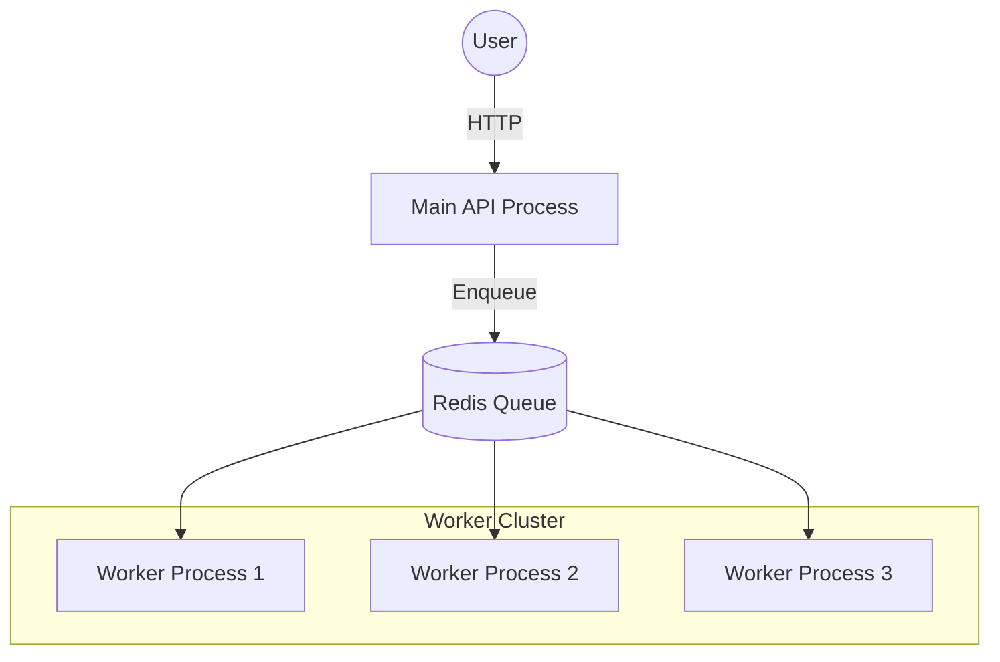

# 👷 Worker Processes: The Unsung Heroes
> **Objective:** Design and manage dedicated processes for background execution | **Language:** Hinglish | **Standard:** 2026 Expert Framework

---

## 🧭 1. Beginner-Friendly Hinglish Explanation
Worker Processes ka matlab hai "Ek alag processor jo sirf heavy kaam ke liye hai".

- **The Problem:** Agar aapka backend server (Main Thread) heavy calculation kar raha hai, toh wo kisi naye user ki request nahi le payega. Site "Hang" ho jayegi.
- **The Solution:** Hum ek alag process chalate hain (Worker) jiska kaam naye users se baat karna nahi hai, balki purane orders ko process karna hai.
- **The Philosophy:** "Main Process" user ko khush rakhta hai (Fast UI), aur "Worker Process" mehnat wala kaam karta hai (Heavy Logic).
- **Intuition:** Restaurant mein:
  1. **Receptionist (Main Process):** Guests ko greet karta hai aur table deta hai.
  2. **Chef (Worker Process):** Kitchen mein khana banata hai. Chef bahar aakar guests se baat nahi karta.

---

## 🧠 2. Deep Technical Explanation
### 1. Process Isolation:
A Worker is a separate OS process. If a worker crashes because of a bug (e.g., Infinite Loop), the Main API process stays alive.

### 2. Communication (IPC):
Workers usually talk to the Main process via a **Message Broker** (Redis/RabbitMQ) rather than direct memory. This allows workers to run on different physical servers.

### 3. Types of Workers:
- **Generic Worker:** Handles any job from the queue.
- **Specialized Worker:** Only handles specific tasks (e.g., Image processing only).
- **Scheduled Worker:** Only runs at specific times (Cron).

---

## 🏗️ 3. Architecture Diagrams (Main vs Worker)


---

## 💻 4. Production-Ready Examples (Running a Separate Worker)
```typescript
// 2026 Standard: Dedicated Worker Entry Point

// 📂 src/worker.ts
import { Worker } from 'bullmq';
import { processHeavyTask } from './services/taskProcessor';

const worker = new Worker('task-queue', async (job) => {
  console.log(`Starting Job: ${job.id}`);
  await processHeavyTask(job.data);
}, {
  connection: { host: 'localhost', port: 6379 },
  concurrency: 5 // Handle 5 jobs in parallel in THIS process
});

worker.on('failed', (job, err) => {
  // Alerting logic (Sentry/Slack)
  console.error(`Job ${job?.id} failed!`);
});

// 💡 Pro Tip: Run this with 'pm2 start src/worker.ts' 
// separate from your API 'pm2 start src/app.ts'.
```

---

## 🌍 5. Real-World Use Cases
- **Analytics:** Aggregating billions of logs into daily reports.
- **Video Rendering:** Processing user-uploaded clips (TikTok/YouTube).
- **Search Indexing:** Updating the ElasticSearch index whenever a product is added.

---

## ❌ 6. Failure Cases
- **Ghost Workers:** A worker that is running but not connected to the queue.
- **Resource Hogging:** One worker taking 100% CPU and 90% RAM, starving other workers on the same machine. **Fix: Use Docker resource limits.**
- **Database Connection Pool:** Too many workers opening too many connections, crashing the DB.

---

## 🛠️ 7. Debugging Section
| Command | Purpose | Tip |
| :--- | :--- | :--- |
| **`pm2 list`** | Monitoring | See if the worker process is `online` or `errored`. |
| **`top` / `htop`** | OS Check | See which specific worker process is eating the most CPU. |
| **`bull-board`** | Job Check | See which worker is currently processing which job ID. |

---

## ⚖️ 8. Tradeoffs
- **Shared vs Dedicated Machines:** Running workers on the same machine as the API is cheaper; running on dedicated machines is more reliable and scalable.

---

## 🛡️ 9. Security Concerns
- **Privilege Escalation:** If a worker processes user-uploaded scripts, it must run in a sandboxed environment (Docker/VM) with NO access to internal secrets.

---

## 📈 10. Scaling Challenges
- **Autoscaling:** Spinning up 50 extra workers during a traffic spike and shutting them down at night to save money.

---

## 💸 11. Cost Considerations
- **Spot Instances:** Since workers can be restarted easily, use cheap AWS Spot instances to run them. If AWS takes the instance back, the job simply goes back to the queue.

---

## ✅ 12. Best Practices
- **Separate code for API and Worker.**
- **Use Concurrency settings wisely.**
- **Graceful Shutdown:** When stopping a worker, wait for it to finish the current job.
- **Log everything.**

---

## ⚠️ 13. Common Mistakes
- **Running worker logic inside the API process.**
- **Not setting memory limits for workers.**

---

## 📝 14. Interview Questions
1. "How do you ensure a worker doesn't process the same job twice?"
2. "How do you scale workers independently of the API?"
3. "What happens to a job if the worker process crashes mid-way?"

---

## 🚀 15. Latest 2026 Production Patterns
- **KEDA (Kubernetes Event-driven Autoscaling):** Automatically scaling the number of worker pods in your cluster based on the number of messages in Redis/SQS.
- **FaaS Workers:** Using AWS Lambda as a "Transient Worker" that only exists for the duration of a single heavy task.
漫
