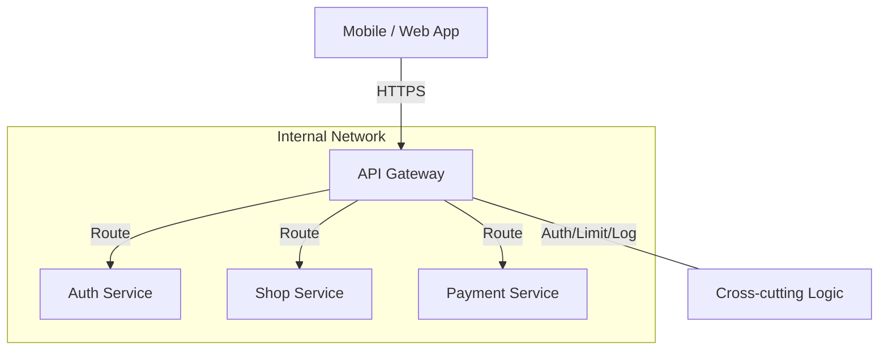

# 🚪 API Gateway: The Single Entry Point
> **Objective:** Design a centralized entry point for all client-to-backend communication | **Language:** Hinglish | **Standard:** 2026 Expert Framework

---

## 🧭 1. Beginner-Friendly Hinglish Explanation
API Gateway ka matlab hai "Aapke backend ka main darwaza (Main Gate)".

- **The Problem:** Microservices mein 50 alag services ho sakti hain. Kya frontend ko 50 alag URLs yaad rakhne chahiye? Kya har service ko apna Auth aur Rate Limiting khud karna chahiye? (Bilkul nahi).
- **The Solution:** Hum aage ek "Gateway" laga dete hain. Frontend sirf is Gateway se baat karta hai.
- **The Job:** 
  1. **Routing:** `/auth` ko Auth Service par bhejo, `/order` ko Order Service par.
  2. **Auth:** Check karo user logged in hai ya nahi, tabhi aage jane do.
  3. **Rate Limiting:** Ek user ko 1 second mein 10 se zyada calls mat karne do.
- **Intuition:** Ye ek "Receptionist" ki tarah hai. Aap building mein kisi se bhi milna chahte hon, aap receptionist se milte hain. Wo check karti hai ki aapka appointment hai ya nahi (Auth), aur phir aapko sahi kamre (Service) mein bhej deti hai.

---

## 🧠 2. Deep Technical Explanation
### 1. Cross-Cutting Concerns:
The Gateway handles logic that is common to all services:
- **Authentication & Authorization:** Verify JWT/API Keys once.
- **SSL Termination:** Handling HTTPS at the gateway.
- **Request Aggregation:** Combine results from 3 services into 1 response for the client.
- **Protocol Translation:** Convert REST calls to internal gRPC calls.

### 2. Popular Tools:
- **Kong / KrakenD:** High-performance specialized gateways.
- **AWS API Gateway:** Managed cloud service.
- **Nginx / HAProxy:** Can be used as simple gateways.

### 3. Backend-for-Frontend (BFF):
A specific type of gateway designed for a specific frontend (e.g., one gateway for Mobile App, another for Web App).

---

## 🏗️ 3. Architecture Diagrams (The Gateway Flow)


---

## 💻 4. Production-Ready Examples (Conceptual Nginx Gateway)
```nginx
# 2026 Standard: Nginx as a Reverse Proxy Gateway

server {
    listen 443 ssl;
    server_name api.susa.com;

    # 1. Global Rate Limiting
    limit_req zone=one burst=5;

    # 2. Routing to Services
    location /auth {
        proxy_pass http://auth_service:3000;
    }

    location /orders {
        proxy_pass http://order_service:3001;
    }

    # 3. Security Headers
    add_header X-Frame-Options DENY;
}
```

---

## 🌍 5. Real-World Use Cases
- **Public APIs (Stripe/Twilio):** Using a gateway to manage millions of API keys and bill customers per call.
- **E-commerce:** Aggregating product info, reviews, and stock levels in one "Product Detail" call.
- **Legacy Migration:** Routing 90% of traffic to the old Monolith and 10% to new Microservices.

---

## ❌ 6. Failure Cases
- **Single Point of Failure (SPOF):** If the Gateway goes down, the entire application is dead. **Fix: Use High-Availability (HA) Gateways.**
- **Gateway Bloat:** Putting business logic (e.g., calculating discounts) inside the gateway. **Fix: Keep the gateway "Thin"—only routing and cross-cutting logic.**
- **Latency:** Every request has an extra "Hop" through the gateway.

---

## 🛠️ 7. Debugging Section
| Problem | Diagnostic | Solution |
| :--- | :--- | :--- |
| **502 Bad Gateway** | Target Service Down | The Gateway can't reach the service. Check if the internal service is running. |
| **401 Unauthorized** | Gateway Auth Fail | The JWT verification failed at the Gateway level. Check the secret key. |
| **Slow Response** | Gateway Timeout | Increase the timeout setting in the Gateway or optimize the internal service. |

---

## ⚖️ 8. Tradeoffs
- **Centralized Control (Easy management) vs Performance (Added latency).**

---

## 🛡️ 9. Security Concerns
- **WAF Integration:** Most gateways integrate with a Web Application Firewall to block SQL Injection and XSS attacks.
- **IP Whitelisting:** Allowing only specific client IPs.

---

## 📈 10. Scaling Challenges
- **Scaling the Gateway:** The Gateway itself needs to be scaled horizontally using a Load Balancer (like AWS ELB) in front of it.

---

## 💸 11. Cost Considerations
- **AWS API Gateway Pricing:** You pay per million requests. For high-traffic apps, this can be more expensive than running your own Nginx/Kong instances.

---

## ✅ 12. Best Practices
- **Never put business logic in the Gateway.**
- **Enable Caching** at the gateway level for static responses.
- **Use Correlation IDs** to track requests through the gateway into the services.
- **Monitor Latency** added by the gateway.

---

## ⚠️ 13. Common Mistakes
- **Exposing internal service IPs** to the public. (Everything must go through the Gateway).
- **Not implementing proper timeouts.**

---

## 📝 14. Interview Questions
1. "What is an API Gateway and what problems does it solve?"
2. "Explain the difference between a Reverse Proxy and an API Gateway."
3. "What is the BFF (Backend-for-Frontend) pattern?"

---

## 🚀 15. Latest 2026 Production Patterns
- **Cloud-Native Gateways (Envoy):** Using high-performance, programmable proxies that integrate natively with Kubernetes.
- **AI Rate Limiting:** Gateways that use machine learning to detect and block "Abnormal" bot behavior while allowing real users.
- **Edge Gateways:** Moving the gateway logic to the CDN level (Edge) to handle Auth and Routing even closer to the user.
漫
