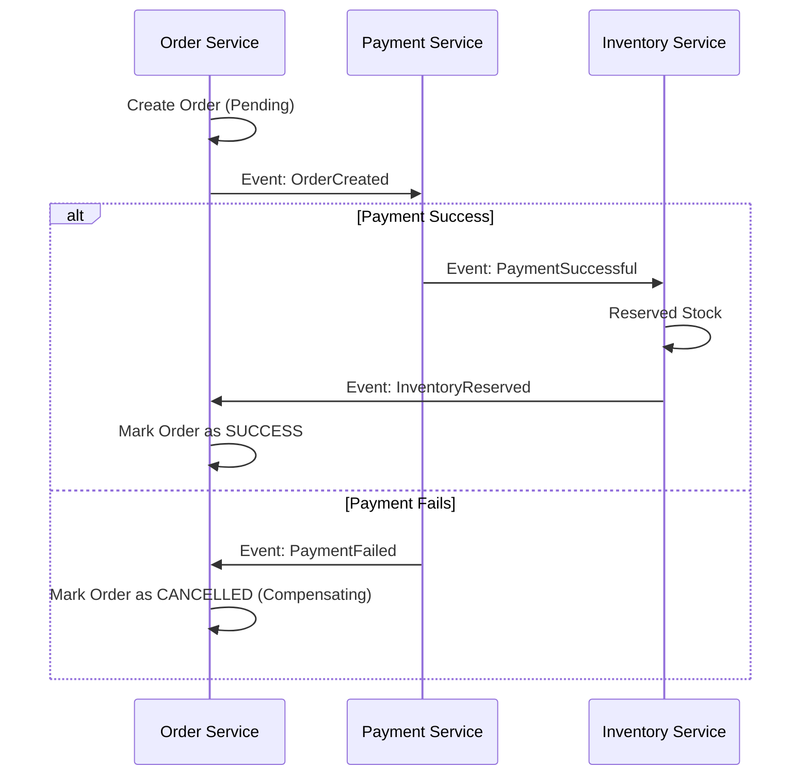

# 💸 Distributed Transactions: Consistency in a Split World
> **Objective:** Handle data consistency across multiple independent services and databases | **Language:** Hinglish | **Standard:** 2026 Expert Framework

---

## 🧭 1. Beginner-Friendly Hinglish Explanation
Distributed Transactions ka matlab hai "Multiple databases mein ek saath kaam pakka karna".

- **The Problem:** Ek Monolith mein, aap ek simple SQL Transaction use karte hain: "Agar payment fail hui, toh order cancel kardo". Poora kaam ek hi DB mein hota hai.
- **The Challenge:** Microservices mein Order ek DB mein hai aur Payment dusre DB mein. Agar Order service ne order save kar liya par Payment service crash ho gayi, toh kya hoga? Database alag hain, toh standard `BEGIN TRANSACTION` kaam nahi karega.
- **The Solution:** Humein advanced patterns chahiye jaise **2PC** (Two Phase Commit) ya **Saga**.
- **Intuition:** Ye ek "Group Vacation" plan karne jaisa hai. Jab tak sab log "Haan" nahi bolte, hotel book nahi hota. Agar ek ne "Naa" bola, toh poora plan cancel (Rollback) karna padta hai.

---

## 🧠 2. Deep Technical Explanation
### 1. Two-Phase Commit (2PC):
A central coordinator asks all services: "Ready to commit?". 
- **Phase 1 (Prepare):** All services lock their rows and say "Ready".
- **Phase 2 (Commit):** Coordinator says "Go!".
- **Cons:** Very slow, locks the databases, and if the coordinator dies, everyone is stuck.

### 2. Saga Pattern (Modern Standard):
Instead of one big transaction, we have a sequence of small local transactions.
- **Choreography:** Services talk to each other via events. If one fails, it emits a "Compensating Event" to undo previous steps.
- **Orchestration:** A central "Saga Manager" tells everyone what to do.

### 3. Compensating Transactions:
In a distributed world, you don't "Rollback" (Undo). You "Compensate" (Redo with opposite logic). E.g., If payment fails, the "Compensating Transaction" for the Order service is to mark the order as "CANCELLED".

---

## 🏗️ 3. Architecture Diagrams (Saga Pattern - Choreography)


---

## 💻 4. Production-Ready Examples (Conceptual Saga Logic)
```typescript
// 2026 Standard: Handling a Compensating Transaction

// Order Service - Event Listener
eventBus.on('PAYMENT_FAILED', async (orderId) => {
  // We can't 'undo' the DB insert, so we update the status.
  await prisma.order.update({
    where: { id: orderId },
    data: { status: 'FAILED', reason: 'Payment Declined' }
  });
  
  // Also notify Inventory to release the items
  eventBus.publish('RELEASE_INVENTORY', { orderId });
});
```

---

## 🌍 5. Real-World Use Cases
- **Flight Booking:** Booking a flight (Service 1) and a hotel (Service 2). If the hotel is full, the flight must be cancelled.
- **E-commerce:** Deducting money (Payment) and reducing stock (Inventory).
- **Banking:** Transferring money between two different banks.

---

## ❌ 6. Failure Cases
- **Partial Failure:** Order is created, Payment is taken, but the Network dies before the Inventory is updated. Result: Money taken but no product. **Fix: Use Idempotent retries.**
- **The "Lost Update":** Two transactions trying to update the same remote record at once.
- **Non-atomic Rollbacks:** The "Undo" action (Compensating) also fails. **Fix: Human intervention / Retry forever.**

---

## 🛠️ 7. Debugging Section
| Problem | Diagnostic | Solution |
| :--- | :--- | :--- |
| **Inconsistent Data** | Distributed Tracing | Use a `correlationId` to see where the chain broke. |
| **Zombie Orders** | Query Status | Find orders stuck in "Pending" status for > 1 hour and trigger manual compensation. |

---

## ⚖️ 8. Tradeoffs
- **ACID (Monolith) vs BASE (Microservices):** 
  - **ACID:** Immediate consistency, simple logic.
  - **BASE:** Eventually consistent, highly scalable, complex logic.

---

## 🛡️ 9. Security Concerns
- **Fraudulent Compensation:** An attacker sending a fake "Payment Failed" event to get a free refund. **Fix: Digitally sign all events.**

---

## 📈 10. Scaling Challenges
- **Latency:** Sagas can take seconds or minutes to complete. The frontend must handle this "In Progress" state.

---

## 💸 11. Cost Considerations
- **Development Time:** Distributed transactions are $5x$ harder to write and test than local ones.

---

## ✅ 12. Best Practices
- **Avoid Distributed Transactions if possible.** (Can you merge the services?).
- **Use the Saga Pattern.**
- **Design all steps to be Idempotent.**
- **Ensure eventual consistency.**

---

## ⚠️ 13. Common Mistakes
- **Expecting immediate consistency.**
- **Not logging the state changes in every service.**

---

## 📝 14. Interview Questions
1. "What is the Saga Pattern?"
2. "Explain the difference between Choreography and Orchestration in Sagas."
3. "What is a Compensating Transaction?"

---

## 🚀 15. Latest 2026 Production Patterns
- **Temporal.io:** A specialized workflow engine that makes writing complex distributed transactions as easy as writing a standard `try/catch` block.
- **Outbox Pattern:** Ensuring that a DB update and an Event publication happen atomically within a single service.
漫
