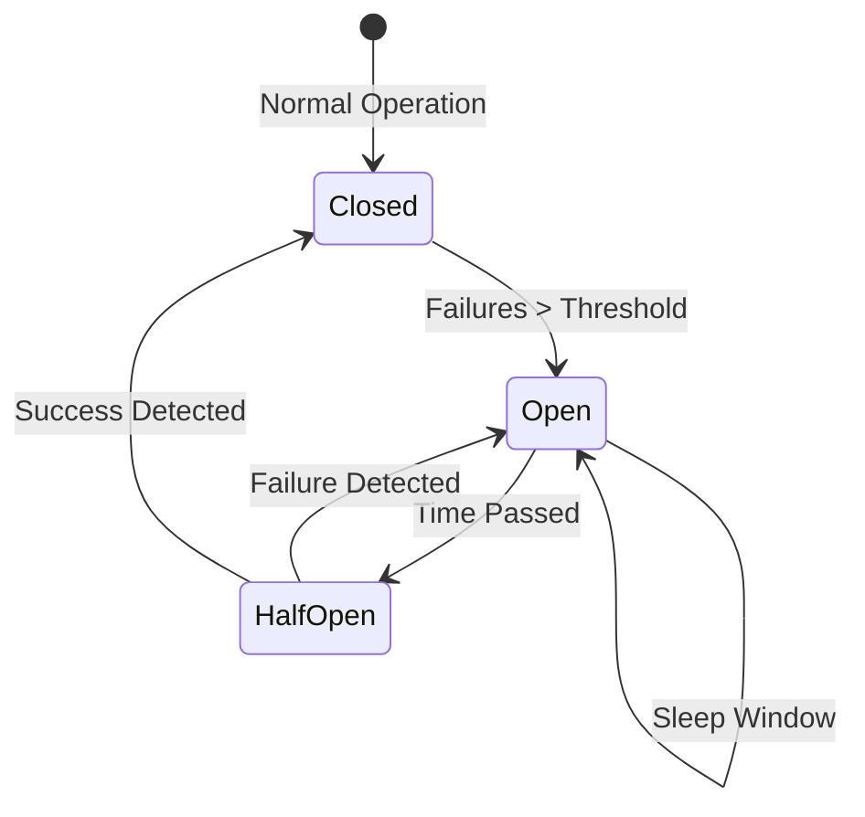

# 💣 Microservices Failure Patterns: Surviving the Chaos
> **Objective:** Design resilient systems that don't collapse when one service fails | **Language:** Hinglish | **Standard:** 2026 Expert Framework

---

## 🧭 1. Beginner-Friendly Hinglish Explanation
Microservices Failure Patterns ka matlab hai "System ko girne se bachane ke tarike".

- **The Problem:** Microservices mein "Network" ek bada dushman hai. Agar aapka server down hai, ya network slow hai, toh ek service ki galti poore system ko le doobegi (Cascading Failure).
- **The Solution:** Humein "Design for Failure" karna chahiye. Hum maante hain ki services fail hongi, isliye hum safety switches lagate hain.
- **The Concept:** 
  1. **Circuit Breaker:** Fuse ki tarah, agar short circuit (service failure) ho, toh light (traffic) band kardo.
  2. **Retry:** Dobara koshish karo.
  3. **Fallback:** Agar main rasta band hai, toh dusre raste se jao (e.g., Cache se data de do).
- **Intuition:** Ye ek "Electric Fuse" ki tarah hai. Agar ghar ki ek machine (Service) kharab ho, toh fuse ud jata hai taaki poore ghar mein aag (Crash) na lage.

---

## 🧠 2. Deep Technical Explanation
### 1. Cascading Failure:
Service A waits for Service B, which is waiting for Service C. If Service C hangs, all three services' threads get blocked, and the whole backend stops responding.

### 2. Circuit Breaker States:
- **Closed:** Everything is normal. Requests flow through.
- **Open:** Service is failing. Requests are rejected immediately (Fast Fail).
- **Half-Open:** Periodically checking if the service has recovered.

### 3. Bulkhead Pattern:
Isolating resources (like thread pools) so that if the "Payment" thread pool is full, it doesn't stop the "Search" service from working. (Named after ship compartments).

---

## 🏗️ 3. Architecture Diagrams (Circuit Breaker Logic)


---

## 💻 4. Production-Ready Examples (Circuit Breaker with Opossum)
```typescript
// 2026 Standard: Implementing a Circuit Breaker in Node.js

import CircuitBreaker from 'opossum';

const callPaymentService = async (data) => {
  // Logic to call the external service
};

const options = {
  timeout: 3000, // 3 seconds
  errorThresholdPercentage: 50, // Open circuit if 50% calls fail
  resetTimeout: 30000 // Wait 30s before trying again
};

const breaker = new CircuitBreaker(callPaymentService, options);

// Using the breaker
breaker.fire(paymentData)
  .then(console.log)
  .catch(err => {
    // Fallback logic
    console.log("Using cached payment status...");
  });

breaker.on('open', () => console.warn('🚨 CIRCUIT OPEN: Payment Service is failing!'));
```

---

## 🌍 5. Real-World Use Cases
- **Recommendation Engine:** If the "AI Recommendation" service is slow, the "Shop" service should just show "Popular Products" (Fallback) instead of waiting and crashing.
- **Payment Processing:** If the primary payment gateway is down, automatically switch to the secondary one.
- **Third-party APIs:** Protecting your app from a slow Twitter/GitHub API.

---

## ❌ 6. Failure Cases
- **Silent Failures:** The circuit is open, but you are not logging it, so you don't know your app is in "Fallback" mode.
- **Aggressive Retries:** Retrying every 10ms, which DDOSes your already struggling service. **Fix: Use Exponential Backoff.**
- **Timeout Mismatch:** Service A waits for 10s, but the Gateway kills the connection in 5s.

---

## 🛠️ 7. Debugging Section
| Status | Meaning | Tip |
| :--- | :--- | :--- |
| **TimeoutError** | Service too slow | Check network latency or DB load on the target service. |
| **CircuitOpenedError** | Circuit is OPEN | Stop debugging the code; the remote service is fundamentally broken. |

---

## ⚖️ 8. Tradeoffs
- **User Experience (Slow) vs Stability (Error):** Is it better for the user to wait 30 seconds or see an "Error" in 1 second? In 2026, **Fast Fail** is preferred.

---

## 🛡️ 9. Security Concerns
- **Error Information Leak:** Don't show the full stack trace of the failed service to the end user.

---

## 📈 10. Scaling Challenges
- **State across Servers:** If Server 1 opens its circuit to Service B, Server 2 might still be trying to call it. **Fix: Use a shared state for Circuit Breakers.**

---

## 💸 11. Cost Considerations
- **Compute Waste:** If you don't use circuit breakers, your servers will waste CPU/RAM waiting for dead services.

---

## ✅ 12. Best Practices
- **Always set timeouts.**
- **Implement Fallbacks.**
- **Monitor Circuit Breaker states.**
- **Use Bulkheads for resource isolation.**

---

## ⚠️ 13. Common Mistakes
- **Not using timeouts at all.**
- **Using a single circuit breaker** for multiple different services.

---

## 📝 14. Interview Questions
1. "What is a Cascading Failure?"
2. "Explain the 3 states of a Circuit Breaker."
3. "What is the Bulkhead pattern?"

---

## 🚀 15. Latest 2026 Production Patterns
- **Chaos Engineering (Gremlin/Chaos Mesh):** Purposely killing your own services in production to test if your circuit breakers and fallbacks actually work.
- **Service Mesh Retries:** Letting the sidecar (Envoy) handle all the retry/circuit-breaking logic so your code stays clean.
漫
