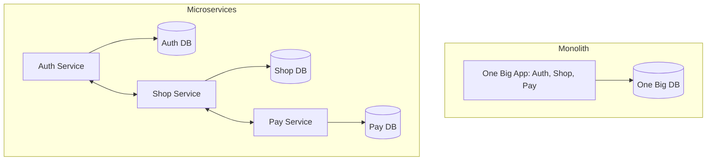

# 🏗️ Microservices Fundamentals: The Art of Breaking Things
> **Objective:** Master the transition from Monolith to a distributed system architecture | **Language:** Hinglish | **Standard:** 2026 Expert Framework

---

## 🧭 1. Beginner-Friendly Hinglish Explanation
Microservices ka matlab hai "Ek giant machine ko choti-choti independent machines mein baantna".

- **The Problem:** Ek "Monolith" (saara code ek hi folder mein) jab bada hota hai, toh use manage karna mushkil ho jata hai. Ek choti si galti poore system ko crash kar sakti hai.
- **The Solution:** Humein system ko functions ke hisaab se todna chahiye (e.g., Auth Service, Payment Service, Order Service).
- **The Concept:** Har service ki apni Database, apni Language, aur apni Team ho sakti hai.
- **Intuition:** Ye ek "Food Court" ki tarah hai. "Pizza Corner" pizza handle karta hai, "Burger King" burger. Agar Burger King ki machine kharab ho jaye, toh Pizza Corner chalta rehta hai. Monolith ek aise restaurant ki tarah hai jahan ek hi chef sab banata hai—agar chef beemar, toh restaurant band!

---

## 🧠 2. Deep Technical Explanation
### 1. Characteristics:
- **Autonomous:** Services are developed, deployed, and scaled independently.
- **Specialized:** Each service solves one specific problem (Single Responsibility).
- **Decentralized Data:** Each microservice should own its data. No shared databases!

### 2. Monolith vs Microservices:
| Feature | Monolith | Microservices |
| :--- | :--- | :--- |
| **Deployment** | All at once | Independent |
| **Scaling** | Scale the whole app | Scale specific services |
| **Failure** | Cascading (Full crash) | Isolated |
| **Complexity** | Low (Internal calls) | High (Network calls) |

### 3. Conway's Law:
Organizations design systems that mirror their communication structure. Microservices allow small teams to move fast without steping on each other's toes.

---

## 🏗️ 3. Architecture Diagrams (The Monolith vs Microservices)


---

## 💻 4. Production-Ready Examples (Conceptual Service Split)
```typescript
// 2026 Standard: Defining a Service Interface

// Instead of importing Auth logic into the Shop service, 
// we call the Auth Service via HTTP or gRPC.

const checkUserAuth = async (token: string) => {
  const response = await fetch('https://auth-service/verify', {
    headers: { Authorization: `Bearer ${token}` }
  });
  return response.json();
};

// 💡 Pro Tip: Every service should have its own package.json, 
// its own Dockerfile, and its own CI/CD pipeline.
```

---

## 🌍 5. Real-World Use Cases
- **Netflix:** Has 1000+ microservices (Recommendation, Playback, Billing, UI).
- **Amazon:** One page load makes 100+ internal service calls.
- **Uber:** Real-time location tracking is a separate service from the Billing service.

---

## ❌ 6. Failure Cases
- **Distributed Monolith:** Services that are so tightly coupled that you have to deploy all of them together anyway. **Fix: Use Event-Driven communication.**
- **Shared Database:** Two services talking to the same DB tables. If Service A changes the schema, Service B crashes.
- **Network Latency:** Making too many "Chatty" calls between services, slowing down the final response.

---

## 🛠️ 7. Debugging Section
| Problem | Diagnostic | Solution |
| :--- | :--- | :--- |
| **Service A can't find Service B** | Service Discovery | Check if your Service Discovery tool (Consul/K8s) is working. |
| **Request is slow** | Distributed Tracing | Use **OpenTelemetry** to see which service in the chain is taking the most time. |

---

## ⚖️ 8. Tradeoffs
- **Flexibility vs Complexity:** You get independent scaling, but you lose simple debugging and data consistency.

---

## 🛡️ 9. Security Concerns
- **Zero Trust:** Don't assume an internal service is safe. Use **mTLS** (Mutual TLS) so services must authenticate with each other.
- **JWT Propagation:** Passing user identity safely between services.

---

## 📈 10. Scaling Challenges
- **Data Consistency:** Since each service has its own DB, you can't use SQL Joins across services. **Fix: Use API Composition or CQRS.**

---

## 💸 11. Cost Considerations
- **Infrastructure Overhead:** Running 10 small services costs more than one big server because of duplicated overhead (RAM for OS, logging, etc.).

---

## ✅ 12. Best Practices
- **Design for Failure (Circuit Breakers).**
- **Use an API Gateway.**
- **Automate everything (CI/CD).**
- **Log centrally (ELK Stack).**

---

## ⚠️ 13. Common Mistakes
- **Starting with Microservices** for a small project (Premature complexity).
- **Not having a clear boundary** between services (Domain-Driven Design).

---

## 📝 14. Interview Questions
1. "What is Conway's Law?"
2. "Why is a shared database considered an anti-pattern in microservices?"
3. "How do you handle transactions across multiple microservices?"

---

## 🚀 15. Latest 2026 Production Patterns
- **Service Mesh (Istio/Linkerd):** A layer that handles communication, security, and retries automatically for all your services.
- **Serverless Microservices:** Each service being a set of Lambda functions, scaling to zero when not in use.
- **Cell-based Architecture:** Grouping related microservices into "Cells" for better isolation and fault tolerance.
漫
