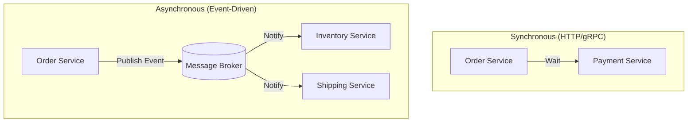

# 🗣️ Service Communication: Synchronous vs Asynchronous
> **Objective:** Master the ways microservices talk to each other | **Language:** Hinglish | **Standard:** 2026 Expert Framework

---

## 🧭 1. Beginner-Friendly Hinglish Explanation
Service Communication ka matlab hai "Do microservices ka aapas mein baat karna".

- **The Problem:** Microservices alag-alag hain, par kaam toh unhe milkar hi karna hai. 
- **The Solution:** 
  1. **Synchronous (Direct):** Service A, Service B ko call karti hai aur "Jawab" (Response) ka intezar karti hai. (Jaise Phone Call).
  2. **Asynchronous (Indirect):** Service A ek message 'Drop' kar deti hai, aur Service B use baad mein dekh leti hai. (Jaise WhatsApp Message).
- **Intuition:** 
  - **Sync:** Jab aap waiter ko bula kar "Pani lao" kehte hain aur wo le aata hai.
  - **Async:** Jab aap pizza order karke ghar aa jate hain aur delivery boy baad mein pizza de jata hai.

---

## 🧠 2. Deep Technical Explanation
### 1. Synchronous (HTTP / gRPC):
- **HTTP/REST:** Standard, easy to debug, but slow because of JSON overhead and TCP connection time.
- **gRPC:** Built on HTTP/2. Uses Binary (Protobuf). $10x$ faster than REST. Perfect for internal service-to-service calls.

### 2. Asynchronous (Message Brokers):
- **Patterns:** Pub/Sub, Point-to-Point.
- **Tools:** RabbitMQ, Kafka, Redis Streams.
- **Benefits:** Decoupling (Service A doesn't need to know if B is online), Backpressure handling.

### 3. Protocol Buffers (Protobuf):
A language-neutral way of serializing structured data. It defines a "Contract" (e.g., `user.proto`) that both services must follow.

---

## 🏗️ 3. Architecture Diagrams (Sync vs Async Flows)


---

## 💻 4. Production-Ready Examples (gRPC Basics)
```protobuf
// 2026 Standard: Defining a gRPC Contract (user.proto)

syntax = "proto3";

package user;

service UserService {
  rpc GetUser (UserRequest) returns (UserResponse) {}
}

message UserRequest {
  string id = 1;
}

message UserResponse {
  string name = 1;
  string email = 2;
}
```

```typescript
// Node.js gRPC Client Call
const client = new UserServiceClient('localhost:50051', grpc.credentials.createInsecure());

client.getUser({ id: '123' }, (err, response) => {
  console.log('User Name:', response.name);
});
```

---

## 🌍 5. Real-World Use Cases
- **Checkout Flow:** Order service calls Payment service (Sync) because the user needs to know immediately if the card was declined.
- **Email Notifications:** Order service sends an event (Async) to Email service. It doesn't matter if the email arrives 10 seconds later.
- **Logging/Analytics:** All services push events (Async) to a central dashboard.

---

## ❌ 6. Failure Cases
- **Cascading Failure:** Service A waits for B, B waits for C. If C is slow, all 3 services stop working. **Fix: Use Circuit Breakers.**
- **Network Glitch:** A message is published but the broker is down. **Fix: Use 'Outbox Pattern'.**
- **Incompatible Versions:** Service A expects JSON field `user_name`, but Service B renamed it to `name`. **Fix: Use API Versioning.**

---

## 🛠️ 7. Debugging Section
| Tool | Purpose | Tip |
| :--- | :--- | :--- |
| **Wireshark** | Packet Sniffing | Use this to see the raw gRPC binary data traveling between services. |
| **BloomRPC** | gRPC GUI | Like Postman, but for testing gRPC services. |
| **Jaeger / Zipkin** | Tracing | See a visual timeline of how a request moved from Service A to B to C. |

---

## ⚖️ 8. Tradeoffs
- **Sync (REST/gRPC):** Low latency, easier to code; but creates tight coupling.
- **Async (Events):** High reliability, loose coupling; but harder to debug and ensure data consistency.

---

## 🛡️ 9. Security Concerns
- **API Keys / mTLS:** Ensuring Service A is actually allowed to talk to Service B.
- **Sensitive Data:** Don't send passwords in plain-text events.

---

## 📈 10. Scaling Challenges
- **Service Mesh Overhead:** Adding Istio/Linkerd adds a small latency to every call.
- **Message Ordering:** In Async, ensuring Event 1 is processed before Event 2.

---

## 💸 11. Cost Considerations
- **Bandwidth:** JSON is "Chatty" and larger. Switching to gRPC can lower inter-service bandwidth costs by $40\%$.

---

## ✅ 12. Best Practices
- **Use gRPC for internal, high-speed communication.**
- **Use Async (Events) for non-critical background tasks.**
- **Define clear API Contracts.**
- **Implement timeouts on every call.**

---

## ⚠️ 13. Common Mistakes
- **Using HTTP for everything.**
- **Making circular dependencies** (A calls B, B calls A).
- **Not handling the 'Service Down' case** (No fallback).

---

## 📝 14. Interview Questions
1. "What is gRPC and why is it faster than REST?"
2. "Explain Synchronous vs Asynchronous communication."
3. "How do you prevent 'Cascading Failures' in microservices?"

---

## 🚀 15. Latest 2026 Production Patterns
- **GraphQL Federation:** Allowing frontend to query multiple microservices via a single GraphQL endpoint that handles the internal sync calls.
- **Sidecar Proxy:** Every service has a "Helper" (Envoy) that handles all the network logic, so the developer only writes business logic.
漫
