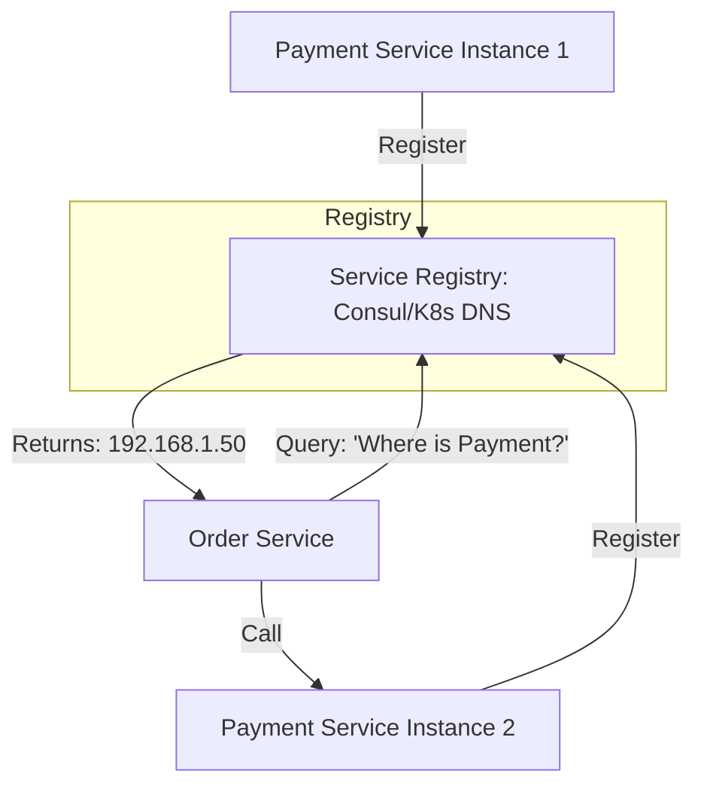

# 🔍 Service Discovery: Finding Services in the Cloud
> **Objective:** Automate how microservices find and communicate with each other | **Language:** Hinglish | **Standard:** 2026 Expert Framework

---

## 🧭 1. Beginner-Friendly Hinglish Explanation
Service Discovery ka matlab hai "Microservices ki phone directory".

- **The Problem:** Cloud mein servers ke IP addresses humesha badalte rehte hain (Auto-scaling). Maan lijiye Order Service ko Payment Service ko call karna hai. Wo IP `192.168.1.10` par call karti hai, par agle hi minute wo server delete ho jata hai aur naya server `192.168.1.50` par aa jata hai. Order service ko kaise pata chalega?
- **The Solution:** Humein ek "Registry" chahiye. Jab bhi koi naya server aata hai, wo khud ko register karta hai: "Main Payment Service hoon, mera IP ye hai".
- **The Job:** 
  1. **Registration:** Naya service instance registry ko batata hai ki wo "Zinda" hai.
  2. **Querying:** Purani service registry se puchti hai: "Bhai, Payment Service kahan hai?".
- **Intuition:** Ye "Truecaller" ki tarah hai. Aapko samne wale ka number (IP) yaad rakhne ki zaroorat nahi hai, aap bas uska naam (Service Name) search karte hain.

---

## 🧠 2. Deep Technical Explanation
### 1. Client-side vs Server-side Discovery:
- **Client-side:** The client (Service A) asks the Registry for the IP, then calls the IP directly. (Fast, but client needs discovery logic).
- **Server-side:** The client calls a Load Balancer. The Load Balancer asks the Registry and routes the request. (Standard in AWS/K8s).

### 2. Service Registry:
A highly available database that stores the location of all service instances.
- **Popular Tools:** **Consul**, **Eureka**, **Etcd**, **Kubernetes (Internal DNS)**.

### 3. Health Checks:
The registry must periodically check if the services are still "Alive". If a service doesn't respond to a ping, it is removed from the registry so no one calls a dead server.

---

## 🏗️ 3. Architecture Diagrams (The Discovery Flow)


---

## 💻 4. Production-Ready Examples (Conceptual Consul Config)
```typescript
// 2026 Standard: Registering a service in Node.js

const consul = require('consul')();

const serviceDetails = {
  name: 'order-service',
  address: '10.0.0.5',
  port: 3000,
  check: {
    http: 'http://10.0.0.5:3000/health',
    interval: '10s'
  }
};

// 1. Register on start
consul.agent.service.register(serviceDetails, (err) => {
  if (err) throw err;
  console.log('Registered in Consul!');
});

// 2. Deregister on shutdown
process.on('SIGTERM', () => {
  consul.agent.service.deregister('order-service', () => process.exit());
});
```

---

## 🌍 5. Real-World Use Cases
- **Dynamic Scaling:** Adding 50 new servers during a sale; they all automatically start receiving traffic without manual config.
- **Blue-Green Deployments:** Registering the "Green" version and slowly deregistering the "Blue" version.
- **Multi-region Routing:** Finding the nearest instance of a service in a global network.

---

## ❌ 6. Failure Cases
- **Stale Registry:** A service crashed but the Registry still thinks it's alive (until the next health check). Result: 502/504 errors. **Fix: Short health-check intervals.**
- **Registry Down:** If the Registry fails, no service can find any other service. **Fix: Use distributed registries like Etcd.**
- **Network Partition:** Service A can't reach the Registry, so it thinks all other services are down.

---

## 🛠️ 7. Debugging Section
| Tool | Purpose | Tip |
| :--- | :--- | :--- |
| **`dig payment-service.default.svc.cluster.local`** | K8s DNS Check | Verify if the Kubernetes DNS is returning the correct internal IP. |
| **Consul UI** | Dashboard | Open the browser to see which services are "Red" (Unhealthy) and why. |

---

## ⚖️ 8. Tradeoffs
- **Complexity vs Automation:** Manual IP config is easy but impossible at scale. Service Discovery is complex to set up but essential for cloud-native apps.

---

## 🛡️ 9. Security Concerns
- **Unauthorized Registration:** A malicious service registering itself as "Payment Service" to steal data. **Fix: Use ACLs and Tokens in your Discovery tool.**

---

## 📈 10. Scaling Challenges
- **The "N+1" Problem:** In a massive system with 10,000 services, the traffic to the Registry itself becomes a bottleneck.

---

## 💸 11. Cost Considerations
- **Managed Discovery:** Cloud providers charge for managed discovery services (like AWS Cloud Map).

---

## ✅ 12. Best Practices
- **Use Kubernetes DNS** if you are already on K8s (It's free and automatic).
- **Implement Robust Health Checks.**
- **Use TTL for registration.**
- **Cache discovery results** locally to avoid hitting the registry on every single call.

---

## ⚠️ 13. Common Mistakes
- **Hardcoding IPs** in the `.env` file for internal services.
- **Not deregistering** a service when it shuts down (leads to 'Ghost' entries).

---

## 📝 14. Interview Questions
1. "What is Service Discovery and why is it needed in Microservices?"
2. "Explain the difference between Client-side and Server-side discovery."
3. "How does a Service Registry know if a service is unhealthy?"

---

## 🚀 15. Latest 2026 Production Patterns
- **Service Mesh (Istio):** Service discovery is built-in. You just call `http://payment-service` and the mesh handles everything invisibly.
- **Cross-Cluster Discovery:** Allowing services in AWS to find services in GCP using a shared discovery layer.
漫
