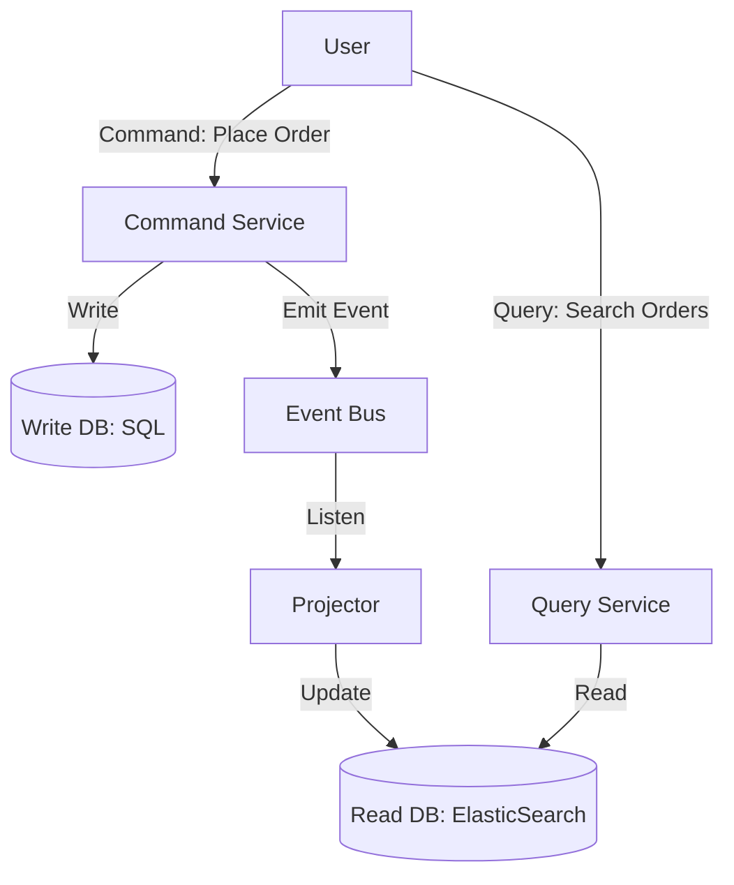

# 🗄️ CQRS: Command Query Responsibility Segregation
> **Objective:** Separate the logic for "Writing Data" from "Reading Data" for ultimate scale | **Language:** Hinglish | **Standard:** 2026 Expert Framework

---

## 🧭 1. Beginner-Friendly Hinglish Explanation
CQRS ka matlab hai "Likhne wala rasta aur Padhne wala rasta alag-alag karna".

- **The Problem:** Standard apps mein hum ek hi Model use karte hain. Wahi model Order place karta hai (Write) aur wahi model "Top 10 Orders" dikhata hai (Read). Par "Reading" logic aksar complex hota hai (Joins, Search, Filters).
- **The Solution:** Humein do alag systems chahiye:
  1. **Commands (Writes):** Sirf data badalne ke liye (e.g., Create Order). Optimized for consistency.
  2. **Queries (Reads):** Sirf data dekhne ke liye (e.g., Get Dashboard). Optimized for speed.
- **Intuition:** Ye ek "Library" ki tarah hai.
  - **The Librarian (Write):** Books ko shelf par sahi jagah rakhti hai (Slow, careful).
  - **The Catalog (Read):** Ek register ya computer jahan se aap turant dekh sakte hain kaunsi book kahan hai (Fast, easy).

---

## 🧠 2. Deep Technical Explanation
### 1. The Split:
- **Command Side:** Validates business rules. Updates the primary DB (Source of Truth).
- **Query Side:** A "Projected" view of the data. Often stored in a Read-Optimized DB like **ElasticSearch** or a **De-normalized SQL Table**.

### 2. Synchronization:
When a Command finishes, it emits an **Event**. A "Projector" listens to this event and updates the Read DB.
- **Eventual Consistency:** There might be a 100ms delay between saving a post and it appearing in the search results.

### 3. Why Use It?
- **Independent Scaling:** You can have 1 Write server and 50 Read servers (since reads are $100x$ more common).
- **Optimized Schemas:** The Read DB can have a completely different structure than the Write DB.

---

## 🏗️ 3. Architecture Diagrams (CQRS with Event Bus)


---

## 💻 4. Production-Ready Examples (Conceptual Structure)
```typescript
// 2026 Standard: Separating Controllers

// 1. COMMAND: Place Order
class OrderCommandController {
  async handle(req, res) {
    const order = await OrderDomain.create(req.body);
    await EventBus.publish('ORDER_CREATED', order);
    res.status(201).send({ id: order.id });
  }
}

// 2. QUERY: Get Order Statistics
class OrderQueryController {
  async handle(req, res) {
    // Reads from a flattened Read DB, no complex joins needed
    const stats = await ReadDB.query('SELECT * FROM order_stats_view');
    res.send(stats);
  }
}
```

---

## 🌍 5. Real-World Use Cases
- **E-commerce Search:** Writing to Postgres (Command) but searching via ElasticSearch (Query).
- **Banking Apps:** Moving money (Command) but showing a complex "Spending Graph" (Query).
- **Social Media:** Posting a tweet (Command) but seeing it in 100 different feeds/hashtags (Query).

---

## ❌ 6. Failure Cases
- **Lag:** The Read DB is 10 seconds behind the Write DB. User is confused. **Fix: Use Sockets to notify UI to refresh.**
- **Projector Crash:** If the projector dies, the Read DB becomes stale forever. **Fix: Implement "Replay" from the Event Store.**
- **Double Complexity:** Every new field must be added to two places (Command and Query).

---

## 🛠️ 7. Debugging Section
| Tool | Purpose | Tip |
| :--- | :--- | :--- |
| **Consistency Check** | Audit | Run a script that compares 100 random records in the Write DB and Read DB to ensure they match. |
| **Event Logs** | Tracking | If a Read DB record is wrong, check the event logs to see if the event was ever sent. |

---

## ⚖️ 8. Tradeoffs
- **High Performance & Scalability** vs **Extreme Complexity & Eventual Consistency.**

---

## 🛡️ 9. Security Concerns
- **Stale Data Permissions:** If a user's access is revoked in the Write DB, ensure it is also revoked (or checked) in the Query DB.

---

## 📈 10. Scaling Challenges
- **Massive Read Load:** If you have 10 million users, you need a cluster of Read DBs. CQRS makes this easy because Read DBs are "Disposable"—you can always rebuild them from the Write DB.

---

## 💸 11. Cost Considerations
- **Storage Double-up:** You are storing the same data twice (once in Write DB, once in Read DB).

---

## ✅ 12. Best Practices
- **Use different technologies** for Write (SQL) and Read (NoSQL/Search Index).
- **Keep the Command side clean** of any "Query" logic.
- **Expect eventual consistency** in the frontend.

---

## ⚠️ 13. Common Mistakes
- **Applying CQRS too early.** (Only use it for high-scale or high-complexity parts of the app).
- **Not having a way to "Re-sync"** the two databases.

---

## 📝 14. Interview Questions
1. "What is CQRS?"
2. "How do you keep the Read and Write databases in sync?"
3. "What is Eventual Consistency?"

---

## 🚀 15. Latest 2026 Production Patterns
- **Materialized Views in the Cloud:** Using services like **AWS Materialize** to create real-time SQL views of your event stream automatically.
- **GraphQL Subscriptions + CQRS:** Pushing the projected view directly to the user's browser via WebSockets the moment it's updated.
漫
