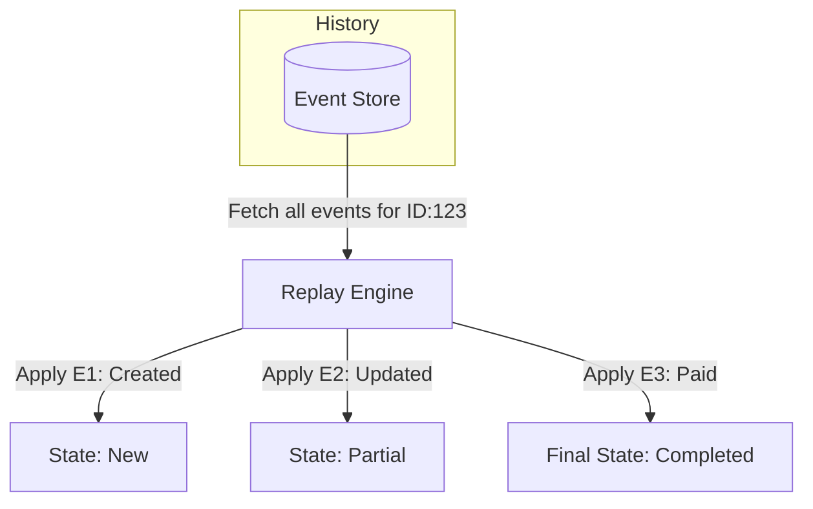

# 📜 Event Sourcing: The Time Machine for Data
> **Objective:** Store the history of "How we got here" instead of just "Where we are" | **Language:** Hinglish | **Standard:** 2026 Expert Framework

---

## 🧭 1. Beginner-Friendly Hinglish Explanation
Event Sourcing ka matlab hai "Current state save karne ke bajaye, saari history save karna".

- **The Problem:** Standard apps mein hum sirf current balance save karte hain: `Balance: ₹500`. Humein nahi pata ki wo ₹500 kaise aaye.
- **The Solution:** Hum har transaction (Event) ko save karte hain:
  1. `Deposited ₹1000`
  2. `Withdrew ₹200`
  3. `Paid Bill ₹300`
- **The Result:** Agar humein ₹500 balance chahiye, toh hum bas in events ko "Add" (Replay) kar lete hain.
- **Intuition:** Ye ek "Bank Passbook" ki tarah hai. Bank sirf final balance nahi likhta, wo har entry likhta hai. Final balance toh bas entries ka sum hota hai.

---

## 🧠 2. Deep Technical Explanation
### 1. State vs Events:
- **State-based:** `UPDATE users SET name = 'Sameer' WHERE id = 1`.
- **Event-based:** `INSERT INTO events (type, data) VALUES ('USER_RENAMED', '{"old": "Sam", "new": "Sameer"}')`.

### 2. The Event Store:
An append-only database. You NEVER update or delete an event. You only add new ones.

### 3. Replaying:
To get the current state of an object (Aggregate), you fetch all events for that ID and apply them in order.

### 4. Snapshots:
If an object has 1 million events, replaying takes too long. We save a "Snapshot" every 1000 events (e.g., "Balance at Event #1000 was ₹500") to speed things up.

---

## 🏗️ 3. Architecture Diagrams (Event Replay)


---

## 💻 4. Production-Ready Examples (Conceptual Implementation)
```typescript
// 2026 Standard: Event-based State Logic

interface Event {
  type: string;
  payload: any;
  timestamp: number;
}

class Account {
  balance: number = 0;
  history: Event[] = [];

  // 1. Appending a new event
  apply(event: Event) {
    switch (event.type) {
      case 'DEPOSIT':
        this.balance += event.payload.amount;
        break;
      case 'WITHDRAW':
        this.balance -= event.payload.amount;
        break;
    }
    this.history.push(event);
  }

  // 2. Rehydrating from history
  static fromHistory(history: Event[]) {
    const account = new Account();
    history.forEach(e => account.apply(e));
    return account;
  }
}
```

---

## 🌍 5. Real-World Use Cases
- **Banking/Finance:** Auditable transaction history.
- **E-commerce:** Tracking the journey of an order (Placed -> Packed -> Shipped -> Delivered).
- **Collaboration (Notion/Google Docs):** Seeing the version history and who changed what.
- **Gaming:** Replaying a match to see exactly how a player moved.

---

## ❌ 6. Failure Cases
- **Version Mismatch:** You changed the event structure in code, but old events in the DB still follow the old structure. **Fix: Upcasting (Mapping old events to new ones).**
- **Query Performance:** Querying "Find all users with balance > 500" is impossible in an Event Store. **Fix: Use CQRS (Read Projections).**
- **Event Bloat:** Millions of tiny events taking up massive disk space.

---

## 🛠️ 7. Debugging Section
| Problem | Diagnostic | Solution |
| :--- | :--- | :--- |
| **Incorrect State** | Manual Replay | Take the event list and manually apply them to see where the logic went wrong. |
| **Slow Startup** | No Snapshots | Check if your services are replaying thousands of events on every request. |

---

## ⚖️ 8. Tradeoffs
- **Auditability & Recovery (Perfect)** vs **Query Complexity (High).**

---

## 🛡️ 9. Security Concerns
- **Event Tampering:** Since history is everything, if someone modifies an old event, the whole state changes. **Fix: Use Cryptographic Hashing (like a Blockchain).**

---

## 📈 10. Scaling Challenges
- **Aggregate Concurrency:** Two people trying to add an event to the same ID at once. **Fix: Optimistic Locking (Versioning).**

---

## 💸 11. Cost Considerations
- **Storage Cost:** Storing every single change forever is more expensive than just storing the final state.

---

## ✅ 12. Best Practices
- **Events should be Immutable.**
- **Use Snapshots.**
- **Always use CQRS with Event Sourcing.**
- **Name events in Past Tense** (e.g., `Order_Placed`, not `Place_Order`).

---

## ⚠️ 13. Common Mistakes
- **Deleting events** to fix a bug. (Never do this! Add a 'Correction' event instead).
- **Putting business logic** in the Event Store.

---

## 📝 14. Interview Questions
1. "What is Event Sourcing?"
2. "How do you handle data updates in an Event Sourced system?"
3. "What is the role of Snapshots?"

---

## 🚀 15. Latest 2026 Production Patterns
- **Event-Driven Microservices:** Using Kafka as the primary Event Store.
- **GraphQL Live Queries:** Automatically pushing the new state to the UI whenever a new event is appended.
漫
