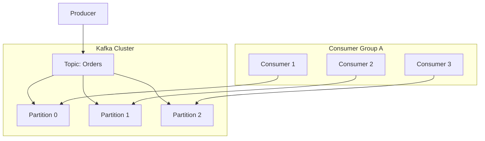

# 🎡 Apache Kafka Fundamentals: The Distributed Log
> **Objective:** Master high-throughput, fault-tolerant event streaming | **Language:** Hinglish | **Standard:** 2026 Expert Framework

---

## 🧭 1. Beginner-Friendly Hinglish Explanation
Kafka ka matlab hai "System ki ek giant Diary (Commit Log)".

- **The Problem:** Standard message brokers (like Redis) messages ko deliver karke bhul jate hain. Agar subscriber offline hua, toh message gaya. Aur wo bahut zyada speed handle nahi kar sakte.
- **The Solution:** Kafka messages ko deliver nahi karta, wo unhe "Store" karta hai ek file (Log) mein. 
- **The Concept:** Subscribers khud Kafka ke paas aate hain aur kehte hain "Mujhe message #10 se aage ke saare messages de do".
- **Intuition:** Kafka ek "News Channel" ki tarah nahi hai jo abhi live hai. Ye ek "Netflix" ki tarah hai. Videos wahan padi hain, aap jab chahe, jahan se chahe dekh sakte hain.

---

## 🧠 2. Deep Technical Explanation
### 1. Core Concepts:
- **Producer:** Sends events to Kafka.
- **Topic:** A category/name for a stream of records (e.g., `user-clicks`).
- **Partition:** Topics are split into partitions for scaling. Each partition is an ordered, immutable sequence of records.
- **Consumer Group:** A group of consumers that work together to process a topic. Each partition is handled by exactly ONE consumer in the group.
- **Offset:** A unique ID (number) for each record in a partition.

### 2. High Availability:
Kafka replicates partitions across multiple servers (Brokers). If one server dies, another takes over.

### 3. Retention:
You can keep messages for 7 days, 30 days, or forever. This allows you to "Replay" history.

---

## 🏗️ 3. Architecture Diagrams (Topics and Partitions)


---

## 💻 4. Production-Ready Examples (KafkaJS in Node.js)
```typescript
// 2026 Standard: Kafka Producer Implementation

import { Kafka } from 'kafkajs';

const kafka = new Kafka({
  clientId: 'my-app',
  brokers: ['kafka-1:9092', 'kafka-2:9092']
});

const producer = kafka.producer();

const run = async () => {
  await producer.connect();
  await producer.send({
    topic: 'user-events',
    messages: [
      { key: 'user-1', value: JSON.stringify({ action: 'login', time: Date.now() }) },
    ],
  });
};

run().catch(console.error);

// 💡 Pro Tip: Use 'Keys' to ensure that all events for the 
// SAME user go to the SAME partition (maintains order).
```

---

## 🌍 5. Real-World Use Cases
- **Activity Tracking:** LinkedIn uses Kafka to track every click and share (Billions of events/day).
- **Log Aggregation:** Collecting logs from 1000 servers into a central place.
- **Financial Transactions:** Recording every trade in a stock market for audit and real-time processing.
- **Real-time Analytics:** Processing live data streams using Kafka Streams or Flink.

---

## ❌ 6. Failure Cases
- **Consumer Lag:** Consumers are slower than Producers. Messages pile up. **Fix: Add more partitions and consumers.**
- **Zookeeper/KRaft Failure:** If the "Brain" of the cluster fails, no one knows who the leader is.
- **Data Loss:** If `acks` is set to `0` and a broker crashes before saving to disk. **Fix: Use `acks: 'all'`.**

---

## 🛠️ 7. Debugging Section
| Tool | Purpose | Tip |
| :--- | :--- | :--- |
| **Kafka UI / Offset Explorer** | Dashboard | Visualizing topics, partitions, and current consumer offsets. |
| **`kafka-console-consumer`** | CLI | `kafka-console-consumer --topic X --from-beginning` to see the raw data. |

---

## ⚖️ 8. Tradeoffs
- **Throughput vs Latency:** Kafka is optimized for massive volume (Throughput), which can add a tiny bit of latency ($5-10ms$) compared to Redis ($<1ms$).

---

## 🛡️ 9. Security Concerns
- **SASL/SSL:** Encrypting data and authenticating producers/consumers.
- **ACLs:** Defining who can read or write to which topic.

---

## 📈 10. Scaling Challenges
- **Rebalancing:** When a new consumer joins a group, Kafka stops everything to re-assign partitions. This can cause temporary "Pauses".

---

## 💸 11. Cost Considerations
- **Disk Space:** Keeping data for a long time costs money. Use **Tiered Storage** (moving old data to S3).

---

## ✅ 12. Best Practices
- **Use meaningful keys for partitioning.**
- **Monitor Consumer Lag.**
- **Set appropriate Retention periods.**
- **Batch your messages** for higher performance.

---

## ⚠️ 13. Common Mistakes
- **Using too few partitions** (can't scale).
- **Using too many partitions** (slows down recovery).
- **Not handling the 'Rebalance' event.**

---

## 📝 14. Interview Questions
1. "How does Kafka achieve high throughput?"
2. "What is a Partition and why is it important for scaling?"
3. "Explain the role of a Consumer Group."

---

## 🚀 15. Latest 2026 Production Patterns
- **KRaft (Zookeeperless Kafka):** Modern Kafka no longer needs Zookeeper, making it easier to manage and faster to scale.
- **Serverless Kafka (Confluent/Upstash):** Pay per message, zero server management.
- **Schema Registry:** Ensuring that all producers use a strict Avro/Protobuf schema before sending data.
漫
