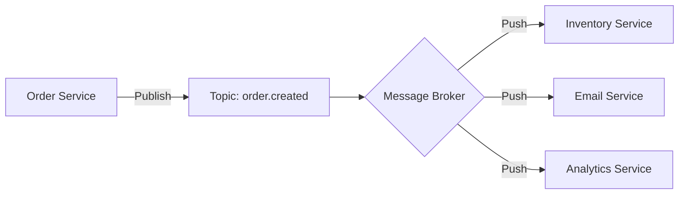

# 📢 Pub/Sub Systems: Decoupling Communication
> **Objective:** Design asynchronous, many-to-many communication patterns | **Language:** Hinglish | **Standard:** 2026 Expert Framework

---

## 🧭 1. Beginner-Friendly Hinglish Explanation
Pub/Sub (Publisher/Subscriber) ka matlab hai "News Agency" model.

- **The Problem:** Maan lijiye aapke system mein 10 services hain. Jab order place hota hai, toh Order Service ko Inventory, Email, SMS, aur Shipping services ko batana padta hai. Agar Order Service sabko ek-ek karke call karegi, toh wo bahut slow ho jayegi.
- **The Solution:** Order Service bas ek "Message" publish kar deti hai: "Order #123 place ho gaya!".
- **The Magic:** Jo bhi service interested hai (Subscribers), wo us message ko khud hi 'Listen' kar leti hain. Order service ko unke baare mein janne ki zaroorat nahi hai.
- **Intuition:** Ye ek YouTube channel ki tarah hai. Creator video "Publish" karta hai, aur jin logon ne "Subscribe" kiya hai unhe notification mil jata hai. Creator ko subscribers ka phone number nahi chahiye.

---

## 🧠 2. Deep Technical Explanation
### 1. Components:
- **Publisher:** Sends messages without knowing who the receivers are.
- **Topic/Channel:** The named pipe where messages are sent.
- **Broker:** The middleman (Redis, RabbitMQ, Kafka) that routes messages.
- **Subscriber:** Listens to specific topics and acts on messages.

### 2. Message Persistence:
- **Ephemeral (Redis):** Messages are lost if no one is listening at that moment. (Fast, good for real-time).
- **Persistent (Kafka/RabbitMQ):** Messages are saved until they are processed. (Reliable, good for critical data).

### 3. Fan-out:
A single message from a publisher is copied and sent to ALL active subscribers of that topic.

---

## 🏗️ 3. Architecture Diagrams (Decoupled Services)


---

## 💻 4. Production-Ready Examples (Redis Pub/Sub)
```typescript
// 2026 Standard: Real-time Event Publishing

import { createClient } from 'redis';

const publisher = createClient();
const subscriber = publisher.duplicate();

async function setupPubSub() {
  await publisher.connect();
  await subscriber.connect();

  // 1. Subscriber: Listening for events
  await subscriber.subscribe('user-login', (message) => {
    const user = JSON.parse(message);
    console.log(`User ${user.name} just logged in. Sending welcome notification...`);
  });

  // 2. Publisher: Emitting events
  const onUserLogin = async (userData: any) => {
    await publisher.publish('user-login', JSON.stringify(userData));
  };
}
```

---

## 🌍 5. Real-World Use Cases
- **Microservices Orchestration:** Services talking to each other without direct API calls.
- **Live Sports Updates:** One source updates the score; millions of clients receive it via Pub/Sub.
- **Log Aggregation:** Services publish logs to a topic; a 'Log Service' subscribes and saves them.
- **IoT Devices:** Sensors publishing data to a central hub.

---

## ❌ 6. Failure Cases
- **At-Most-Once Delivery:** If a subscriber is offline for 1 second, it misses the message. **Fix: Use Persistent Queues.**
- **The "Slow Consumer":** One subscriber is processing too slowly, causing messages to pile up in the broker's memory.
- **Message Loop:** Service A publishes to Topic X -> Service B listens and publishes to Topic Y -> Service A listens to Y and publishes to X... (Infinite loop).

---

## 🛠️ 7. Debugging Section
| Problem | Diagnostic | Solution |
| :--- | :--- | :--- |
| **No messages received** | Check Channel Name | Ensure publisher and subscriber are using the EXACT same string for the topic. |
| **Duplicate messages** | Over-subscription | Check if you have multiple instances of the same service subscribed to the same topic without a 'Consumer Group'. |

---

## ⚖️ 8. Tradeoffs
- **Pub/Sub vs Direct HTTP:** Pub/Sub is better for scaling and decoupling; Direct HTTP is better for simple "Wait for result" (Synchronous) logic.

---

## 🛡️ 9. Security Concerns
- **Topic Access Control:** Ensuring that a 'Payment Service' can't listen to 'Admin Command' topics.
- **Payload Encryption:** Encrypting sensitive data inside the message since it travels through a broker.

---

## 📈 10. Scaling Challenges
- **Broker Memory:** Redis stores everything in RAM. If you publish faster than you consume, RAM will fill up.
- **Throughput:** Kafka is better for 1 million+ messages/second; Redis is better for < 100k messages/second.

---

## 💸 11. Cost Considerations
- **Data Transfer:** Cloud providers charge for data moving between services/regions via Pub/Sub brokers.

---

## ✅ 12. Best Practices
- **Use meaningful topic names** (e.g., `domain.event.version`).
- **Keep messages small.**
- **Implement a 'Dead Letter' strategy** for persistent topics.
- **Don't use Pub/Sub for synchronous needs** (e.g., "Login and wait for result").

---

## ⚠️ 13. Common Mistakes
- **Assuming the message will definitely arrive** (in non-persistent systems).
- **Not versioning your message schema.**

---

## 📝 14. Interview Questions
1. "What is the difference between a Queue and a Pub/Sub system?"
2. "How do you handle message delivery guarantee in a Pub/Sub model?"
3. "When would you choose Kafka over Redis Pub/Sub?"

---

## 🚀 15. Latest 2026 Production Patterns
- **Cloud Events Standard:** A common specification for describing event data in a consistent way across different cloud providers.
- **Schema Registry:** A central service that validates message formats before they are allowed to be published (Used with Kafka/Confluent).
- **Serverless Pub/Sub:** Using **AWS EventBridge** or **Google Pub/Sub** to trigger serverless functions automatically.
漫
