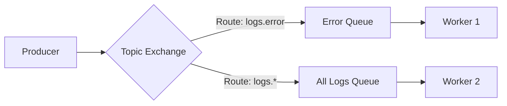

# 🐇 RabbitMQ: The Smart Message Broker
> **Objective:** Master complex message routing and reliable delivery | **Language:** Hinglish | **Standard:** 2026 Expert Framework

---

## 🧭 1. Beginner-Friendly Hinglish Explanation
RabbitMQ ka matlab hai "Post Office with Smart Sorting".

- **The Problem:** Kafka bahut data handle karta hai par wo "Simple" hai. Agar aapko complex rules chahiye (e.g., "Sirf wo messages bhejo jo 'Error' hain aur 'Germany' se hain"), toh Kafka mein mushkil hai.
- **The Solution:** RabbitMQ "Exchanges" aur "Bindings" use karta hai messages ko smart tarike se route karne ke liye.
- **The Goal:** Messages ko sahi destination par pahunchana, aur ensure karna ki wo "Delete" tabhi ho jab receiver confirm kare (Acknowledgement).
- **Intuition:** RabbitMQ ek "Advanced Mail Sorting Machine" ki tarah hai. Ye check karta hai "Address" (Routing Key) aur decide karta hai ki message kis box (Queue) mein jana chahiye.

---

## 🧠 2. Deep Technical Explanation
### 1. Key Components:
- **Producer:** Sends messages to an Exchange.
- **Exchange:** Receives messages and decides where to send them.
- **Binding:** The "Link" between an Exchange and a Queue.
- **Queue:** Where messages sit until a Consumer picks them up.
- **Routing Key:** A label the exchange uses to filter messages.

### 2. Exchange Types:
- **Direct:** Match the routing key exactly. (E.g., `error`).
- **Topic:** Pattern matching. (E.g., `*.critical` or `logs.#`).
- **Fanout:** Send to ALL connected queues. (Broadcast).
- **Headers:** Based on message headers instead of routing keys.

### 3. Reliability (ACKs):
RabbitMQ keeps the message in the queue until the consumer sends an **ACK** (Acknowledgement). If the consumer dies without an ACK, RabbitMQ puts the message back in the queue for someone else.

---

## 🏗️ 3. Architecture Diagrams (Exchanges and Bindings)


---

## 💻 4. Production-Ready Examples (amqplib in Node.js)
```typescript
// 2026 Standard: Reliable RabbitMQ Producer

import amqp from 'amqplib';

const sendLog = async (msg: string, severity: string) => {
  const connection = await amqp.connect('amqp://localhost');
  const channel = await connection.createChannel();
  const exchange = 'logs_topic';

  // 1. Declare the Exchange
  await channel.assertExchange(exchange, 'topic', { durable: false });

  // 2. Publish with a Routing Key
  channel.publish(exchange, severity, Buffer.from(msg));
  console.log(`Sent ${severity}: ${msg}`);

  setTimeout(() => {
    connection.close();
  }, 500);
};

// Usage: sendLog("DB Connection Failed", "error.db");
```

---

## 🌍 5. Real-World Use Cases
- **Enterprise Integration:** Connecting a Java backend, a Python AI service, and a Node.js frontend.
- **Order Processing:** Routing orders to different warehouses based on location.
- **IoT Routing:** Managing thousands of sensors with different priority levels.
- **Task Distribution:** Heavy jobs split across multiple workers with priority queues.

---

## ❌ 6. Failure Cases
- **Message Looping:** Routing a message back to the same exchange infinitely.
- **Queue Explosion:** Too many messages in a queue eating up all the RAM of the RabbitMQ server. **Fix: Set 'TTL' or 'Max Length'.**
- **Connection Leaks:** Opening a new connection for every message instead of reusing one.

---

## 🛠️ 7. Debugging Section
| Tool | Purpose | Tip |
| :--- | :--- | :--- |
| **RabbitMQ Management UI** | Full Dashboard | Standard on port 15672. See real-time graphs of messages/second and queue depths. |
| **`rabbitmqctl`** | CLI | Manage users, permissions, and list queues from the terminal. |

---

## ⚖️ 8. Tradeoffs
- **Complexity vs Power:** RabbitMQ is more complex than Redis but provides much better delivery guarantees and routing logic.

---

## 🛡️ 9. Security Concerns
- **Virtual Hosts (vhosts):** Isolating different apps on the same RabbitMQ server.
- **Permissions:** Ensuring only the "Admin" can delete queues.

---

## 📈 10. Scaling Challenges
- **Mirroring:** Syncing queues across multiple nodes in a cluster for high availability.

---

## 💸 11. Cost Considerations
- **Memory Usage:** RabbitMQ is memory-intensive. Monitoring RAM is critical for stability.

---

## ✅ 12. Best Practices
- **Use meaningful Exchange and Routing Key names.**
- **Always use Acknowledgements (ACK).**
- **Keep queues short.**
- **Use Persistent messages** if you don't want to lose data on restart.

---

## ⚠️ 13. Common Mistakes
- **Using 'Fanout' for everything** (wastes resources).
- **Ignoring the Management UI** until something breaks.

---

## 📝 14. Interview Questions
1. "What is an Exchange in RabbitMQ?"
2. "How does a Topic exchange differ from a Direct exchange?"
3. "What happens if a consumer doesn't send an ACK?"

---

## 🚀 15. Latest 2026 Production Patterns
- **Quorum Queues:** A modern, more reliable alternative to mirrored queues that uses the Raft consensus algorithm.
- **Streams:** RabbitMQ now has a "Stream" feature similar to Kafka for high-performance log reading.
- **CloudAMQP:** Managed RabbitMQ that handles scaling and backups for you.
漫
