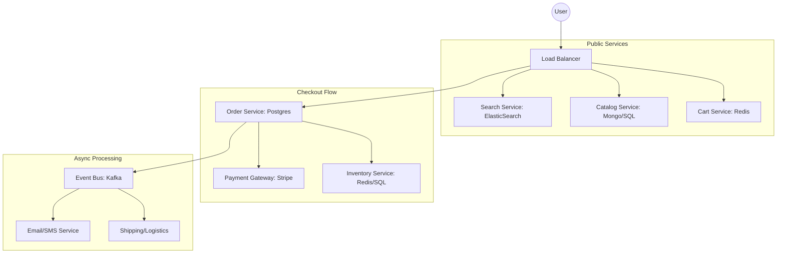

# 🛒 System Design: Scaling an E-Commerce Platform
> **Objective:** Design a robust, high-traffic platform like Amazon or Flipkart | **Language:** Hinglish | **Standard:** 2026 Expert Framework

---

## 🧭 1. Beginner-Friendly Hinglish Explanation
E-Commerce System Design ka matlab hai "Amazon jaisa app banana jo sale ke din bhi crash na ho".

- **The Problem:** Ek e-commerce app mein bahut saare moving parts hote hain: Search, Inventory, Payments, Cart, aur Delivery. Sabse badi problem "Flash Sale" hoti hai jahan 1 second mein 1 lakh log ek hi phone khareedne aate hain.
- **The Solution:** Humein components ko alag karna padega (Microservices) aur "Event-Driven" banna padega.
- **The Goal:** Order kabhi loss nahi hona chahiye (Consistency) aur site humesha khuli rehni chahiye (Availability).
- **Intuition:** Ye ek "Big Bazaar" ki tarah hai. Agar bheed bahut zyada hai, toh hum alag-alag counters (Services) banate hain: Ek sirf billing ke liye, ek sirf inquiry ke liye, aur ek warehouse se saman laane ke liye.

---

## 🧠 2. Deep Technical Explanation
### 1. Key Microservices:
- **Product Catalog:** Stores millions of items (NoSQL/Search Index).
- **Inventory Service:** Handles stock levels (Highly consistent SQL).
- **Cart & Checkout:** Temporary storage (Redis) and final processing.
- **Order Service:** Managing the lifecycle of an order.
- **Payment Service:** External gateway integration.

### 2. Handling Inventory (The Hard Part):
During a sale, you can't just run `UPDATE stock = stock - 1`. 
- **The Locking Strategy:** Use **Optimistic Locking** or **Distributed Locks (Redis)** to ensure you don't oversell (selling 11 items when you only have 10).

### 3. Search Optimization:
Using **ElasticSearch** or **Algolia** to allow users to filter by price, brand, and rating instantly across millions of products.

---

## 🏗️ 3. Architecture Diagrams (E-Commerce High-Level)


---

## 💻 4. Production-Ready Examples (Inventory Check Pattern)
```typescript
// 2026 Standard: Atomic Stock Decrement in Redis

const purchaseItem = async (productId: string, quantity: number) => {
  // 1. Check and Decrement Atomically
  // This prevents race conditions in a flash sale
  const remaining = await redis.decrBy(`stock:${productId}`, quantity);

  if (remaining < 0) {
    // Rollback: Add back the quantity
    await redis.incrBy(`stock:${productId}`, quantity);
    throw new Error("Out of stock!");
  }

  // 2. Proceed to Payment/Order creation
  return true;
};
```

---

## 🌍 5. Real-World Use Cases
- **Flash Sales (iPhone Launch):** Handling 1M+ requests per second.
- **Personalized Recommendations:** Showing "Users who bought this also bought..."
- **Real-time Price Changes:** Dynamic pricing based on demand and supply.

---

## ❌ 6. Failure Cases
- **Overselling:** Telling the user "Order Confirmed" but having no stock. **Fix: Distributed Locking.**
- **Payment Success, Order Failure:** Money taken but order not saved. **Fix: Saga Pattern / Distributed Transactions.**
- **Search Latency:** Filters taking 5 seconds to load. **Fix: Better Indexing in ElasticSearch.**

---

## 🛠️ 7. Debugging Section
| Problem | Diagnostic | Solution |
| :--- | :--- | :--- |
| **Missing Orders** | Dead Letter Queue | Check if the Order event reached the Shipping/Email services. |
| **Slow Checkout** | DB Locking | Check for "Row Locks" in your SQL DB during peak traffic. |

---

## ⚖️ 8. Tradeoffs
- **Immediate Consistency (Slow Checkout)** vs **Eventual Consistency (Fast Checkout but risk of overselling).** Amazon uses Eventual Consistency (they cancel orders later if stock runs out).

---

## 🛡️ 9. Security Concerns
- **Fraud Detection:** Using AI services to flag suspicious orders with stolen cards.
- **Inventory Sniping:** Bots trying to buy all the stock in 0.1 seconds. **Fix: Captcha + Rate Limiting.**

---

## 📈 10. Scaling Challenges
- **Database Sharding:** Splitting orders by `year-month` or `userId` so no single DB gets overwhelmed.

---

## 💸 11. Cost Considerations
- **Search Index Costs:** ElasticSearch uses a lot of RAM. Optimize your "Searchable Fields" to save money.

---

## ✅ 12. Best Practices
- **Use a Search Engine (don't use SQL LIKE).**
- **Handle payments asynchronously** where possible.
- **Cache Product Detail pages.**
- **Implement a robust Saga pattern** for distributed consistency.

---

## ⚠️ 13. Common Mistakes
- **Putting everything in one MySQL DB.**
- **Not using a CDN** for product images.

---

## 📝 14. Interview Questions
1. "How do you handle a flash sale with 1 million concurrent users?"
2. "Explain the checkout flow in a microservices architecture."
3. "How do you ensure inventory remains consistent across multiple regions?"

---

## 🚀 15. Latest 2026 Production Patterns
- **Serverless Checkout:** Using EventBridge and Step Functions to handle the entire order lifecycle without a single persistent server.
- **Edge Search:** Moving the product search index to the edge (Cloudflare) so users get results in $<50ms$.
漫
