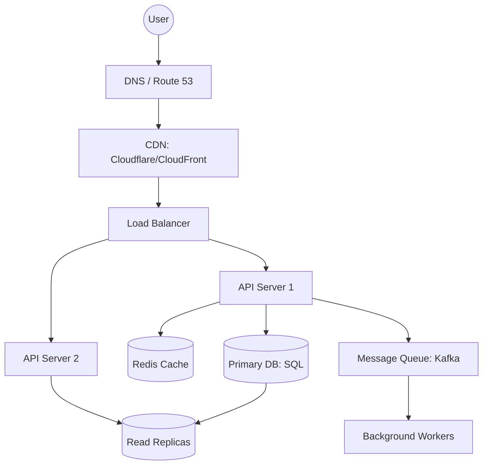

# 📐 System Design Fundamentals: Thinking at Scale
> **Objective:** Master the blueprints for building world-class distributed systems | **Language:** Hinglish | **Standard:** 2026 Expert Framework

---

## 🧭 1. Beginner-Friendly Hinglish Explanation
System Design ka matlab hai "Ek badi software building ka naksha (blueprint) banana".

- **The Problem:** Ek chote app mein aap bas code likhte hain. Par jab aapko 10 crore users ke liye app banana ho, toh sirf code se kaam nahi chalta. Aapko sochna padta hai ki data kahan rahega, traffic kaise manage hoga, aur agar ek server jal gaya toh kya hoga.
- **The Solution:** Humein components ko dhang se arrange karna chahiye (Load Balancers, Caching, Databases, Queues).
- **The Goal:** System **Scalable** (zyada users le sake), **Available** (kabhi down na ho), aur **Reliable** (data na khoye) hona chahiye.
- **Intuition:** Ye ek "City Planning" ki tarah hai. Aap bas ghar nahi banate, aap road, bijli, pani, aur traffic lights ka poora system design karte hain taaki sheher (App) smoothly chale.

---

## 🧠 2. Deep Technical Explanation
### 1. Core Principles:
- **Scalability:** Horizontal (Adding more machines) vs Vertical (Adding RAM/CPU).
- **Availability:** Measuring "Uptime" in 9s (e.g., 99.99% is "Four Nines").
- **Consistency:** How soon all users see the same data (Strong vs Eventual).

### 2. The CAP Theorem:
In a distributed system, you can only pick TWO:
- **Consistency:** Everyone sees the same data at once.
- **Availability:** Every request gets a response.
- **Partition Tolerance:** The system works even if network fails between nodes.
*(In the real world, you MUST have Partition Tolerance, so you choose between C and A).*

### 3. Latency vs Throughput:
- **Latency:** How long it takes to process ONE request (Goal: $<100ms$).
- **Throughput:** How MANY requests can be processed in 1 second (Goal: $1M+$).

---

## 🏗️ 3. Architecture Diagrams (The Universal High-Level Design)


---

## 💻 4. Production-Ready Examples (Conceptual Load Balancing)
```typescript
// 2026 Standard: Round Robin Logic (Simple Example)

class LoadBalancer {
  private servers: string[] = ['10.0.1.1', '10.0.1.2', '10.0.1.3'];
  private current: number = 0;

  getNextServer() {
    const server = this.servers[this.current];
    this.current = (this.current + 1) % this.servers.length;
    return server;
  }
}

// 💡 In production, use Nginx, HAProxy, or AWS ALB for this.
```

---

## 🌍 5. Real-World Use Cases
- **YouTube:** Storing petabytes of video data and serving it with low latency globally.
- **Twitter/X:** Handling "Celebrity Fan-out" where one post must be sent to 100M+ people instantly.
- **Google Search:** Indexing the entire web and returning results in <0.5 seconds.

---

## ❌ 6. Failure Cases
- **Cascading Failure:** One service dies, its load goes to Service B, which also dies, and soon the whole system is gone.
- **Single Point of Failure (SPOF):** Having only one database. If it crashes, the app is dead. **Fix: Use Replication.**
- **Cache Stampede:** Cache expires, and 1 million users hit the Database at the same time.

---

## 🛠️ 7. Debugging Section
| Metric | Diagnostic | Solution |
| :--- | :--- | :--- |
| **P99 Latency > 1s** | Bottleneck | Use **Tracing** to find which component is slow (often the DB). |
| **503 Errors** | Capacity | Your servers are full. Trigger **Auto-scaling**. |

---

## ⚖️ 8. Tradeoffs
- **SQL vs NoSQL:** SQL is better for structured data and consistency; NoSQL is better for scale and flexibility.
- **Long Polling vs WebSockets:** Polling is easier; WebSockets are faster for real-time.

---

## 🛡️ 9. Security Concerns
- **DDoS Protection:** Using a WAF (Web Application Firewall) to block bad traffic before it hits your servers.
- **Data Encryption:** Encrypting data "At Rest" (on disk) and "In Transit" (over network).

---

## 📈 10. Scaling Challenges
- **Database Sharding:** When one DB is too small, you split data across 10 DBs (e.g., User 1-1M in DB1, User 1M-2M in DB2).

---

## 💸 11. Cost Considerations
- **Egress Fees:** Moving data out of the cloud is expensive. Use **Compression** and **Caching**.

---

## ✅ 12. Best Practices
- **Design for failure.**
- **Stateless is better.**
- **Cache everything you can.**
- **Monitor P95/P99 latency, not average.**

---

## ⚠️ 13. Common Mistakes
- **Over-engineering** for a small user base.
- **Not calculating "Back of the envelope" estimates** (Storage/Bandwidth needs).

---

## 📝 14. Interview Questions
1. "Explain the CAP Theorem."
2. "How would you scale a system to handle 10 million daily active users?"
3. "What is the difference between Horizontal and Vertical scaling?"

---

## 🚀 15. Latest 2026 Production Patterns
- **Serverless First:** Starting with Lambda/Fargate to reduce management overhead.
- **Edge Computing:** Moving logic to the CDN level (Cloudflare Workers) to handle requests in $<20ms$ globally.
- **Database-as-a-Service (DBaaS):** Using PlanetScale or Neon for "Infinite" SQL scaling without managing servers.
漫
