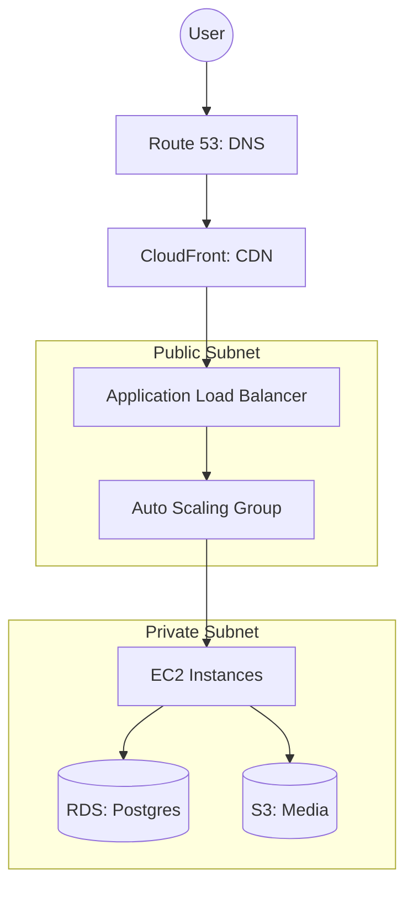

# 🌥️ AWS Essentials: Navigating the Giant
> **Objective:** Master the most critical services of the world's leading cloud provider | **Language:** Hinglish | **Standard:** 2026 Expert Framework

---

## 🧭 1. Beginner-Friendly Hinglish Explanation
AWS Essentials ka matlab hai "AWS ke wo 5-10 services jo har backend engineer ko aani chahiye".

- **The Problem:** AWS mein 200+ services hain. Ek beginner ke liye ye kisi "Maze" (bhulbhulaiya) jaisa hai.
- **The Solution:** Humein 80% kaam ke liye sirf 20% services ki zaroorat hoti hai.
- **The Core Services:**
  1. **EC2:** Virtual Computer (Server).
  2. **S3:** Storage (Files).
  3. **RDS:** Database (SQL).
  4. **Lambda:** Serverless Functions (No server management).
  5. **VPC:** Private Network (Security).
- **Intuition:** Ye ek "Supermarket" ki tarah hai. Aapko har cheez nahi khareedni, bas wo cheezein lo jo aapki recipe (App) ke liye zaroori hain.

---

## 🧠 2. Deep Technical Explanation
### 1. Compute (Running Code):
- **EC2 (Elastic Compute Cloud):** Renting a VM. You choose the CPU/RAM.
- **ECS/EKS:** Running Docker containers.
- **Lambda:** Running functions in response to events.

### 2. Storage & Databases:
- **S3 (Simple Storage Service):** Unlimited object storage.
- **RDS (Relational Database Service):** Managed MySQL/Postgres. Handles backups and patching automatically.
- **DynamoDB:** High-scale NoSQL (Key-Value) store.

### 3. Networking & Content Delivery:
- **VPC (Virtual Private Cloud):** Your own private space on AWS.
- **CloudFront:** CDN to deliver content fast.
- **Route 53:** DNS service (Mapping domains like `susa.com` to IPs).

---

## 🏗️ 3. Architecture Diagrams (A Standard AWS Web Stack)


---

## 💻 4. Production-Ready Examples (AWS CLI Basics)
```bash
# 2026 Standard: Interacting with AWS via CLI

# 1. List all S3 buckets
aws s3 ls

# 2. Upload a file to a bucket
aws s3 cp my-photo.jpg s3://my-app-assets/

# 3. Check health of EC2 instances
aws ec2 describe-instance-status --instance-ids i-1234567890abcdef0

# 💡 Pro Tip: Use 'AWS SSO' to manage logins instead of 
# hardcoding long-lived access keys.
```

---

## 🌍 5. Real-World Use Cases
- **Hosting a Startup:** Using Amplify or Elastic Beanstalk for quick deployment.
- **Large Enterprise:** Using VPC Peering to connect hundreds of internal services safely.
- **Streaming Service:** Using S3 + CloudFront for video delivery.

---

## ❌ 6. Failure Cases
- **Leaking Secrets:** Committing AWS Access Keys to GitHub. **Fix: Use IAM Roles for EC2.**
- **Overspending on RDS:** Choosing a giant database instance for a small dev project.
- **Network Isolation:** Putting your database in a Public Subnet where hackers can scan it. **Fix: Use Private Subnets.**

---

## 🛠️ 7. Debugging Section
| Tool | Purpose | Tip |
| :--- | :--- | :--- |
| **AWS CloudTrail** | Audit Logs | See "Who did what" (e.g., Who deleted that database?). |
| **VPC Flow Logs** | Network | See why requests are being dropped (Security Groups vs NACLs). |

---

## ⚖️ 8. Tradeoffs
- **Managed (RDS) vs Self-hosted (DB on EC2):** Managed costs $20-30\%$ more but saves you 10 hours of work every week on backups and maintenance.

---

## 🛡️ 9. Security Concerns
- **Security Groups:** Act as a virtual firewall for your EC2 instances. Only open the ports you need (e.g., 80, 443).
- **KMS (Key Management Service):** Encrypting your database passwords and environment variables.

---

## 📈 10. Scaling Challenges
- **Auto Scaling Groups (ASG):** Automatically adding servers when CPU > 70% and removing them when traffic drops.

---

## 💸 11. Cost Considerations
- **AWS Free Tier:** Use it wisely to learn, but remember that some "Free" things expire after 12 months.

---

## ✅ 12. Best Practices
- **Use IAM Roles, not Users.**
- **Tag everything** (e.g., `Env: Production`).
- **Never make an S3 bucket public** unless strictly necessary.
- **Turn off what you don't use.**

---

## ⚠️ 13. Common Mistakes
- **Running a Single Instance** without any backup (SPOF).
- **Ignoring the AWS Trusted Advisor** (which gives free cost/security tips).

---

## 📝 14. Interview Questions
1. "What is the difference between an S3 bucket and an EBS volume?"
2. "How do Security Groups differ from Network ACLs?"
3. "Explain what a VPC is in simple terms."

---

## 🚀 15. Latest 2026 Production Patterns
- **AWS CDK (Cloud Development Kit):** Writing your infrastructure code in TypeScript instead of YAML/JSON.
- **Serverless Databases (Aurora Serverless):** A database that automatically turns off when not in use and scales to 0 to save money.
- **AI Integration (Bedrock):** Using AWS Bedrock to integrate LLMs (like Claude or Llama) directly into your AWS stack.
漫
