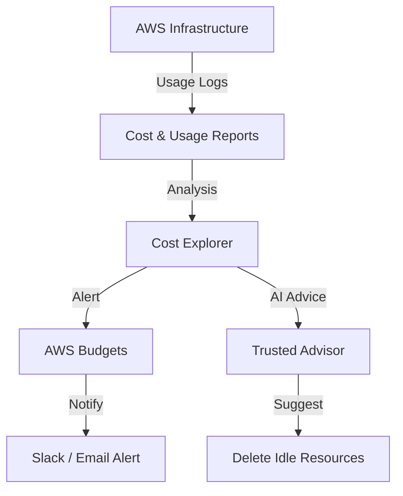

# 💰 Cloud Cost Management: Stopping the Bleeding
> **Objective:** Monitor, optimize, and control cloud spending to avoid "Sticker Shock" | **Language:** Hinglish | **Standard:** 2026 Expert Framework

---

## 🧭 1. Beginner-Friendly Hinglish Explanation
Cloud Cost Management ka matlab hai "Cloud ke bill ko control mein rakhna".

- **The Problem:** Cloud "Pay-as-you-go" hai. Iska matlab hai ki agar aapne ek bada server chalu karke chhod diya, toh wo tab tak paise kaat-ta rahega jab tak aap use band na karein. Bahut saare developers ko mahine ke end mein ₹50,000 ka bill aata hai jabki unhe lag raha tha ki sab free hai.
- **The Solution:** Humein budgets set karne chahiye, unused resources ko delete karna chahiye, aur saste alternatives (jaise Spot Instances) use karne chahiye.
- **Intuition:** Ye "Hotel Minibar" ki tarah hai. Har cheez available hai, par har cheez ka alag price hai. Agar aapne bina dekhe sab kha liya, toh check-out ke waqt bill dekh kar rona aayega.

---

## 🧠 2. Deep Technical Explanation
### 1. Cost Drivers:
- **Compute:** Running servers (Hourly/Per-second).
- **Storage:** Keeping files in S3 or DB (Per GB/Month).
- **Data Transfer (Egress):** Data leaving the AWS network to the internet. (Most overlooked cost!).
- **Managed Services:** Extra fees for using RDS, Elasticache, etc.

### 2. Pricing Models:
- **On-Demand:** Full price, maximum flexibility.
- **Reserved Instances (RIs):** $30-70\%$ discount for committing to 1 or 3 years.
- **Savings Plans:** Commit to a specific dollar amount per hour ($/hr).
- **Spot Instances:** $90\%$ discount but AWS can take the server back at any time.

---

## 🏗️ 3. Architecture Diagrams (Cost Monitoring Pipeline)


---

## 💻 4. Production-Ready Examples (Conceptual Cost Alert)
```yaml
# 2026 Standard: AWS Budget for a Startup Project

Budget:
  Name: Monthly-Safety-Budget
  Limit: $50.00
  TimeUnit: MONTHLY
  Notifications:
    - Threshold: 80% ($40)
      Type: ACTUAL
      Contact: admin@susa.com
    - Threshold: 100% ($50)
      Type: FORECASTED
      Contact: admin@susa.com
      
# 💡 Forecasted means: "At this rate, you WILL hit $50 by 
# the end of the month." This gives you time to react.
```

---

## 🌍 5. Real-World Use Cases
- **Development Workflows:** Automatically turning off all "Dev" servers at 7 PM and turning them on at 9 AM.
- **Data Archiving:** Moving 5-year-old logs from S3 Standard to S3 Glacier Deep Archive (saves $95\%$ in storage costs).
- **Scale-to-Zero:** Using Serverless (Lambda) for features that are rarely used.

---

## ❌ 6. Failure Cases
- **Zombies:** A Load Balancer or Elastic IP that is not attached to any server but still costs $0.005$ per hour.
- **Unused Snapshots:** Keeping 1000 daily backups of a database that was deleted 2 years ago.
- **Cross-Region Transfer:** Sending 10TB of data between a US server and an India DB.

---

## 🛠️ 7. Debugging Section
| Tool | Purpose | Tip |
| :--- | :--- | :--- |
| **AWS Cost Explorer** | Visualization | Use "Group by Service" to see exactly which service is costing the most. |
| **AWS Trusted Advisor** | Optimization | Look for the "Cost Optimization" category to see a list of idle resources you can delete. |

---

## ⚖️ 8. Tradeoffs
- **Managed Services (High cost, low maintenance)** vs **Self-hosted (Low cost, high maintenance).**

---

## 🛡️ 9. Security Concerns
- **Billing Access:** Ensure only the "CFO" or "Admin" can see the billing dashboard to prevent unauthorized people from seeing company financial data.

---

## 📈 10. Scaling Challenges
- **The "Success" Tax:** If your app goes viral, your cloud bill will explode. Ensure your business model can handle the cost of a million users.

---

## 💸 11. Cost Considerations
- **Egress Optimization:** Use a CDN (CloudFront) as it has lower data transfer rates than raw S3/EC2.

---

## ✅ 12. Best Practices
- **TAG EVERYTHING** with `Project`, `Environment`, and `Owner`.
- **Set up Billing Alerts on Day 1.**
- **Use Spot Instances** for background workers.
- **Regularly review the 'Unused Resources' report.**

---

## ⚠️ 13. Common Mistakes
- **Assuming the 'Free Tier' covers everything.**
- **Leaving unattached EBS volumes** (Hard drives) after deleting an EC2 instance.

---

## 📝 14. Interview Questions
1. "How do you optimize S3 costs for long-term data?"
2. "What is the difference between an On-demand and a Spot instance?"
3. "Name three ways to reduce a monthly AWS bill."

---

## 🚀 15. Latest 2026 Production Patterns
- **FinOps:** A dedicated culture/role that bridge the gap between Finance and Engineering to ensure cloud efficiency.
- **AI Cost Anomaly Detection:** AWS now uses AI to detect "Unusual" spending patterns (e.g., a sudden $200$ spike in 1 hour) and alerts you immediately.
- **Carbon Footprint Monitoring:** Many companies now optimize for "Carbon Cost" alongside "Dollar Cost".
漫
