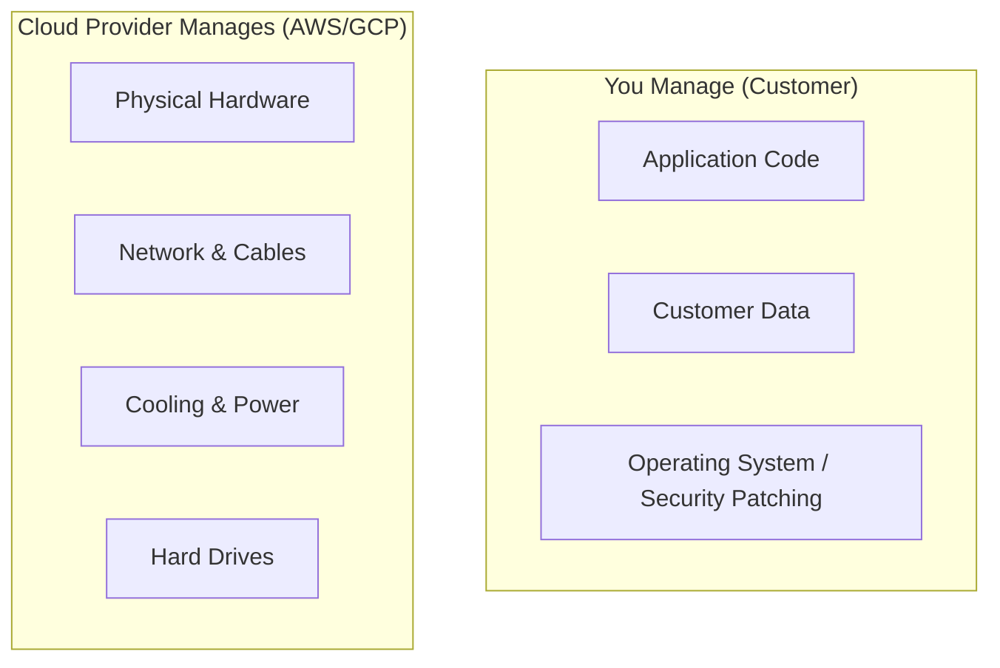

# ☁️ Cloud Fundamentals: The Future of Infrastructure
> **Objective:** Understand the core concepts of cloud computing and why it replaced traditional servers | **Language:** Hinglish | **Standard:** 2026 Expert Framework

---

## 🧭 1. Beginner-Friendly Hinglish Explanation
Cloud Fundamentals ka matlab hai "Apna computer khareedne ke bajaye, internet par computer kiraye (rent) par lena".

- **The Problem:** Purane zamane mein company ko apne office mein "Servers" lagane padte the. Isme bahut kharcha hota tha, bijli chahiye thi, aur ek insaan humesha unhe dekhne ke liye chahiye tha.
- **The Solution:** Cloud Providers (AWS, Google, Azure) ne giant data centers banaye hain. Aap unhe monthly paise do aur unke computer use karo.
- **The Concept:** 
  1. **On-Demand:** Jab chahiye tab lo.
  2. **Pay-as-you-go:** Jitna use kiya utna paisa do.
  3. **Infinite Scaling:** Ek click mein 100 servers khade kardo.
- **Intuition:** Ye "Bijli" (Electricity) ki tarah hai. Aap apna power plant (Server) nahi lagate, aap bas grid se connection lete hain aur jitna unit use kiya uska bill dete hain.

---

## 🧠 2. Deep Technical Explanation
### 1. Cloud Service Models:
- **IaaS (Infrastructure as a Service):** You get raw virtual machines. (E.g., AWS EC2). You manage the OS and software.
- **PaaS (Platform as a Service):** You get a platform to run code. (E.g., Heroku, Google App Engine). You only manage the code.
- **SaaS (Software as a Service):** You use the final software. (E.g., Gmail, Slack).

### 2. Virtualization & Containers:
Cloud works by "Slicing" one big physical server into many small "Virtual Machines" (VMs). 2026 standard uses **Containers (Docker)** to make apps even more portable across clouds.

### 3. Regions and Availability Zones (AZs):
- **Region:** A physical location (e.g., Mumbai, Virginia).
- **AZ:** A specific data center within that region. High availability means running your app across 2 or 3 AZs.

---

## 🏗️ 3. Architecture Diagrams (The Shared Responsibility Model)


---

## 💻 4. Production-Ready Examples (Conceptual Cloud Config)
```yaml
# 2026 Standard: Defining a Cloud Instance (Terraform/IaC style)

resource "aws_instance" "web_server" {
  ami           = "ami-0c55b159cbfafe1f0" # Amazon Linux
  instance_type = "t3.medium"             # 2 vCPU, 4GB RAM
  
  tags = {
    Name = "Production-API-Node"
    Project = "MyLLM"
  }
}
```

---

## 🌍 5. Real-World Use Cases
- **Startups:** Launching a global app with ₹0 upfront cost.
- **High-Traffic Events:** Scaling servers up for "Black Friday" and scaling them down to zero the next day.
- **Disaster Recovery:** Having a backup of your entire system in another country in case of a natural disaster.

---

## ❌ 6. Failure Cases
- **"The Surprise Bill":** Leaving an expensive server running by mistake. **Fix: Set Billing Alerts.**
- **Region Outage:** AWS Mumbai goes down. If you only have one region, your app is dead. **Fix: Multi-region setup.**
- **Vendor Lock-in:** Using a feature that only AWS has, making it impossible to move to Google Cloud later.

---

## 🛠️ 7. Debugging Section
| Tool | Purpose | Tip |
| :--- | :--- | :--- |
| **CloudWatch / Stackdriver** | Logs | Check these centralized logs to see why a server is failing to start. |
| **Reachability Analyzer** | Network | Use this to see if a firewall is blocking traffic between your App and DB. |

---

## ⚖️ 8. Tradeoffs
- **Control (Self-hosted) vs Speed (Cloud):** Cloud is faster to launch; Self-hosting (on your own hardware) is cheaper at extreme scales but very slow to manage.

---

## 🛡️ 9. Security Concerns
- **Identity & Access Management (IAM):** "Who can do what". Never use your root account for daily work. Create small users with limited permissions.
- **Encryption:** Ensuring data is encrypted before it leaves your app.

---

## 📈 10. Scaling Challenges
- **Cold Starts:** In serverless (Lambda), the first request after a long time can be slow ($>1s$).

---

## 💸 11. Cost Considerations
- **Reserved Instances:** Pay for 1 year upfront to get a $70\%$ discount compared to "On-Demand" pricing.

---

## ✅ 12. Best Practices
- **Use Multi-AZ for reliability.**
- **Automate with Infrastructure as Code (IaC).**
- **Set Budget Alerts on Day 1.**
- **Keep your servers "Stateless".**

---

## ⚠️ 13. Common Mistakes
- **Assuming the Cloud is "Automatically Secure".** (It's not, you must configure firewalls).
- **Hardcoding internal IP addresses.**

---

## 📝 14. Interview Questions
1. "What is the difference between IaaS, PaaS, and SaaS?"
2. "How do you ensure high availability in a cloud environment?"
3. "What is the Shared Responsibility Model?"

---

## 🚀 15. Latest 2026 Production Patterns
- **Multi-Cloud:** Running different parts of the app on AWS and GCP to avoid being dependent on one provider.
- **Serverless Containers:** Using AWS Fargate or Google Cloud Run to run Docker containers without managing servers.
- **Sustainable Computing:** Choosing cloud regions that run on 100% renewable energy.
漫
