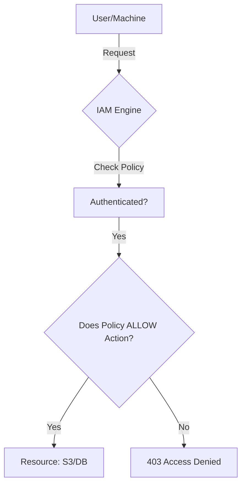

# 🔐 IAM and Cloud Security: Locking the Doors
> **Objective:** Secure your cloud resources using Identity and Access Management | **Language:** Hinglish | **Standard:** 2026 Expert Framework

---

## 🧭 1. Beginner-Friendly Hinglish Explanation
IAM (Identity and Access Management) ka matlab hai "Kaun kya kar sakta hai".

- **The Problem:** Agar aap kisi naye employee ko apna poora AWS account ka login de denge, toh wo galti se (ya jaan-bujhkar) saara data delete kar sakta hai.
- **The Solution:** Humein har insaan aur har "Machine" (jaise EC2 server) ko sirf utni hi permission deni chahiye jitni use zaroorat hai.
- **The Concept:** 
  1. **User:** Ek insaan (Sameer).
  2. **Group:** Ek category (Developers).
  3. **Role:** Ek temporary permission (EC2 server ko S3 se image download karni hai).
  4. **Policy:** Ek JSON file jo batati hai ki "Allow: Read S3 Bucket 'MyImages'".
- **Intuition:** Ye ek "Office Keycard" ki tarah hai. Sales team ka card pantry aur unke desk tak chalta hai, par wo Server Room nahi khol sakte.

---

## 🧠 2. Deep Technical Explanation
### 1. Principle of Least Privilege (PoLP):
Never give `AdministratorAccess`. Start with `ReadOnly` or specific actions (e.g., `s3:GetObject`) and only add permissions if they are absolutely needed.

### 2. IAM Roles vs Users:
- **Users:** Long-lived credentials (Username/Password/Access Key). High risk if leaked.
- **Roles:** Temporary, short-lived tokens. No password stored. Used by AWS services (Lambda, EC2) to talk to each other. **Always prefer Roles over Users for machines.**

### 3. Policy Structure:
A JSON document with 4 parts:
- **Effect:** Allow or Deny.
- **Action:** What can be done (e.g., `dynamodb:PutItem`).
- **Resource:** On which specific item (e.g., `arn:aws:s3:::my-bucket/*`).
- **Condition:** (Optional) Under what circumstances (e.g., "Only if request comes from our office IP").

---

## 🏗️ 3. Architecture Diagrams (How IAM Works)


---

## 💻 4. Production-Ready Examples (A Secure S3 Policy)
```json
{
  "Version": "2012-10-17",
  "Statement": [
    {
      "Sid": "AllowSpecificBucketRead",
      "Effect": "Allow",
      "Action": [
        "s3:GetObject",
        "s3:ListBucket"
      ],
      "Resource": [
        "arn:aws:s3:::susa-labs-prod-assets",
        "arn:aws:s3:::susa-labs-prod-assets/*"
      ],
      "Condition": {
        "IpAddress": {
          "aws:SourceIp": "203.0.113.0/24"
        }
      }
    }
  ]
}
```

---

## 🌍 5. Real-World Use Cases
- **Contractor Access:** Giving a freelancer access to only ONE specific S3 bucket for 24 hours.
- **Microservices:** Ensuring the "Payment Service" can write to the "Transactions DB" but the "Marketing Service" can only read it.
- **Compliance:** Auditing every action in the account to pass security certifications (ISO 27001).

---

## ❌ 6. Failure Cases
- **The "Admin" Leak:** Committing an IAM User's access key to a public GitHub repo. Bots will find it in seconds and start mining Bitcoin on your bill.
- **Star (*) Permissions:** Using `"Action": "*"` (everything). If that server is hacked, the attacker has full control of your cloud.
- **Forgotten Users:** An employee leaves the company, but their IAM access isn't deleted.

---

## 🛠️ 7. Debugging Section
| Tool | Purpose | Tip |
| :--- | :--- | :--- |
| **IAM Policy Simulator** | Testing | Paste your policy and a sample request to see if it would be allowed or denied without actually running it. |
| **CloudTrail** | Investigation | Search for `AccessDenied` events to see exactly which permission is missing for a failing service. |

---

## ⚖️ 8. Tradeoffs
- **Tight Security (Complex management)** vs **Loose Security (Easy but Dangerous).**

---

## 🛡️ 9. Security Concerns
- **MFA (Multi-Factor Authentication):** Mandatory for all IAM users. Even if a password is leaked, the account is safe.
- **Credential Rotation:** Changing passwords and access keys every 90 days.

---

## 📈 10. Scaling Challenges
- **Policy Limits:** IAM policies have a maximum size. If you have too many rules, you must group them or use different strategies.

---

## 💸 11. Cost Considerations
- **IAM is Free:** AWS doesn't charge for users or roles. Use as many as you need for security!

---

## ✅ 12. Best Practices
- **Enable MFA for the Root User and hide the password.**
- **Use Roles for EC2/Lambda.**
- **Analyze IAM Access Analyzer** reports to find unused permissions.
- **Use Groups** instead of attaching policies to individual users.

---

## ⚠️ 13. Common Mistakes
- **Using the Root Account for coding.**
- **Sharing Access Keys** between developers.

---

## 📝 14. Interview Questions
1. "What is the difference between an IAM User and an IAM Role?"
2. "Explain the Principle of Least Privilege."
3. "What are the components of an IAM Policy JSON?"

---

## 🚀 15. Latest 2026 Production Patterns
- **IAM Identity Center (SSO):** Connecting your office login (Google/Microsoft) to AWS so users don't need separate AWS passwords.
- **Attribute-Based Access Control (ABAC):** Using tags (e.g., `Project: Alpha`) to automatically give access to anyone working on that project.
- **IAM Permission Boundaries:** Setting a maximum limit on what a developer can do, even if they try to give themselves admin rights.
漫
