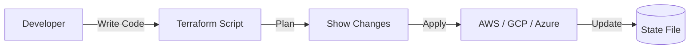

# 📜 Infrastructure as Code (IaC): Coding your Servers
> **Objective:** Automate the creation and management of cloud resources using scripts | **Language:** Hinglish | **Standard:** 2026 Expert Framework

---

## 🧭 1. Beginner-Friendly Hinglish Explanation
Infrastructure as Code (IaC) ka matlab hai "Servers aur Databases ko manual click karke nahi, balki code likhkar banana".

- **The Problem:** Agar aapko AWS console mein 10 servers, 2 databases, aur 1 load balancer banana hai, toh isme 1 ghanta lagega aur galti hone ke chances hain. Aur agar aapko yahi setup "Staging" ke liye dobara chahiye? Phir se 1 ghanta!
- **The Solution:** Aap ek script likhte hain jo batati hai ki humein kya-kya chahiye. 
- **The Concept:** Aap script run karte hain aur cloud provider (AWS) apne aap saare resources bana deta hai.
- **Intuition:** Ye ek "Lego Instruction Manual" ki tarah hai. Aap code mein manual likhte hain, aur automation engine (Terraform/Pulumi) us manual ko follow karke poora "Lego Set" (Infrastructure) khada kar deta hai.

---

## 🧠 2. Deep Technical Explanation
### 1. Declarative vs Imperative:
- **Declarative (Standard):** You say "I want 3 servers". The tool figures out how to create them. (E.g., **Terraform**, **CloudFormation**).
- **Imperative:** You say "Create server 1, then create server 2...". You define the exact steps.

### 2. Idempotency:
A key feature of IaC. If you run the same script 10 times, it won't create 10 sets of servers. It will check the current state and only create what's missing.

### 3. State Management:
IaC tools keep a "State File" (e.g., `terraform.tfstate`) that remembers exactly what exists in the cloud. Never delete this file!

---

## 🏗️ 3. Architecture Diagrams (The IaC Lifecycle)


---

## 💻 4. Production-Ready Examples (Terraform Basics)
```hcl
# 2026 Standard: Defining a S3 Bucket with Terraform

provider "aws" {
  region = "us-east-1"
}

resource "aws_s3_bucket" "my_assets" {
  bucket = "susa-labs-prod-assets-2026"
  
  tags = {
    Environment = "Prod"
    ManagedBy   = "Terraform"
  }
}

# 💡 Commands:
# 1. terraform init   (Setup)
# 2. terraform plan   (Dry run - see what will happen)
# 3. terraform apply  (Make it real)
```

---

## 🌍 5. Real-World Use Cases
- **Multi-Environment Setup:** Creating identical Dev, Staging, and Production environments in minutes.
- **Disaster Recovery:** If your entire AWS region is deleted, you can re-create your whole infrastructure in another region using one command.
- **Audit Compliance:** Seeing exactly how your infrastructure was changed and by whom (via Git history).

---

## ❌ 6. Failure Cases
- **State Mismatch:** Someone manually deletes a server via the AWS console. Now the IaC script is confused. **Fix: Use 'Drift Detection'.**
- **Concurrency Issues:** Two developers running `terraform apply` at the same time. **Fix: Use State Locking (e.g., via DynamoDB).**
- **Circular Dependencies:** Server A needs Database B, but Database B needs Server A.

---

## 🛠️ 7. Debugging Section
| Command | Purpose | Tip |
| :--- | :--- | :--- |
| **`terraform show`** | Inspect | See exactly what resources are currently managed in the state file. |
| **`terraform destroy`** | Cleanup | Deletes EVERYTHING defined in the script. Use with extreme caution! |

---

## ⚖️ 8. Tradeoffs
- **Initial Setup Time (High)** vs **Long-term Speed & Reliability (Extreme).** For a 1-day prototype, IaC might be overkill; for a production app, it's mandatory.

---

## 🛡️ 9. Security Concerns
- **Sensitive Data in State:** Terraform state files often contain DB passwords in plain text. **Fix: Use Remote State with encryption (S3 + KMS).**
- **Least Privilege:** The IAM user running Terraform should only have the permissions it needs.

---

## 📈 10. Scaling Challenges
- **Large State Files:** When your infra grows to thousands of resources, a single script becomes slow. **Fix: Use Modules to break it down.**

---

## 💸 11. Cost Considerations
- **Planning Savings:** IaC tools like **Infracost** can tell you exactly how much your script will cost per month BEFORE you even create the resources.

---

## ✅ 12. Best Practices
- **Never click in the Console.** (Once you start IaC, stick to it).
- **Use Git** for all infra code.
- **Store State Remotely** (Not on your laptop).
- **Use Modules** for reusability.

---

## ⚠️ 13. Common Mistakes
- **Committing `terraform.tfstate` to GitHub.** (Security risk!).
- **Hardcoding values** (Use variables instead).

---

## 📝 14. Interview Questions
1. "What is the difference between Declarative and Imperative IaC?"
2. "Why is the State File important in Terraform?"
3. "What happens if someone manually changes a resource in the cloud?"

---

## 🚀 15. Latest 2026 Production Patterns
- **Pulumi:** Using real programming languages (TypeScript/Python/Go) instead of YAML/HCL to define infrastructure.
- **GitOps:** Using tools like **ArgoCD** where your infrastructure automatically updates as soon as you push code to GitHub.
- **Crossplane:** Managing cloud resources directly from inside a Kubernetes cluster.
漫
