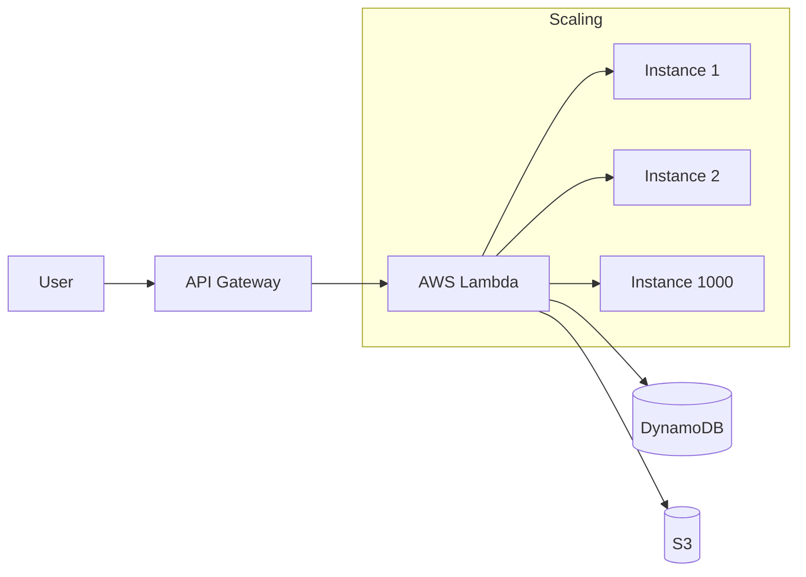

# ⚡ Serverless Architecture: Focus on Code, Not Servers
> **Objective:** Design highly scalable, cost-efficient systems without managing virtual machines | **Language:** Hinglish | **Standard:** 2026 Expert Framework

---

## 🧭 1. Beginner-Friendly Hinglish Explanation
Serverless ka matlab ye nahi hai ki "Server nahi hai". Iska matlab hai "Server hai, par aapko uski chinta nahi karni".

- **The Problem:** Ek server (EC2) ko manage karne mein bahut time lagta hai: Updates, Security, Scaling, aur idle time ka paisa.
- **The Solution:** Aap bas apna "Function" (Code) cloud par upload kar dete hain. Jab koi request aati hai, cloud provider ek chota server turant chalu karta hai, aapka code run karta hai, aur band kar deta hai.
- **The Magic:** Aap sirf "Execution Time" ke paise dete hain. Agar koi user nahi aaya, toh ₹0 bill.
- **Intuition:** Ye ek "Taxi" ki tarah hai. Aapko gaadi (Server) khareedne aur maintain karne ki zaroorat nahi hai. Aap bas baithte hain, destination tak jate hain, aur sirf us trip ka paisa dete hain.

---

## 🧠 2. Deep Technical Explanation
### 1. FaaS (Function as a Service):
The core of serverless. (E.g., **AWS Lambda**, **Google Cloud Functions**).
- **Event-Driven:** Runs in response to an HTTP request, a file upload to S3, or a message in a queue.
- **Short-lived:** Usually has a 15-minute maximum runtime.

### 2. BaaS (Backend as a Service):
Managed services that replace your own backend logic.
- **Auth:** Firebase Auth / AWS Cognito.
- **DB:** DynamoDB / PlanetScale.
- **Storage:** S3.

### 3. The Cold Start:
When a function hasn't been used in a while, the cloud provider needs to "Initialize" a container for it. This can add 500ms-2s of latency to the first request.

---

## 🏗️ 3. Architecture Diagrams (A Fully Serverless App)


---

## 💻 4. Production-Ready Examples (AWS Lambda in Node.js)
```typescript
// 2026 Standard: Clean Lambda Handler with TS

import { APIGatewayProxyEvent, APIGatewayProxyResult } from 'aws-lambda';

export const handler = async (event: APIGatewayProxyEvent): Promise<APIGatewayProxyResult> => {
  try {
    const body = JSON.parse(event.body || '{}');
    const { name } = body;

    // Logic: Save to DB, Send Email, etc.
    
    return {
      statusCode: 200,
      body: JSON.stringify({ message: `Hello ${name}, processed by Serverless!` }),
      headers: { 'Content-Type': 'application/json' }
    };
  } catch (err) {
    return {
      statusCode: 500,
      body: JSON.stringify({ error: 'Internal Server Error' })
    };
  }
};
```

---

## 🌍 5. Real-World Use Cases
- **Image Processing:** A user uploads a photo to S3 -> Trigger Lambda -> Resize image -> Save back to S3.
- **Cron Jobs:** Running a script every night to clean up old database records.
- **Chatbots:** Responding to messages from Telegram/Slack without a 24/7 server.
- **Webhooks:** Handling Stripe payment notifications.

---

## ❌ 6. Failure Cases
- **Timeouts:** Trying to process a 10GB video in a Lambda (it will die after 15 mins).
- **Concurrency Limits:** AWS has a default limit of 1000 parallel Lambdas. If you exceed this, new users get an error.
- **Hidden Complexity:** Managing 100 separate functions can become a debugging nightmare without proper tools.

---

## 🛠️ 7. Debugging Section
| Problem | Diagnostic | Solution |
| :--- | :--- | :--- |
| **High Latency** | Cold Start | Increase Memory (more memory = more CPU) or use "Provisioned Concurrency". |
| **Permission Denied** | IAM Role | Check if the Lambda has the correct policy to access S3/DynamoDB. |

---

## ⚖️ 8. Tradeoffs
- **Zero Maintenance & Infinite Scale** vs **Cold Starts & Higher cost per millisecond** (at very high constant traffic).

---

## 🛡️ 9. Security Concerns
- **Function Over-privilege:** Giving a function "Full Admin Access". **Fix: Use the Principle of Least Privilege.**
- **Secret Management:** Never put API keys in the code. Use **Environment Variables** or **Secrets Manager**.

---

## 📈 10. Scaling Challenges
- **Database Connections:** If 1000 Lambdas spin up at once, they might overwhelm your MySQL/Postgres DB with too many connections. **Fix: Use RDS Proxy or a serverless-native DB.**

---

## 💸 11. Cost Considerations
- **The "Bill Shock":** If a bug causes a Lambda to run in an infinite loop, you could get a bill for thousands of dollars in hours. **Fix: Set per-function concurrency limits.**

---

## ✅ 12. Best Practices
- **Keep functions small and specialized.**
- **Write stateless code.**
- **Use the Serverless Framework or AWS SAM** to manage your deployment.
- **Optimize for Cold Starts** (Keep dependencies minimal).

---

## ⚠️ 13. Common Mistakes
- **Using Serverless for "Long-running" tasks** (like a 2-hour data migration).
- **Not logging properly to CloudWatch.**

---

## 📝 14. Interview Questions
1. "What is a Cold Start and how do you mitigate it?"
2. "Why would you choose Serverless over EC2?"
3. "What happens if a Lambda function fails?"

---

## 🚀 15. Latest 2026 Production Patterns
- **Edge Functions (Cloudflare Workers/Vercel):** Running your code at the CDN edge, reducing latency to <30ms globally.
- **Step Functions:** Orchestrating multiple Lambdas into a complex workflow (e.g., If step 1 fails, do step 2).
- **Rust in Lambda:** Using Rust for ultra-fast startup times and lower memory usage compared to Node.js/Python.
漫
