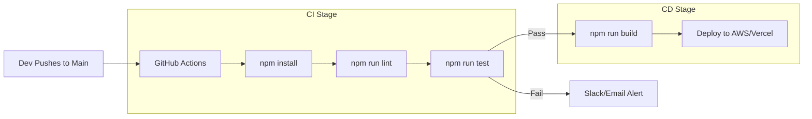

# 🚀 CI/CD for Backend: Automated Delivery
> **Objective:** Automate testing and deployment for rapid, reliable shipping | **Language:** Hinglish | **Standard:** 2026 Expert Framework

---

## 🧭 1. Beginner-Friendly Hinglish Explanation
CI/CD ka matlab hai "Manual mehnat khatam karo aur computer se kaam karwao".

- **The Problem:** Har baar code change karne ke baad manually `npm test` chalana aur server par code upload karna boring aur risky hai. Aap bhul sakte hain test chalana!
- **The Solution:** 
  - **CI (Continuous Integration):** Jaise hi aap code GitHub par "Push" karte hain, ek server automatically tests chalata hai. Agar test fail huye, toh code merge nahi hoga.
  - **CD (Continuous Deployment):** Agar tests pass ho gaye, toh code automatically "Production Server" (AWS/Vercel) par deploy ho jata hai.
- **The Result:** Aap sirf code likhte hain, baaki sab automation sambhal leti hai.

---

## 🧠 2. Deep Technical Explanation
### 1. The Pipeline:
A series of steps that must succeed for code to reach production:
1.  **Checkout:** Get code from GitHub.
2.  **Install:** `npm install`.
3.  **Lint:** Check code style.
4.  **Test:** Run unit and integration tests.
5.  **Build:** Compile TypeScript to JS.
6.  **Deploy:** Upload to cloud.

### 2. Tools:
- **GitHub Actions:** Most popular for 2026. Easy to setup inside the repo.
- **GitLab CI:** Great for enterprises.
- **CircleCI:** Very fast but can be expensive.

### 3. Deployment Strategies:
- **Rolling Update:** Update servers one by one.
- **Blue-Green:** Deploy to a new set of servers (Green), then switch traffic from old (Blue).
- **Canary:** Deploy to 5% of users first to check for bugs.

---

## 🏗️ 3. Architecture Diagrams (The Pipeline Flow)


---

## 💻 4. Production-Ready Examples (GitHub Action Workflow)
```yaml
# .github/workflows/main.yml
# 2026 Standard: Production Backend Pipeline

name: Backend CI/CD

on:
  push:
    branches: [ main ]

jobs:
  test-and-deploy:
    runs-on: ubuntu-latest
    
    steps:
      - uses: actions/checkout@v4
      
      - name: Setup Node.js
        uses: actions/setup-node@v4
        with:
          node-version: '20'
          cache: 'npm'

      - name: Install Dependencies
        run: npm ci

      - name: Run Tests
        run: npm test
        env:
          DATABASE_URL: ${{ secrets.TEST_DB_URL }}

      - name: Deploy to Vercel
        if: github.ref == 'refs/heads/main'
        run: npx vercel --token ${{ secrets.VERCEL_TOKEN }} --prod
```

---

## 🌍 5. Real-World Use Cases
- **Fast Shipping:** Deploying 10 times a day with confidence.
- **Open Source:** Automatically checking if a contributor's PR breaks anything.
- **Security:** Running an automatic vulnerability scan on every push.

---

## ❌ 6. Failure Cases
- **"It works on my machine":** Code passes locally but fails in CI because of missing environment variables. **Fix: Use GitHub Secrets.**
- **Long Pipelines:** Waiting 45 minutes for a deploy. **Fix: Use Parallel jobs and Caching.**
- **Broken Main:** Merging code that passes linting but breaks the actual app logic.

---

## 🛠️ 7. Debugging Section
| Problem | Diagnostic | Solution |
| :--- | :--- | :--- |
| **Pipeline fails at Install** | Check `package-lock.json` | Run `npm install` locally and re-commit the lock file. |
| **Test fails in CI** | Check logs | Look for "Environment Variable" or "Database Connection" errors. |
| **Slow Deploy** | Check Cache | Use `actions/setup-node` with `cache: 'npm'`. |

---

## ⚖️ 8. Tradeoffs
- **Full Automation vs Human Approval:** Automated CD is fast, but some companies prefer a "Manual Approval" button before hitting production.

---

## 🛡️ 9. Security Concerns
- **Exposed Secrets:** Never print secrets in your logs. GitHub Actions automatically masks them, but be careful.
- **Supply Chain Attacks:** CI servers downloading a malicious package. **Fix: Use `npm ci` and lock files.**

---

## 📈 10. Scaling Challenges
- **Self-hosted Runners:** If GitHub's servers are too slow, you can run CI on your own powerful servers.

---

## 💸 11. Cost Considerations
- **Free Tier Limits:** GitHub Actions gives 2,000 minutes/month for free. Large teams can easily exceed this.

---

## ✅ 12. Best Practices
- **Never skip tests in CI.**
- **Use `npm ci`** for faster and more reliable installs.
- **Cache your `node_modules`.**
- **Fail fast:** Put the fastest steps (Lint) before slow ones (E2E).

---

## ⚠️ 13. Common Mistakes
- **No caching:** Downloading the entire internet on every single push.
- **Hardcoding secrets** in the `.yml` file.

---

## 📝 14. Interview Questions
1. "What is the difference between Continuous Integration and Continuous Deployment?"
2. "Why should you use `npm ci` instead of `npm install` in a CI environment?"
3. "Explain the 'Blue-Green' deployment strategy."

---

## 🚀 15. Latest 2026 Production Patterns
- **GitHub Environments:** Protecting production deployments with required reviewers and wait timers.
- **Atomic Deploys:** Ensuring that a deployment is "All or Nothing"—it never leaves the site in a half-updated state.
- **AI Log Analysis:** Using agents to analyze CI failure logs and suggest the exact fix to the developer.
漫
