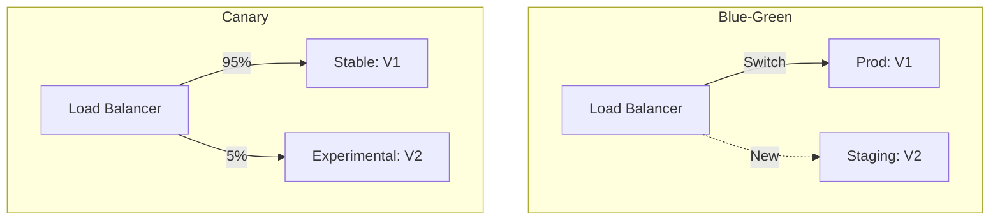

# 🚀 Deployment Strategies: Zero-Downtime Shipping
> **Objective:** Update your application safely without interrupting the user's experience | **Language:** Hinglish | **Standard:** 2026 Expert Framework

---

## 🧭 1. Beginner-Friendly Hinglish Explanation
Deployment Strategies ka matlab hai "Naya code server par daalne ka tarika".

- **The Problem:** Jab aap naya code deploy karte hain, toh server restart hota hai. Is 30-60 seconds mein agar koi user site par aaye, toh use "Error" dikhta hai.
- **The Solution:** Humein aise tarike chahiye ki naya code bhi aa jaye aur user ko pata bhi na chale.
- **The Core Strategies:**
  1. **Recreate:** Purana band karo, naya chalu karo. (Downtime!).
  2. **Rolling Update:** Ek-ek karke servers badlo.
  3. **Blue-Green:** Do poore set rakho (Purana aur Naya), aur switch kardo.
  4. **Canary:** Pehle sirf 5% users ko naya code dikhao.
- **Intuition:** Ye ek "Relay Race" ki tarah hai. Ek runner tab tak nahi rukta jab tak dusra doudna shuru na karde aur baton (Traffic) exchange na ho jaye.

---

## 🧠 2. Deep Technical Explanation
### 1. Rolling Update (Default in K8s):
If you have 10 servers, you replace 2 at a time.
- **Pros:** No downtime, uses the same amount of hardware.
- **Cons:** For a few minutes, some users see Version 1 and some see Version 2. (Can cause DB issues!).

### 2. Blue-Green Deployment:
You spin up a completely new environment (Green) with Version 2. You test it. If it's perfect, you flip the Load Balancer to Green.
- **Pros:** Instant switch, easy rollback (just flip back to Blue).
- **Cons:** Very expensive (you need $2x$ the servers during the switch).

### 3. Canary Deployment:
Routing a small percentage of traffic (e.g., 5%) to the new version.
- **Goal:** If the new version has a bug, only 5% of users are affected. If the metrics look good, increase to 20%, 50%, then 100%.

---

## 🏗️ 3. Architecture Diagrams (Blue-Green vs Canary)


---

## 💻 4. Production-Ready Examples (Conceptual Nginx Canary)
```nginx
# 2026 Standard: Nginx Split Traffic (Canary)

upstream backend {
    # 90% of traffic to stable
    server stable-api.susa.com weight=90;
    
    # 10% of traffic to canary
    server canary-api.susa.com weight=10;
}

server {
    location / {
        proxy_pass http://backend;
    }
}
```

---

## 🌍 5. Real-World Use Cases
- **Mission Critical Apps (Banking):** Using Blue-Green to ensure 100% uptime and instant rollback if a transaction bug is found.
- **Social Media (Facebook):** Using Canary to test new features in only one country (e.g., New Zealand) before the whole world.
- **Small Prototypes:** Using Recreate (Stop-Start) as downtime doesn't matter much yet.

---

## ❌ 6. Failure Cases
- **Database Schema Mismatch:** You deployed Version 2 which expects a new column in the DB, but Version 1 (which is still running during the update) doesn't know about it and crashes. **Fix: Use 'Expand and Contract' pattern for DB migrations.**
- **Sticky Session Failure:** A user was in the middle of a session on V1, and suddenly they are moved to V2, losing their local state.
- **Incomplete Rollback:** Trying to go back to V1 but some data has already been permanently changed by V2.

---

## 🛠️ 7. Debugging Section
| Problem | Diagnostic | Solution |
| :--- | :--- | :--- |
| **Errors Spike during deploy** | Monitoring | If the error rate on the Canary version is > 1%, immediately **Rollback** to the stable version. |
| **Downtime detected** | Load Balancer | Check if the Health Checks for the new version are passing. If not, the LB won't send traffic to it. |

---

## ⚖️ 8. Tradeoffs
- **Reliability (Canary) vs Cost (Blue-Green) vs Simplicity (Recreate).**

---

## 🛡️ 9. Security Concerns
- **Traffic Interception:** Ensure that during a Blue-Green switch, HTTPS remains active and certificates are valid for both environments.

---

## 📈 10. Scaling Challenges
- **Service Mesh (Istio):** Using a mesh to handle complex traffic splits (e.g., "Send only users from New York to the Canary version").

---

## 💸 11. Cost Considerations
- **Environment Duplication:** Blue-Green requires double the cost for a few hours. Budget accordingly.

---

## ✅ 12. Best Practices
- **Automate the Rollback** (If errors > X, go back).
- **Use Feature Flags** instead of separate deployments for simple features.
- **Keep Database Migrations independent** of code deployments.
- **Monitor logs in real-time** during the deployment window.

---

## ⚠️ 13. Common Mistakes
- **Deploying on Fridays!** (Never do this, unless you want to work on Saturday).
- **Not testing the rollback process.**

---

## 📝 14. Interview Questions
1. "Explain the difference between Blue-Green and Canary deployments."
2. "How do you handle database migrations during a rolling update?"
3. "What is Zero-Downtime deployment?"

---

## 🚀 15. Latest 2026 Production Patterns
- **Progressive Delivery (Argo Rollouts):** An automated K8s controller that handles Canary deployments and automatically rolls back if it detects a spike in errors or latency.
- **Shadow Deployment:** Running the new version in parallel with the old one, sending it REAL traffic, but ignoring its responses. This allows you to test V2 with real load without affecting any users.
漫
