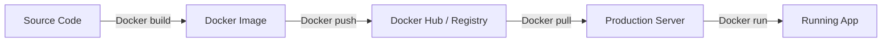

# 🐳 Docker Complete Guide: Shipping your App in a Box
> **Objective:** Master containerization to ensure your app runs everywhere perfectly | **Language:** Hinglish | **Standard:** 2026 Expert Framework

---

## 🧭 1. Beginner-Friendly Hinglish Explanation
Docker ka matlab hai "Apne app ke liye ek virtual box (Container) banana".

- **The Problem:** "Mere machine par chal raha hai, par server par nahi" (It works on my machine!). Ye isliye hota hai kyunki server par Node.js version alag ho sakta hai, ya koi library missing ho sakti hai.
- **The Solution:** Docker aapke code, libraries, settings, aur dependencies ko ek saath pack kar deta hai.
- **The Concept:** 
  1. **Image:** Ek frozen template (jaise Windows ki ISO file ya game ki CD).
  2. **Container:** Us image ka ek live instance (jaise game install hone ke baad chal raha hai).
- **Intuition:** Ye ek "Shipping Container" ki tarah hai. Iske andar kya hai (Node.js, Python, Java) usse farak nahi padta. Crane (Docker Engine) ise utha kar kisi bhi jahaz (Server) par rakh sakti hai.

---

## 🧠 2. Deep Technical Explanation
### 1. VM vs Container:
- **VM (Virtual Machine):** Includes a whole Guest OS. Heavy and slow ($>1GB$ size).
- **Container:** Shares the Host OS kernel. Light and fast ($<100MB$ size).

### 2. Layers:
Docker images are made of layers. If you change only one line of code, Docker only rebuilds the top layer. This makes builds super fast.

### 3. Registry (Docker Hub):
A place where you store and share your images.

---

## 🏗️ 3. Architecture Diagrams (The Docker Workflow)


---

## 💻 4. Production-Ready Examples (A Perfect Dockerfile)
```dockerfile
# 2026 Standard: Optimized Multi-stage Build for Node.js

# Stage 1: Build
FROM node:20-alpine AS builder
WORKDIR /app
COPY package*.json ./
RUN npm install
COPY . .
RUN npm run build

# Stage 2: Production
FROM node:20-alpine
WORKDIR /app
COPY --from=builder /app/dist ./dist
COPY --from=builder /app/package*.json ./
RUN npm install --omit=dev

EXPOSE 3000
CMD ["node", "dist/main.js"]

# 💡 Pro Tip: Using 'alpine' images reduces size from 
# 900MB to 100MB, saving bandwidth and storage.
```

---

## 🌍 5. Real-World Use Cases
- **Microservices:** Running 50 different services (each with its own DB and language) on a single machine without conflicts.
- **CI/CD:** Ensuring the testing environment is EXACTLY the same as the production environment.
- **Legacy Apps:** Running a 10-year-old app that needs a very specific, outdated version of Linux.

---

## ❌ 6. Failure Cases
- **Massive Images:** Forgetting to use `.dockerignore`, so you upload your `node_modules` and `.git` folder into the image.
- **Root User:** Running the app as 'root' inside the container. If the app is hacked, the hacker has root access to your server. **Fix: Use `USER node`.**
- **Hardcoded Secrets:** Putting API keys in the `Dockerfile`. **Fix: Use Environment Variables.**

---

## 🛠️ 7. Debugging Section
| Command | Purpose | Tip |
| :--- | :--- | :--- |
| **`docker ps`** | Status | See all running containers and their IDs. |
| **`docker logs -f [id]`** | Logging | See the live console output of your app inside the container. |
| **`docker exec -it [id] sh`** | SSH | "Jump inside" the running container to check files and debug. |

---

## ⚖️ 8. Tradeoffs
- **Complexity (Learning curve)** vs **Reliability (Consistency).**

---

## 🛡️ 9. Security Concerns
- **Image Scanning:** Use tools like **Snyk** or **Trivy** to scan your Docker images for known security vulnerabilities before deploying.
- **Read-only Filesystems:** Running containers with a read-only filesystem so hackers can't modify your code.

---

## 📈 10. Scaling Challenges
- **Orchestration:** When you have 100 containers, managing them manually is impossible. You need **Kubernetes** or **Docker Swarm**.

---

## 💸 11. Cost Considerations
- **Storage:** Large images cost more to store in private registries (like AWS ECR). Always prune old images.

---

## ✅ 12. Best Practices
- **Use Multi-stage builds.**
- **Use `.dockerignore`.**
- **Never store data inside a container** (It's ephemeral!). Use **Volumes**.
- **Keep images small.**

---

## ⚠️ 13. Common Mistakes
- **Running one container for App + Database.** (Bad! Use separate containers).
- **Not specifying versions** (e.g., using `FROM node:latest` instead of `node:20`).

---

## 📝 14. Interview Questions
1. "What is the difference between a Docker Image and a Container?"
2. "How do Multi-stage builds help?"
3. "What is a Docker Volume and why is it needed?"

---

## 🚀 15. Latest 2026 Production Patterns
- **Wasm (WebAssembly) in Docker:** Running lightning-fast, secure binaries inside Docker instead of whole Linux containers.
- **Distroless Images:** Images that contain ONLY your app and its dependencies (no shell, no package manager), making them ultra-secure.
- **BuildKit:** The new Docker build engine that allows parallel execution and secret mounting during build time.
漫
