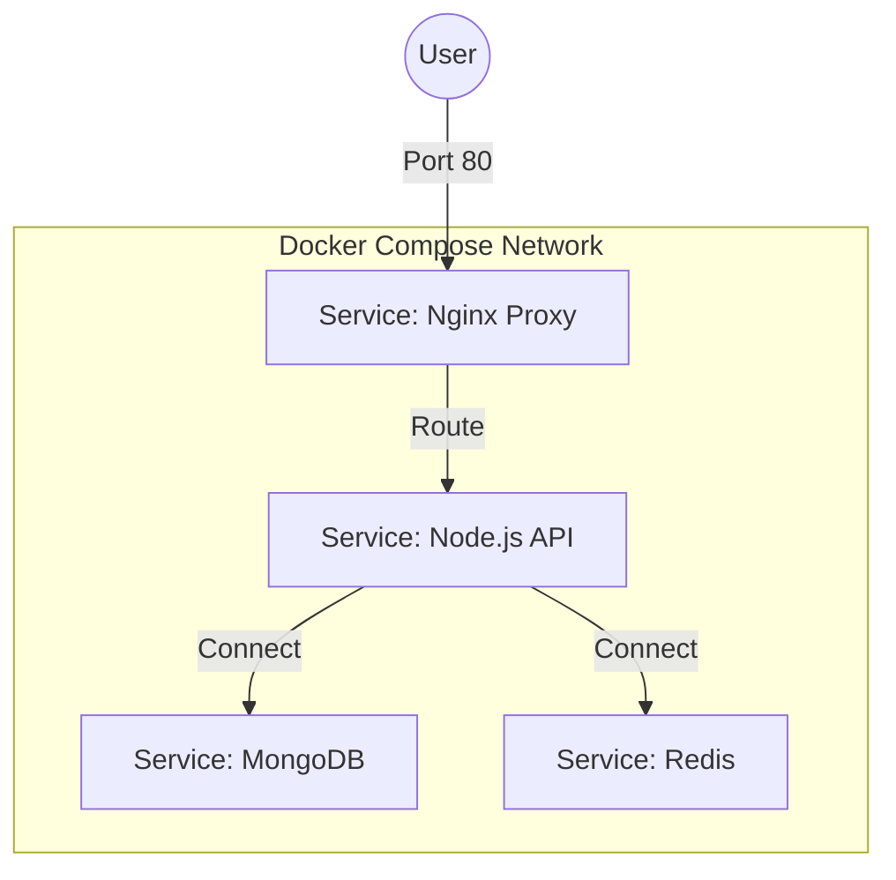

# 🐙 Docker Compose: Managing Multi-Container Apps
> **Objective:** Orchestrate multiple services (API, DB, Redis) with a single command | **Language:** Hinglish | **Standard:** 2026 Expert Framework

---

## 🧭 1. Beginner-Friendly Hinglish Explanation
Docker Compose ka matlab hai "Poore system ko ek saath manage karna".

- **The Problem:** Aapka app sirf Node.js nahi hai. Use MongoDB, Redis, aur ElasticSearch bhi chahiye. Kya aap har baar 4-5 lambi `docker run` commands manually type karenge?
- **The Solution:** Humein ek `docker-compose.yml` file milti hai jahan hum likhte hain ki kaunse containers chahiye aur wo aapas mein kaise baat karenge.
- **The Command:** Sirf ek command: `docker-compose up`. Saara system (Frontend, Backend, DB) apne aap khada ho jayega.
- **Intuition:** Ye ek "Orchestra Conductor" ki tarah hai. Wo batata hai ki piano kab bajega, drum kab bajega, aur sab saath mein kaise bajenge.

---

## 🧠 2. Deep Technical Explanation
### 1. Service Definition:
In Compose, each container is a "Service". You define the image, environment variables, ports, and volumes for each.

### 2. Networking:
Compose automatically creates a "Private Network" for your services. Inside the network, services can talk to each other using their names (e.g., `http://database:27017`) instead of IPs.

### 3. Depends On:
You can tell Compose to start the Database *before* starting the API using the `depends_on` property.

---

## 🏗️ 3. Architecture Diagrams (The Compose Stack)


---

## 💻 4. Production-Ready Examples (A Full Stack YAML)
```yaml
# 2026 Standard: Production-Ready docker-compose.yml

version: '3.8'

services:
  api:
    build: .
    ports:
      - "3000:3000"
    environment:
      - MONGO_URL=mongodb://db:27017/myapp
      - REDIS_URL=redis://cache:6379
    depends_on:
      - db
      - cache

  db:
    image: mongo:latest
    volumes:
      - mongo_data:/data/db

  cache:
    image: redis:alpine

volumes:
  mongo_data:
```

---

## 🌍 5. Real-World Use Cases
- **Local Development:** Giving a new developer a working environment in 5 minutes.
- **Automated Testing:** CI/CD pipeline spins up the full stack, runs tests, and deletes everything.
- **Staging Environments:** Mirroring the production stack on a single small server for internal testing.

---

## ❌ 6. Failure Cases
- **Port Conflict:** Trying to run two Compose stacks that both want to use port 80.
- **Startup Race Condition:** The API starts, tries to connect to the DB, but the DB is still "Booting up". The API crashes. **Fix: Use a 'wait-for-it' script or health checks.**
- **Missing Volumes:** Forgetting to define volumes, so when you restart the DB, all your data is gone.

---

## 🛠️ 7. Debugging Section
| Command | Purpose | Tip |
| :--- | :--- | :--- |
| **`docker-compose up -d`** | Detached | Run in the background so it doesn't block your terminal. |
| **`docker-compose logs -f api`** | Service Logs | See logs for only one specific service. |
| **`docker-compose down -v`** | Full Reset | Stops everything and DELETES all volumes (use for a fresh start). |

---

## ⚖️ 8. Tradeoffs
- **Ease of Use (High)** vs **Production Readiness (Medium).** For a single-server deploy, Compose is great; for a massive cluster, use Kubernetes.

---

## 🛡️ 9. Security Concerns
- **Internal Only:** By default, services in Compose can talk to each other, but only the ones you put in `ports` are visible to the outside world. Keep your DB private!

---

## 📈 10. Scaling Challenges
- **Vertical Only:** Standard Compose is meant for a single machine. You can't easily scale to 5 different physical servers with just Compose.

---

## 💸 11. Cost Considerations
- **Resource Limits:** If one container has a memory leak, it can crash the whole machine. **Fix: Use `deploy.resources.limits` in your YAML.**

---

## ✅ 12. Best Practices
- **Use `.env` files** for secrets.
- **Name your volumes** for easy management.
- **Use `alpine` images** where possible.
- **Specify versions** for every image.

---

## ⚠️ 13. Common Mistakes
- **Hardcoding passwords** in the YAML file.
- **Not using health checks.**

---

## 📝 14. Interview Questions
1. "How do services talk to each other in Docker Compose?"
2. "What is the purpose of the `volumes` section?"
3. "How do you handle secrets in a docker-compose.yml file?"

---

## 🚀 15. Latest 2026 Production Patterns
- **Docker Compose V2:** The new `docker compose` (without the hyphen) is faster and integrated directly into the Docker CLI.
- **Profiles:** Using "Profiles" to selectively start services (e.g., `docker compose --profile debug up` only starts the debugger container).
- **Compose Bridge:** Tools that automatically convert your Docker Compose file into Kubernetes manifests.
漫
