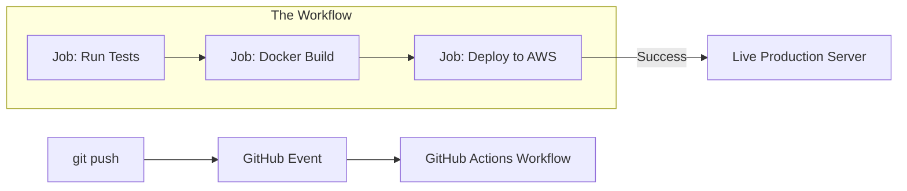

# 🐙 GitHub Actions: Automating your Workflow
> **Objective:** Master CI/CD directly inside your GitHub repository | **Language:** Hinglish | **Standard:** 2026 Expert Framework

---

## 🧭 1. Beginner-Friendly Hinglish Explanation
GitHub Actions ka matlab hai "GitHub par ek chota robot jo aapka kaam aasaan karta hai".

- **The Problem:** Har baar jab aap code push karte hain, aapko manually tests run karne padte hain, build banani padti hai, aur server par deploy karna padta hai. Isme galti hone ke chances hain aur ye boring hai.
- **The Solution:** GitHub Actions aapko "Workflows" banane deta hai. Jab aap code `push` karte hain, GitHub apne aap ek server chalu karta hai, aapka code download karta hai, aur aapke bataye huye saare kaam (Steps) kar deta hai.
- **The Magic:** Agar tests fail hote hain, toh code deploy nahi hoga.
- **Intuition:** Ye ek "Smart Assistant" ki tarah hai. Aap use kehte hain: "Jab bhi main main-branch mein code daalun, use check karo aur agar sab sahi ho toh server par bhej do".

---

## 🧠 2. Deep Technical Explanation
### 1. Core Components:
- **Workflow:** The full process (defined in a `.yml` file in `.github/workflows/`).
- **Event:** What triggers the workflow (e.g., `push`, `pull_request`, `schedule`).
- **Job:** A set of steps that run on the same runner (server).
- **Step:** An individual task (e.g., `npm install`).
- **Action:** A reusable piece of code (e.g., `actions/checkout`).
- **Runner:** The server that executes the workflow (GitHub-hosted or Self-hosted).

### 2. Secrets:
Encrypted environment variables (like API keys) that you save in GitHub settings and use in your workflows safely.

### 3. Matrix Builds:
Running the same tests across multiple versions of Node.js or different Operating Systems at the same time.

---

## 🏗️ 3. Architecture Diagrams (The CI/CD Pipeline)


---

## 💻 4. Production-Ready Examples (A Real Node.js Workflow)
```yaml
# 2026 Standard: Node.js CI/CD Workflow

name: Node.js CI

on:
  push:
    branches: [ main ]
  pull_request:
    branches: [ main ]

jobs:
  test-and-build:
    runs-on: ubuntu-latest

    steps:
    - name: Checkout Code
      uses: actions/checkout@v4

    - name: Setup Node.js
      uses: actions/setup-node@v4
      with:
        node-version: '20'
        cache: 'npm'

    - name: Install Dependencies
      run: npm ci

    - name: Run Tests
      run: npm test

    - name: Docker Build & Push
      if: github.ref == 'refs/heads/main'
      run: |
        docker build -t susalabs/api:${{ github.sha }} .
        echo "${{ secrets.DOCKER_PASSWORD }}" | docker login -u "${{ secrets.DOCKER_USERNAME }}" --password-stdin
        docker push susalabs/api:${{ github.sha }}
```

---

## 🌍 5. Real-World Use Cases
- **Auto-testing:** Running 500 unit tests on every Pull Request.
- **Auto-linting:** Automatically fixing code style (prettier) and pushing it back.
- **Releasing:** Creating a GitHub "Release" and uploading a ZIP file whenever a new Tag is pushed.
- **Security:** Scanning your dependencies for known vulnerabilities every night.

---

## ❌ 6. Failure Cases
- **Bill Overload:** Running a complex workflow that takes 30 minutes on every small commit. **Fix: Use `path` filters.**
- **Secret Leaks:** Accidentally printing a secret in the logs using `echo $SECRET`. **Fix: GitHub automatically masks secrets with `***`, but be careful.**
- **Race Conditions:** Two deployments running at the same time and messing up the server.

---

## 🛠️ 7. Debugging Section
| Problem | Diagnostic | Solution |
| :--- | :--- | :--- |
| **Workflow not triggering** | Event Check | Ensure your branch names match exactly in the `on:` section. |
| **"Command not found"** | Environment | Ensure you have installed the tool (like `npm` or `docker`) in a previous step. |
| **Permissions Error** | GITHUB_TOKEN | Some actions need explicit permissions to write to the repo. Check the `permissions:` block. |

---

## ⚖️ 8. Tradeoffs
- **Ease of Use (High)** vs **Cost (Paid for private repos after free limit).**

---

## 🛡️ 9. Security Concerns
- **Pull Request Injection:** If you run untrusted code from a Pull Request, it can steal your secrets. **Fix: Never run `secrets` on `pull_request` from forks.**

---

## 📈 10. Scaling Challenges
- **Self-hosted Runners:** If you need specific hardware (GPUs) or want to save money, you can use your own servers as runners.

---

## 💸 11. Cost Considerations
- **Public Repos:** 100% Free!
- **Private Repos:** 2000 minutes/month for free, then you pay. Be careful with large Docker builds.

---

## ✅ 12. Best Practices
- **Use Caching** for `node_modules` to speed up builds by $3x$.
- **Use 'Enviroments'** for deployment protection (requires manual approval).
- **Keep Workflows small and modular.**
- **Use the latest version of actions** (e.g., `@v4`).

---

## ⚠️ 13. Common Mistakes
- **Not using `npm ci`** (Use `ci` for consistent installs in CI).
- **Hardcoding branch names** inside steps.

---

## 📝 14. Interview Questions
1. "What is a GitHub Action?"
2. "How do you handle secrets in GitHub Actions?"
3. "Explain the difference between a Job and a Step."

---

## 🚀 15. Latest 2026 Production Patterns
- **Reusable Workflows:** Creating one standard "Deploy" workflow and sharing it across 50 different microservice repos.
- **Deployment Protection Rules:** Requiring a successful security scan or a manual click from a manager before deploying to production.
- **Dependency Caching (NPM/Yarn/Bun):** Built-in caching that makes Node.js CI almost instant.
漫
