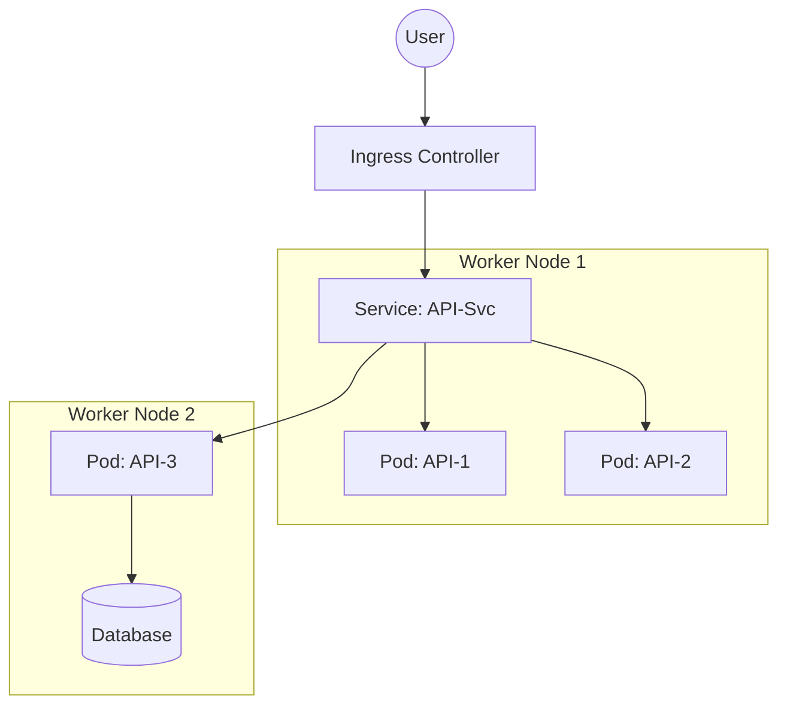

# ☸️ Kubernetes Fundamentals: The Ship's Captain
> **Objective:** Master container orchestration at scale | **Language:** Hinglish | **Standard:** 2026 Expert Framework

---

## 🧭 1. Beginner-Friendly Hinglish Explanation
Kubernetes (K8s) ka matlab hai "Containers ka Manager".

- **The Problem:** Docker se aap 1-2 containers toh manage kar lenge. Par agar aapke paas 500 containers hain jo 50 servers par chal rahe hain, toh unhe update karna, unka health check karna, aur scale karna insaan ke bas ki baat nahi hai.
- **The Solution:** Kubernetes ek automation engine hai jo aapke containers ko "Orchestrate" (manage) karta hai.
- **The Magic:** Aap K8s ko batate hain: "Mujhe 10 containers chalu chahiye". Agar ek container crash hota hai, K8s use turant dobara chalu kar deta hai.
- **Intuition:** K8s ek "Automatic Pilot" ki tarah hai. Aap use batate hain kahan jana hai, aur wo raste ki mushkilon (Server failure, High traffic) ko khud handle karta hai.

---

## 🧠 2. Deep Technical Explanation
### 1. Cluster Architecture:
- **Control Plane:** The "Brain" that makes decisions.
- **Worker Nodes:** The physical/virtual machines where containers actually run.

### 2. Basic Objects:
- **Pod:** The smallest unit. It contains one or more containers.
- **Deployment:** Controls how many copies (Replicas) of a Pod should run.
- **Service:** A stable IP/DNS name to reach a set of Pods (Load Balancer).
- **Ingress:** The "Gatekeeper" that routes external HTTP traffic into the cluster.

### 3. Declarative Management:
You define everything in **YAML** files. K8s constantly works to make the "Actual State" match your "Desired State".

---

## 🏗️ 3. Architecture Diagrams (The K8s Cluster)


---

## 💻 4. Production-Ready Examples (A Simple Deployment)
```yaml
# 2026 Standard: K8s Deployment Manifest

apiVersion: apps/v1
kind: Deployment
metadata:
  name: susa-api
spec:
  replicas: 3
  selector:
    matchLabels:
      app: susa-api
  template:
    metadata:
      labels:
        app: susa-api
    spec:
      containers:
      - name: api
        image: susalabs/api:v1.2.0
        ports:
        - containerPort: 3000
        resources:
          limits:
            memory: "512Mi"
            cpu: "500m"
```

---

## 🌍 5. Real-World Use Cases
- **Self-Healing:** If a server hardware fails, K8s moves all its containers to another healthy server automatically.
- **Zero-Downtime Updates:** Updating the app version by replacing containers one by one (Rolling Update).
- **Auto-scaling:** Adding 100 more Pods in seconds when traffic spikes.

---

## ❌ 6. Failure Cases
- **Resource Exhaustion:** One Pod using too much RAM and getting killed by K8s (OOMKilled).
- **ImagePullBackOff:** K8s trying to pull a private image but doesn't have the password (Secret).
- **CrashLoopBackOff:** Your app has a bug and crashes immediately on start; K8s keeps trying to restart it forever.

---

## 🛠️ 7. Debugging Section
| Command | Purpose | Tip |
| :--- | :--- | :--- |
| **`kubectl get pods`** | Status | See all pods and their current state (Running/Pending/Error). |
| **`kubectl describe pod [name]`** | Investigation | See a detailed "Event Log" of what happened to the pod. |
| **`kubectl logs [name]`** | Logging | Standard output of the app inside the pod. |

---

## ⚖️ 8. Tradeoffs
- **High Reliability & Infinite Scale** vs **High Complexity & Steep Learning Curve.** Small startups should avoid K8s until they truly need it.

---

## 🛡️ 9. Security Concerns
- **RBAC (Role-Based Access Control):** Limiting what developers can do inside the cluster.
- **Secrets:** Storing DB passwords securely instead of in plain YAML.

---

## 📈 10. Scaling Challenges
- **The Database Problem:** Scaling stateless APIs is easy; scaling stateful databases (Postgres/Mongo) inside K8s is very hard. **Fix: Use Managed DBs (RDS) outside K8s.**

---

## 💸 11. Cost Considerations
- **Idle Nodes:** If you have 10 servers but only use 10% of their CPU, you are wasting money. **Fix: Use 'Cluster Autoscaler'.**

---

## ✅ 12. Best Practices
- **Always set Resource Limits.**
- **Use Readiness & Liveness Probes.**
- **Use Namespaces** to separate Dev/Prod.
- **Don't use 'latest' tags for images.**

---

## ⚠️ 13. Common Mistakes
- **Treating Pods like VMs** (They are temporary! Don't save data inside them).
- **Putting the whole cluster in a single Public Subnet.**

---

## 📝 14. Interview Questions
1. "What is a Pod?"
2. "How does a Service provide a stable IP for changing Pods?"
3. "Explain the difference between a Deployment and a StatefulSet."

---

## 🚀 15. Latest 2026 Production Patterns
- **Serverless K8s (EKS Fargate):** Running K8s without managing the worker nodes (AWS manages them for you).
- **ArgoCD (GitOps):** Your cluster automatically pulls changes from GitHub. No more `kubectl apply` manually.
- **Service Mesh (Istio):** Handling complex routing and security between pods automatically.
漫
