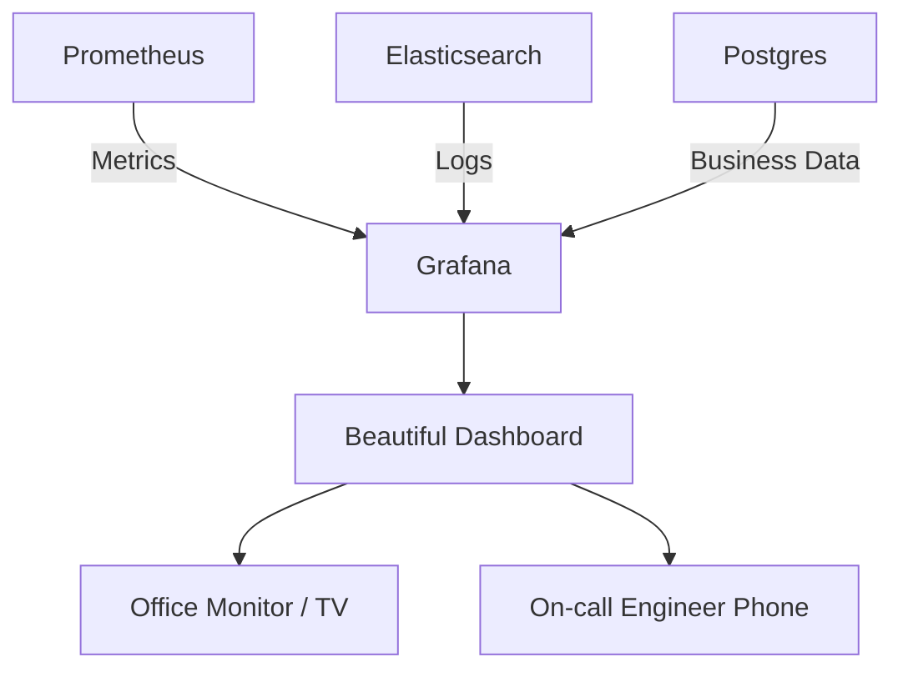

# 🖼️ Dashboards with Grafana: Visualizing Reality
> **Objective:** Turn complex metrics and logs into beautiful, actionable dashboards | **Language:** Hinglish | **Standard:** 2026 Expert Framework

---

## 🧭 1. Beginner-Friendly Hinglish Explanation
Grafana ka matlab hai "Data ka Makeup (Visualization)".

- **The Problem:** Prometheus aapko numbers deta hai, aur Logs aapko text dete hain. Inhe dekhkar turant samajhna mushkil hai ki system "Theek hai ya nahi".
- **The Solution:** Grafana ek dashboard tool hai jo Prometheus aur Elasticsearch se data leta hai aur use Graphs, Pie Charts, aur Heatmaps mein badal deta hai.
- **The Concept:** 
  1. **Data Source:** Jahan se data aa raha hai (Prometheus).
  2. **Panel:** Ek akela graph (e.g., "Active Users").
  3. **Dashboard:** Bahut saare panels ka ek page.
- **Intuition:** Ye ek "Mission Control Center" ki tarah hai (jaise NASA mein hota hai). Screens par sab dikh raha hota hai—agar koi line "Lal" (Red) hui, toh matlab khatra hai!

---

## 🧠 2. Deep Technical Explanation
### 1. Multi-source Visualization:
The power of Grafana is that you can have one graph from **Prometheus** (CPU) and another from **Elasticsearch** (Errors) on the same page.

### 2. Variables & Templating:
Instead of making 10 dashboards for 10 servers, you make one dashboard with a `$server` variable. You can then switch between servers using a dropdown menu.

### 3. Annotations:
Grafana can mark events on your graphs. E.g., if you deployed a new version at 2 PM, a vertical line appears. If errors spike right after that line, you know the deployment caused it.

---

## 🏗️ 3. Architecture Diagrams (The Visualization Stack)


---

## 💻 4. Production-Ready Examples (Conceptual Dashboard Setup)
```json
// 2026 Standard: A typical Grafana Dashboard JSON (Snippet)

{
  "panels": [
    {
      "title": "HTTP Requests per Second",
      "type": "timeseries",
      "targets": [
        {
          "expr": "sum(rate(http_requests_total[1m]))",
          "legendFormat": "Requests/sec"
        }
      ]
    },
    {
      "title": "Error Rate (%)",
      "type": "stat",
      "targets": [
        {
          "expr": "sum(rate(http_requests_total{status=~'5..'}[1m])) / sum(rate(http_requests_total[1m])) * 100"
        }
      ]
    }
  ]
}
```

---

## 🌍 5. Real-World Use Cases
- **The "Wall of Truth":** A big TV in the engineering office showing the real-time health of the system.
- **Business Monitoring:** Tracking how many "Orders" are being placed every minute to see if the marketing campaign is working.
- **Cloud Cost:** Visualizing AWS spending in real-time to avoid a bill shock.

---

## ❌ 6. Failure Cases
- **The "Dashboard Blindness":** Having too many graphs (100+) on one page. The engineer gets confused and misses the important one. **Fix: Follow the 'Golden Signals' approach.**
- **Stale Data:** The dashboard shows "Everything is OK" because the connection to Prometheus is broken. **Fix: Use health checks for data sources.**
- **Permission Issues:** Giving "Edit" access to everyone, and someone accidentally deletes a critical panel.

---

## 🛠️ 7. Debugging Section
| Problem | Diagnostic | Solution |
| :--- | :--- | :--- |
| **"No data points"** | Query Error | Check the PromQL query in the Prometheus UI first. If it works there, check the Grafana Data Source settings. |
| **Dashboard is slow** | Heavy Queries | If you are calculating 1-year averages on every refresh, Grafana will hang. Use **Recording Rules** in Prometheus. |

---

## ⚖️ 8. Tradeoffs
- **Self-hosted (Free but needs management)** vs **Grafana Cloud (Paid but zero-maintenance and highly reliable).**

---

## 🛡️ 9. Security Concerns
- **Sensitive Business Data:** If your dashboard shows revenue or user phone numbers, ensure it is behind an **SSO/Google Login**.
- **Public Snapshots:** Never share a "Public Snapshot" of a dashboard that contains internal server IPs.

---

## 📈 10. Scaling Challenges
- **Rendering Load:** If 1000 people open a complex dashboard at once, it can crash the Grafana server. **Fix: Use Caching or Grafana Enterprise.**

---

## 💸 11. Cost Considerations
- **Grafana Cloud:** Offers a generous free tier, but the cost increases based on the number of "Active Series" (metrics) you send.

---

## ✅ 12. Best Practices
- **Use Dark Mode** (Easier on the eyes for 24/7 monitoring).
- **Keep it simple** (5-7 key metrics per dashboard).
- **Group related panels into 'Rows'.**
- **Use Alerts** inside Grafana for visual warnings.

---

## ⚠️ 13. Common Mistakes
- **Making dashboards too 'Pretty' but useless.**
- **Not using variables** (Hardcoding server names).

---

## 📝 14. Interview Questions
1. "What is the difference between Prometheus and Grafana?"
2. "What are 'Variables' in Grafana and why are they useful?"
3. "How do you visualize logs and metrics on the same Grafana dashboard?"

---

## 🚀 15. Latest 2026 Production Patterns
- **Dashboard as Code (Grafonnet/Terraform):** Writing your dashboards in code so they can be version-controlled in Git.
- **AI-Powered Anomaly Detection:** Grafana automatically highlighting a part of the graph and saying "This drop in traffic is unusual for a Monday morning."
- **Mixed Data Sources:** Combining SQL data (User Growth) and Prometheus data (Server Load) to see how users affect the infrastructure.
漫
