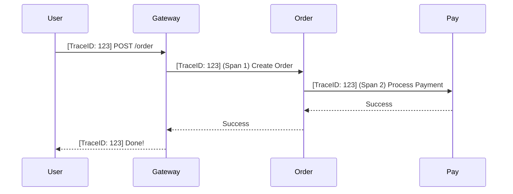

# 🕸️ Distributed Tracing: Tracking the Journey
> **Objective:** Visualize how a single request travels through multiple microservices | **Language:** Hinglish | **Standard:** 2026 Expert Framework

---

## 🧭 1. Beginner-Friendly Hinglish Explanation
Distributed Tracing ka matlab hai "Ek request ka poora 'Safar' (Journey) track karna".

- **The Problem:** Microservices mein, jab ek user "Buy" button dabata hai, toh wo request API Gateway -> Order Service -> Payment Service -> Email Service tak jati hai. Agar user ko error aata hai, toh aapko kaise pata chalega ki kis service mein galti hui? 
- **The Solution:** Hum har request ko ek unique "ID" (Trace ID) de dete hain jo ek service se dusri service tak 'Travel' karti hai.
- **The Concept:** 
  1. **Trace:** Poori journey (The whole trip).
  2. **Span:** Ek service ke andar ka kaam (One stop in the trip).
- **Intuition:** Ye ek "Courier Tracking Number" ki tarah hai. Aapko pata hota hai ki parcel abhi kis city mein hai, kis warehouse mein hai, aur kahan deri (delay) ho rahi hai.

---

## 🧠 2. Deep Technical Explanation
### 1. Context Propagation:
The Trace ID is usually passed in the HTTP Headers (e.g., `x-trace-id` or standard `traceparent`). Every service that receives the request must read this ID and pass it along when calling the next service.

### 2. Spans:
A Trace is made of multiple Spans. A Span has:
- Start time and End time.
- Tags (e.g., `http.method: POST`).
- Logs/Events.
- Parent ID (to know who called this service).

### 3. OpenTelemetry (OTel):
The industry-standard library that allows you to collect traces regardless of the language (Node.js, Go, Java) or the storage (Jaeger, Zipkin, Honeycomb).

---

## 🏗️ 3. Architecture Diagrams (The Trace Path)


---

## 💻 4. Production-Ready Examples (OpenTelemetry in Node.js)
```typescript
// 2026 Standard: Automatic Instrumentation with OTel

import { NodeSDK } from '@opentelemetry/sdk-node';
import { HttpInstrumentation } from '@opentelemetry/instrumentation-http';
import { ExpressInstrumentation } from '@opentelemetry/instrumentation-express';
import { JaegerExporter } from '@opentelemetry/exporter-jaeger';

const sdk = new NodeSDK({
  serviceName: 'order-service',
  traceExporter: new JaegerExporter({
    endpoint: 'http://localhost:14268/api/traces',
  }),
  instrumentations: [
    new HttpInstrumentation(),
    new ExpressInstrumentation(),
  ],
});

sdk.start();

// 💡 Pro Tip: Run this BEFORE importing any other libraries 
// to automatically track all outgoing HTTP/DB calls.
```

---

## 🌍 5. Real-World Use Cases
- **Bottleneck Hunting:** Finding out that the "Payment" service is taking 2 seconds because it's waiting for a slow Database query.
- **Error Analysis:** Seeing that a `500 Error` in the Gateway was actually caused by a `Timeout` in the internal "Inventory" service.
- **Service Mapping:** Automatically generating a map of how all your services talk to each other.

---

## ❌ 6. Failure Cases
- **Broken Chain:** One service in the middle forgets to pass the Trace ID. The journey is "Split" into two different traces.
- **Sampling Overload:** Capturing 100% of traces for 1 billion requests will crash your storage. **Fix: Use 'Tail-based Sampling' (only save traces that are slow or have errors).**
- **Overhead:** If the tracing library is slow, it can add $5-10ms$ to every internal call.

---

## 🛠️ 7. Debugging Section
| Tool | Purpose | Tip |
| :--- | :--- | :--- |
| **Jaeger / Zipkin** | UI | Search by Trace ID to see the beautiful waterfall chart of the request journey. |
| **Honeycomb / Datadog** | Analytics | See "Heatmaps" of which requests are slow and why. |

---

## ⚖️ 8. Tradeoffs
- **Deep Visibility (Easy debugging)** vs **Infrastructure Cost (Running a tracing backend) and minor performance hit.**

---

## 🛡️ 9. Security Concerns
- **Header Injection:** Attackers sending their own Trace IDs to mess with your logs. **Fix: Sanitize or overwrite Trace IDs at the Gateway.**

---

## 📈 10. Scaling Challenges
- **Trace Ingestion:** Millions of spans per second need a high-performance backend (like **ClickHouse** or **Elasticsearch**) to store them.

---

## 💸 11. Cost Considerations
- **Managed Services:** Datadog/New Relic charge per million spans. This can get VERY expensive quickly. **Fix: Use Open-Source Jaeger/Loki.**

---

## ✅ 12. Best Practices
- **Use OpenTelemetry** (Don't lock yourself to one vendor).
- **Implement Sampling** (e.g., save only 1% of successful traces).
- **Propagate Trace IDs in all headers.**
- **Add 'Tags' to spans** (e.g., `customerType: Premium`).

---

## ⚠️ 13. Common Mistakes
- **Not passing the Trace ID to background workers.**
- **Logging the same data in both Logs and Traces** (Waste of storage).

---

## 📝 14. Interview Questions
1. "What is Distributed Tracing and why do we need it in microservices?"
2. "What is the difference between a Trace and a Span?"
3. "How does OpenTelemetry help in tracing?"

---

## 🚀 15. Latest 2026 Production Patterns
- **eBPF Tracing:** Using kernel-level hooks (eBPF) to track requests without even adding any library to your code (Zero-instrumentation).
- **Service Graph:** A real-time, interactive map in Grafana/Datadog that shows the "Traffic Flow" and "Health" of every service connection.
- **Adaptive Sampling:** The system automatically saves more traces when it detects that the error rate is rising.
漫
