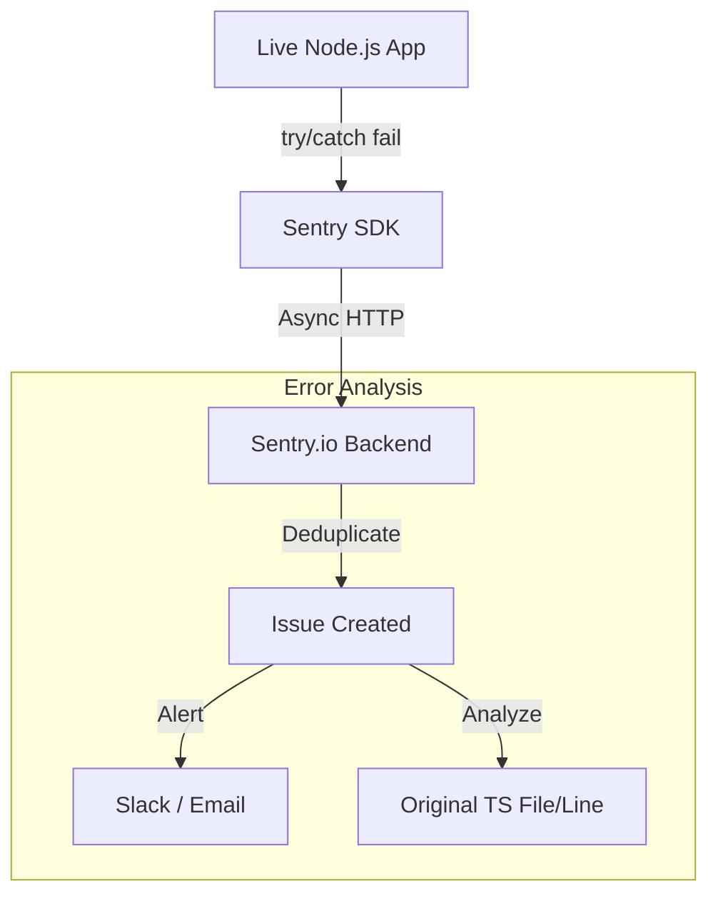

# 🪲 Error Tracking with Sentry: Catching the Crash
> **Objective:** Real-time crash reporting and performance monitoring for production apps | **Language:** Hinglish | **Standard:** 2026 Expert Framework

---

## 🧭 1. Beginner-Friendly Hinglish Explanation
Sentry ka matlab hai "Production ke bugs ka detective".

- **The Problem:** Jab aapka app server par run hota hai aur crash hota hai, toh user ko bas "Something went wrong" dikhta hai. Aapko pata hi nahi chalta ki kya hua jab tak user complain na kare.
- **The Solution:** Sentry ek library hai jo aapke app mein baithti hai. Jaise hi koi error aata hai, Sentry use "Catch" karti hai aur aapko turant Email/Slack bhej deti hai.
- **The Concept:** 
  1. **Issue:** Ek specific bug jo 100 baar hua hai (Sentry unhe group kar deta hai).
  2. **Stack Trace:** Exactly kaunsi file ki kaunsi line par error aaya.
  3. **Context:** User kaunsa browser use kar raha tha? Uska ID kya tha? Error se theek pehle usne kya kiya tha (Breadcrumbs)?
- **Intuition:** Ye ek "Black Box" ki tarah hai jo flight (App) crash hone ke baad saari recording deta hai taaki aap use theek kar sakein.

---

## 🧠 2. Deep Technical Explanation
### 1. Grouping: Grouping is the most powerful feature. If a `TypeError` happens 10,000 times, Sentry shows it as ONE "Issue" with a counter, preventing your inbox from exploding.

### 2. Breadcrumbs:
Sentry records a "Timeline" of events before the crash:
- `14:01:05 - API Request: GET /user/profile`
- `14:01:10 - Click: Update Button`
- `14:01:12 - CRASH: null is not an object`

### 3. Source Maps:
If your code is minified (common in Production), Sentry uses "Source Maps" to show you the original TypeScript code line instead of a mess of random characters.

---

## 🏗️ 3. Architecture Diagrams (The Sentry Catch Flow)


---

## 💻 4. Production-Ready Examples (Sentry in Express)
```typescript
// 2026 Standard: Sentry Integration for Express

import * as Sentry from "@sentry/node";
import express from "express";

const app = express();

Sentry.init({
  dsn: "https://your-public-key@sentry.io/123456",
  environment: "production",
  tracesSampleRate: 1.0, // Monitor performance too
});

// 1. The request handler must be the first middleware on the app
app.use(Sentry.Handlers.requestHandler());

app.get("/", (req, res) => {
  throw new Error("Broke something on purpose!");
});

// 2. The error handler must be before any other error middleware and after all controllers
app.use(Sentry.Handlers.errorHandler());

// 💡 Pro Tip: Use 'Sentry.setUser({ id: "123" })' after login 
// to know EXACTLY which user faced the error.
```

---

## 🌍 5. Real-World Use Cases
- **Silent Failures:** Catching errors in background workers that don't have a UI.
- **Frontend-Backend Tracking:** Connecting a frontend error to the specific backend API call that failed (Distributed Tracing).
- **Performance Profiling:** Finding the exact line of code that makes a database call slow.

---

## ❌ 6. Failure Cases
- **Secret Leak:** Sending the user's password or credit card in the "Breadcrumbs" or "Context". **Fix: Use `beforeSend` to scrub sensitive data.**
- **Log Noise:** Sending every `404 Not Found` to Sentry. (This will eat up your quota). **Fix: Only send 500+ errors.**
- **SDK Failure:** Sentry is down, and your app's error handler hangs while trying to talk to it. **Fix: Sentry SDK is asynchronous and non-blocking by default.**

---

## 🛠️ 7. Debugging Section
| Status | Meaning | Tip |
| :--- | :--- | :--- |
| **Unresolved** | New Bug | This bug needs a developer to fix it and mark it as "Resolved". |
| **Regressed** | Bug returned | A bug that was "Resolved" has happened again in the new version. Check your Git history! |

---

## ⚖️ 8. Tradeoffs
- **Full Visibility (Easy fixes)** vs **Extra Latency (Minor SDK overhead) and Privacy concerns.**

---

## 🛡️ 9. Security Concerns
- **Personally Identifiable Information (PII):** Sentry has a "Data Scrubber" feature. Enable it to automatically remove emails, IPs, and passwords from logs.

---

## 📈 10. Scaling Challenges
- **Sampling:** If you have 100 million requests, you can't send all performance traces to Sentry (it will be too expensive). **Fix: Set `tracesSampleRate: 0.1` (10% sampling).**

---

## 💸 11. Cost Considerations
- **Event Limits:** Sentry is free for small projects, but once you exceed a few thousand errors/month, it becomes paid.

---

## ✅ 12. Best Practices
- **Integrate with GitHub** (to see which commit caused the bug).
- **Upload Source Maps.**
- **Set the `environment` tag** (Development/Staging/Production).
- **Use `Sentry.captureException(err)`** inside `try/catch` blocks.

---

## ⚠️ 13. Common Mistakes
- **Not setting the `release` version** (Can't tell if the bug is from the new or old version).
- **Ignoring the "Breadcrumbs"** (which are the most important part for reproduction).

---

## 📝 14. Interview Questions
1. "How does Sentry group multiple errors into a single issue?"
2. "What are 'Breadcrumbs' in error tracking?"
3. "How do you ensure Sentry doesn't capture user passwords?"

---

## 🚀 15. Latest 2026 Production Patterns
- **Session Replay:** Sentry can record a "Video-like" reconstruction of what the user did on the screen before the crash.
- **Dynamic Sampling:** Automatically increasing the sampling rate when an error spike is detected to capture more data.
- **Profiling:** Going beyond "How long did it take?" to "Which specific line of code used the most CPU?".
漫
