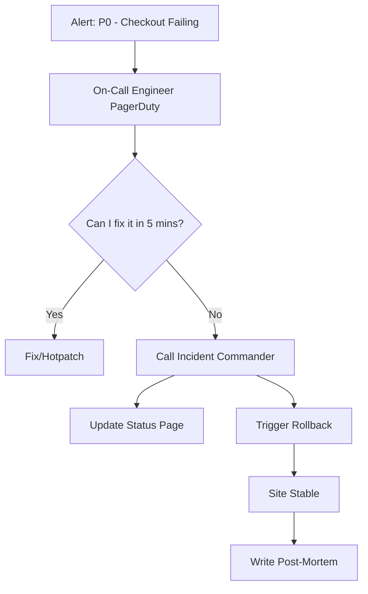

# 🚨 Incident Management: Fighting Production Fires
> **Objective:** Master the process of detecting, responding to, and learning from system failures | **Language:** Hinglish | **Standard:** 2026 Expert Framework

---

## 🧭 1. Beginner-Friendly Hinglish Explanation
Incident Management ka matlab hai "Production mein lagi aag (Failure) ko bujhana".

- **The Problem:** Site down hai. Users gussa hain. CEO phone kar raha hai. Team panic kar rahi hai. Sab log ek saath code badalne ki koshish kar rahe hain. Result? Situation aur kharab ho gayi!
- **The Solution:** Humein ek strict "Process" chahiye. Kaun lead karega? Kaun users ko reply karega? Aur problem theek hone ke baad hum kya sikhlenge?
- **The Concept:** 
  1. **Detection:** Pata lagana ki problem hai (via Alerts).
  2. **Response:** Turant action lena (e.g., Rollback).
  3. **Mitigation:** Problem ko kam karna (even if not fully fixed).
  4. **Post-Mortem:** Baith kar discuss karna ki ye dobara na ho.
- **Intuition:** Ye ek "Fire Department" ki tarah hai. Jab aag lagti hai, toh sab log ek saath pani nahi phenkte. Ek commander hota hai, ek team pani daalti hai, aur ek team bheed ko door rakhti hai.

---

## 🧠 2. Deep Technical Explanation
### 1. Incident Lifecycle:
- **Triage:** Is it a P0 (Site down) or P3 (Typo on profile page)?
- **Stabilization:** Get the system back up. **Rule #1: Rollback first, debug later.**
- **Root Cause Analysis (RCA):** The deep dive into why it happened (The "5 Whys").

### 2. On-Call Culture:
Engineers take turns being "On-call" (carrying a pager/phone) to respond to alerts 24/7. 

### 3. Error Budgets:
SRE (Site Reliability Engineering) concept. You are allowed, for example, 43 minutes of downtime per month (99.9% uptime). If you exceed this "Budget", you must stop all new features and focus ONLY on stability.

---

## 🏗️ 3. Architecture Diagrams (Incident Response Flow)


---

## 💻 4. Production-Ready Examples (Conceptual Post-Mortem Template)
```markdown
# 📝 Incident Report: 2026-05-10: Payment Gateway Timeout

## 📈 Impact
- **Duration:** 45 minutes (14:00 - 14:45 UTC)
- **Users Affected:** Approx 5,000 customers.
- **Revenue Loss:** ~$10,000.

## 🔍 Root Cause
A new database index was deployed which caused a table lock for 30 minutes, blocking all payment writes.

## 🛡️ Corrective Actions
1. **Short-term:** Rolled back the migration.
2. **Long-term:** Mandate 'Online Schema Migrations' using tools like `gh-ost`.
3. **Monitoring:** Add alerts for 'Database Lock Wait Time'.
```

---

## 🌍 5. Real-World Use Cases
- **Cloudflare Outage:** Detailed public post-mortems explaining exactly which BGP config failed.
- **Flash Sale Crash:** Quickly scaling up and adding a "Queue" page to stop the servers from dying.
- **Cyber Attack:** Shutting down external traffic while investigating a breach.

---

## ❌ 6. Failure Cases
- **The "Blame Game":** Shouting at the developer who wrote the bug. This makes people hide their mistakes. **Fix: Use 'Blameless Post-mortems'.**
- **Alert Fatigue:** Sending 1000 minor alerts to the engineer's phone, so they start ignoring the important ones.
- **Communication Gap:** The engineers are fixing the bug, but the Customer Support team has no idea what to tell users.

---

## 🛠️ 7. Debugging Section
| Tool | Purpose | Tip |
| :--- | :--- | :--- |
| **PagerDuty / Opsgenie** | On-call Management | Schedules who is on-call and escalates if they don't answer in 5 mins. |
| **Status.io / Cachet** | Status Page | A public page (status.susa.com) to tell users "We are working on it". |

---

## ⚖️ 8. Tradeoffs
- **Speed of Fix (Hotpatch)** vs **Safety (Rollback).** Rollback is almost always safer.

---

## 🛡️ 9. Security Concerns
- **Incident Channel Access:** Keep the "War Room" (Slack channel) private if it contains sensitive logs or vulnerability details.

---

## 📈 10. Scaling Challenges
- **Massive Incidents:** When 10 different services are failing at once. You need a dedicated **Incident Commander** whose ONLY job is to coordinate and not write any code.

---

## 💸 11. Cost Considerations
- **Downtime Cost:** Calculating how much money the company loses per minute of downtime helps justify the cost of better monitoring tools.

---

## ✅ 12. Best Practices
- **Rollback first, Debug later.**
- **Automate alerts for P0/P1 issues.**
- **Conduct 'Blameless Post-mortems'.**
- **Keep a 'Status Page' updated for users.**
- **Practice 'Game Days'** (Simulated failures).

---

## ⚠️ 13. Common Mistakes
- **Fixing the bug directly in production** (without a proper PR/CI flow).
- **Not having an On-call rotation.**

---

## 📝 14. Interview Questions
1. "What do you do first when you realize the production site is down?"
2. "What is a Blameless Post-mortem?"
3. "How do you calculate Uptime and Error Budgets?"

---

## 🚀 15. Latest 2026 Production Patterns
- **AIOps:** Using AI to group alerts and automatically suggest the most likely root cause based on past incidents.
- **Automated Remediation:** If CPU > 95%, the system automatically restarts the container without human intervention.
- **Incident Response Bots:** Slack bots that automatically create the "War Room" channel and the "Incident Doc" as soon as an alert is triggered.
漫
