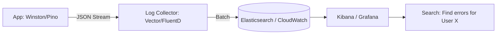

# 📝 Logging Best Practices: The Diary of a Backend
> **Objective:** Write logs that are actually useful for debugging production issues | **Language:** Hinglish | **Standard:** 2026 Expert Framework

---

## 🧭 1. Beginner-Friendly Hinglish Explanation
Logging ka matlab hai "App ki activities ka record rakhna".

- **The Problem:** Jab app server par hota hai, aap use `console.log` karke check nahi kar sakte (wo bahut saare users ka data mix kar dega). Agar app crash hua, toh aapko kaise pata chalega ki kis user ne kya kiya tha?
- **The Solution:** Humein Structured Logging chahiye. Har log mein timestamp, user ID, aur error level hona chahiye.
- **The Concept:** 
  1. **Debug:** Sirf development ke liye.
  2. **Info:** General activities (e.g., "User logged in").
  3. **Warn:** Kuch ajeeb hua par app chal raha hai (e.g., "Retrying DB connection").
  4. **Error:** Kuch kharab ho gaya (e.g., "Payment failed").
- **Intuition:** Ye ek "CCTV Camera" ki tarah hai. Aap use roz nahi dekhte, par jab chori (Bug/Crash) hoti hai, tab ye camera hi sabse badi help karta hai.

---

## 🧠 2. Deep Technical Explanation
### 1. Structured Logging (JSON):
Never log plain text: `console.log("User 123 failed login")`.
Always log JSON: `{"level": "error", "userId": 123, "action": "login", "status": "failed", "timestamp": "..."}`.
**Why?** Because JSON can be easily searched and filtered by tools like **ELK (Elasticsearch, Logstash, Kibana)** or **Datadog**.

### 2. Contextual Information:
Every log should have a `correlationId` (Request ID). If a request goes from API -> Auth -> DB, all logs for that single request should share the same ID.

### 3. Log Levels:
- **DEBUG:** Verbose info for devs. (Disabled in Production).
- **INFO:** Meaningful business events.
- **WARN:** Unexpected but recoverable.
- **ERROR:** Something broke, needs attention.
- **FATAL:** The whole app is crashing.

---

## 🏗️ 3. Architecture Diagrams (The Logging Pipeline)


---

## 💻 4. Production-Ready Examples (Using Winston)
```typescript
// 2026 Standard: Robust Winston Logger Setup

import winston from 'winston';

const logger = winston.createLogger({
  level: 'info',
  format: winston.format.combine(
    winston.format.timestamp(),
    winston.format.json() // Output as JSON for production
  ),
  defaultMeta: { service: 'order-service' },
  transports: [
    new winston.transports.Console(),
    new winston.transports.File({ filename: 'error.log', level: 'error' })
  ]
});

// Usage:
logger.error('Payment failed', { 
  userId: 'user_123', 
  amount: 500, 
  error: 'Insufficient funds' 
});
```

---

## 🌍 5. Real-World Use Cases
- **Post-Mortem:** Analyzing logs to find out why the server crashed at 3 AM.
- **Auditing:** Keeping a record of who changed the admin settings and when.
- **Performance:** Logging the time taken by a DB query and finding slow ones.

---

## ❌ 6. Failure Cases
- **Sensitive Data Leak:** Logging the user's password, credit card, or JWT token. **Fix: Use a 'Redaction' filter in your logger.**
- **Log Flooding:** Logging inside a fast loop, creating 10GB of logs in 1 hour. **Fix: Throttling / Sampling.**
- **Disk Full:** Saving logs to the local disk until it fills up and crashes the app. **Fix: Stream to an external log manager.**

---

## 🛠️ 7. Debugging Section
| Problem | Diagnostic | Solution |
| :--- | :--- | :--- |
| **Can't find the error** | No Metadata | Ensure you are logging the object/error stack, not just a string message. |
| **Logs are missing** | Buffer issues | If the app crashes instantly, it might not have time to "Flush" the logs. Use synchronous logging for fatal errors. |

---

## ⚖️ 8. Tradeoffs
- **Verbose Logging (Easy debugging)** vs **Cost & Performance (Expensive storage and overhead).**

---

## 🛡️ 9. Security Concerns
- **PII (Personally Identifiable Information):** Ensure you are not logging emails or phone numbers unless strictly necessary and encrypted.

---

## 📈 10. Scaling Challenges
- **Log Aggregation:** When you have 100 servers, you need a central place to search all logs. Use **Loki** or **Splunk**.

---

## 💸 11. Cost Considerations
- **Log Retention:** Storing 1 year of logs is expensive. Keep "Info" for 7 days and "Error" for 30 days.

---

## ✅ 12. Best Practices
- **Log in JSON format.**
- **Redact sensitive info.**
- **Use Correlation IDs.**
- **Don't use `console.log` in production.**
- **Set the log level via Environment Variables.**

---

## ⚠️ 13. Common Mistakes
- **Logging too much** ("Entering function X", "Leaving function X").
- **Logging too little** (Only "Error occurred").

---

## 📝 14. Interview Questions
1. "Why is structured logging better than plain text?"
2. "How do you prevent logging sensitive user data?"
3. "What is a correlation ID?"

---

## 🚀 15. Latest 2026 Production Patterns
- **OpenTelemetry (OTel):** A unified standard for logs, metrics, and traces. One library to rule them all.
- **Log-based Metrics:** Automatically creating a graph of "Failed Logins" by scanning the logs in real-time.
- **AI-assisted Log Analysis:** Using LLMs to summarize 1 million log lines into a 1-paragraph incident report.
漫
