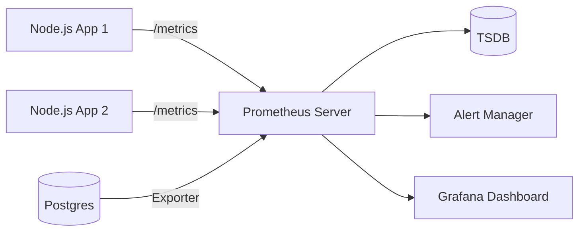

# 📊 Monitoring with Prometheus: The Health Checker
> **Objective:** Track system metrics (CPU, RAM, Request Count) in real-time | **Language:** Hinglish | **Standard:** 2026 Expert Framework

---

## 🧭 1. Beginner-Friendly Hinglish Explanation
Monitoring ka matlab hai "Apne app ki pulse (dharkan) check karna".

- **The Problem:** Logs bata sakte hain ki "Kya" kharab hua, par wo nahi bata sakte ki "Abhi kya ho raha hai". Kya server ka RAM full hai? Kya abhi 500 users queue mein wait kar rahe hain?
- **The Solution:** Prometheus ek tool hai jo numbers (Metrics) ko collect karta hai.
- **The Concept:** 
  1. **Metric:** Ek number (e.g., `cpu_usage: 45%`).
  2. **Scraping:** Prometheus har 15 second mein aapke app se puchta hai: "Bhai, tera status kya hai?".
  3. **Alerting:** Agar RAM 90% se upar jaye, toh Prometheus aapko SMS/Slack bhej dega.
- **Intuition:** Ye ek "Dashboard" ki tarah hai jo aapki car ki speed, fuel, aur engine heat dikhata hai. Bina iske, aap andhere mein drive kar rahe hain.

---

## 🧠 2. Deep Technical Explanation
### 1. Push vs Pull:
Most monitoring tools wait for the app to "Push" data. Prometheus is different—it "Pulls" (Scrapes) data from your app. This prevents your app from being overwhelmed if the monitoring tool is slow.

### 2. Metric Types:
- **Counter:** A number that only goes UP (e.g., `total_requests`).
- **Gauge:** A number that can go up or down (e.g., `memory_usage`, `active_users`).
- **Histogram:** Tracks the distribution of values (e.g., `request_latency`).

### 3. Time Series Database (TSDB):
Prometheus stores data as a series of numbers over time. This allows you to ask: "What was the CPU usage last Tuesday at 4 PM?".

---

## 🏗️ 3. Architecture Diagrams (The Prometheus Scrape Flow)


---

## 💻 4. Production-Ready Examples (prom-client in Node.js)
```typescript
// 2026 Standard: Exporting Metrics from Express

import express from 'express';
import { Registry, Counter, collectDefaultMetrics } from 'prom-client';

const app = express();
const register = new Registry();

// 1. Collect default metrics (CPU, Memory, Event Loop Lag)
collectDefaultMetrics({ register });

// 2. Custom Metric: Count HTTP requests
const httpRequestCounter = new Counter({
  name: 'http_requests_total',
  help: 'Total number of HTTP requests',
  labelNames: ['method', 'status'],
  registers: [register],
});

app.use((req, res, next) => {
  res.on('finish', () => {
    httpRequestCounter.inc({ method: req.method, status: res.statusCode });
  });
  next();
});

// 3. Expose the /metrics endpoint for Prometheus to scrape
app.get('/metrics', async (req, res) => {
  res.set('Content-Type', register.contentType);
  res.end(await register.metrics());
});
```

---

## 🌍 5. Real-World Use Cases
- **Auto-scaling:** If `http_requests_total` increases by $500\%$, tell Kubernetes to add more servers.
- **Downtime Detection:** If Prometheus can't reach the `/metrics` endpoint, send a critical alert.
- **SLA Tracking:** Ensuring that 99.9% of requests are served in under 200ms.

---

## ❌ 6. Failure Cases
- **Cardinality Explosion:** Adding a unique label (like `user_id`) to a metric. If you have 1 million users, Prometheus will try to store 1 million separate graphs and crash. **Fix: Only use labels with small sets of values (e.g., `status_code`).**
- **Endpoint Exposure:** Leaving `/metrics` open to the public internet, allowing hackers to see your internal stats. **Fix: Protect it with an IP whitelist or basic auth.**

---

## 🛠️ 7. Debugging Section
| Problem | Diagnostic | Solution |
| :--- | :--- | :--- |
| **No data in Prometheus** | Scrape Config | Check `prometheus.yml` to ensure the correct IP and port of your app are listed. |
| **Gaps in graphs** | App Restart | If the app is crashing and restarting constantly, Prometheus won't be able to scrape it. |

---

## ⚖️ 8. Tradeoffs
- **High Resolution (1s scrape)** vs **High Load (CPU usage for scraping).** 15-30s is usually the sweet spot.

---

## 🛡️ 9. Security Concerns
- **Internal Only:** Monitoring data should never leave your internal network.

---

## 📈 10. Scaling Challenges
- **Federation:** When you have too many servers for one Prometheus, you use a "Main" Prometheus to scrape data from "Regional" Prometheus servers.

---

## 💸 11. Cost Considerations
- **Storage Retention:** Data is usually kept for 15 days by default. Keeping it for a year requires a massive amount of high-speed disk space.

---

## ✅ 12. Best Practices
- **Use meaningful labels.**
- **Monitor the 'Golden Signals':** Latency, Traffic, Errors, Saturation.
- **Use Exporters** for third-party tools (Redis Exporter, Postgres Exporter).
- **Test your alerts.**

---

## ⚠️ 13. Common Mistakes
- **Putting too much logic** inside the metrics collection.
- **Not setting up alerts.** (Monitoring without alerting is just "Watching things fail").

---

## 📝 14. Interview Questions
1. "What is the difference between a Counter and a Gauge?"
2. "Why does Prometheus use a 'Pull' model?"
3. "What are the four Golden Signals of monitoring?"

---

## 🚀 15. Latest 2026 Production Patterns
- **Service Discovery Integration:** Prometheus automatically finding new Kubernetes pods and scraping them without manual config.
- **PromQL (Prometheus Query Language):** Using advanced math in queries (e.g., `rate(http_requests_total[5m])`) to see the current speed of requests.
- **VictoriaMetrics / Thanos:** Using these tools to store Prometheus data forever in a scalable way.
漫
