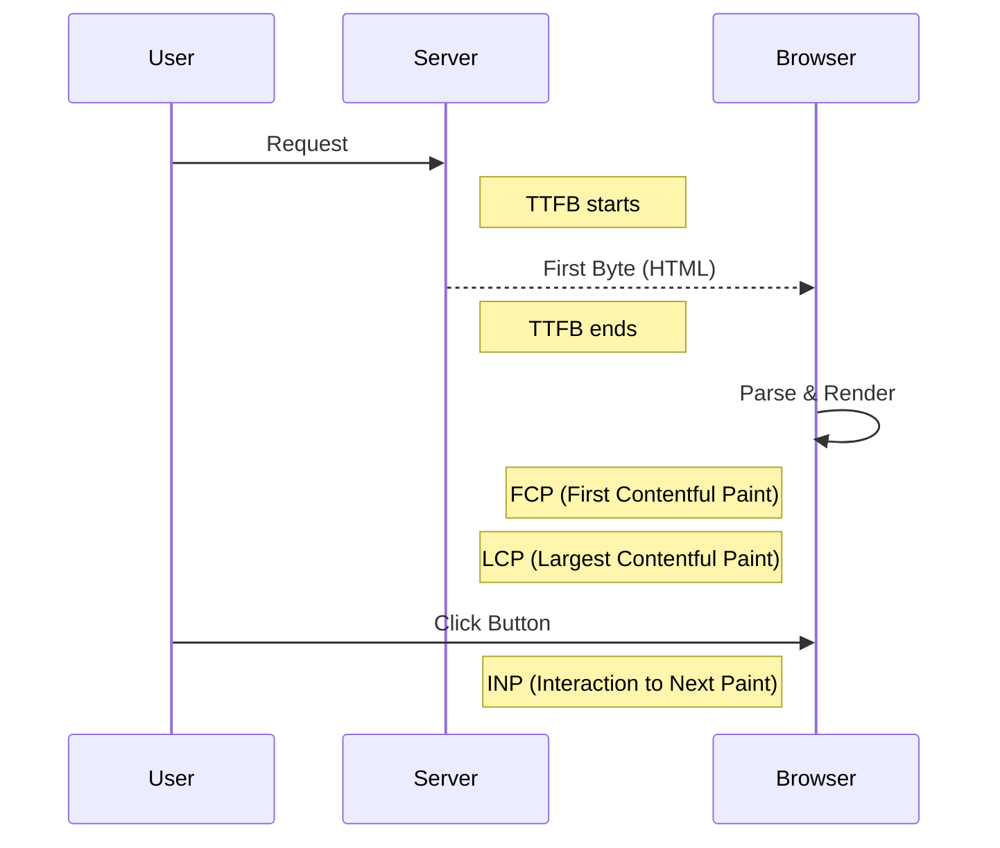

# 📊 Web Performance Metrics: Measuring Success
> **Objective:** Understand the numbers that define a 'Fast' application | **Language:** Hinglish | **Standard:** 2026 Expert Framework

---

## 🧭 1. Beginner-Friendly Hinglish Explanation
Performance Metrics ka matlab hai "Sahi tarike se napna (measure) ki aapki site kitni fast hai".

- **The Problem:** "Mujhe site fast lag rahi hai" ye koi measurement nahi hai. Different users (Slow internet, old phone) ke liye experience different hota hai.
- **The Solution:** Humein standardized numbers chahiye jinhe hum monitor kar sakein.
- **The Core Metrics (Core Web Vitals):**
  1. **LCP:** Sabse bada content kitni der mein dikha?
  2. **FID:** User ke click karne par kitni der mein action hua?
  3. **CLS:** Kya loading ke waqt buttons upar-neeche hile (Jumping UI)?
- **The Goal:** In numbers ko "Green Zone" mein rakhna.

---

## 🧠 2. Deep Technical Explanation
### 1. The Core Web Vitals (Google's Standard):
- **LCP (Largest Contentful Paint):** Measures loading performance. (Target: $< 2.5s$).
- **INP (Interaction to Next Paint):** Measures responsiveness. (Replaced FID in 2024). (Target: $< 200ms$).
- **CLS (Cumulative Layout Shift):** Measures visual stability. (Target: $< 0.1$).

### 2. Backend-Specific Metrics:
- **TTFB (Time to First Byte):** How long the server takes to send the first byte of data. (Target: $< 800ms$).
- **Request Duration:** The total time for an API call from start to finish.
- **P95 / P99 Latency:** The latency experienced by the 95th or 99th percentile of users (Filtering out the lucky ones).

### 3. Lab vs Field Data:
- **Lab Data:** Testing in a controlled environment (Lighthouse).
- **Field Data (RUM):** Real-world data from actual users (Chrome User Experience Report).

---

## 🏗️ 3. Architecture Diagrams (The Performance Timeline)


---

## 💻 4. Production-Ready Examples (Monitoring TTFB)
```typescript
// 2026 Standard: Logging Request Metrics in Node.js

app.use((req, res, next) => {
  const start = process.hrtime();

  res.on('finish', () => {
    const diff = process.hrtime(start);
    const timeInMs = (diff[0] * 1e3 + diff[1] * 1e-6).toFixed(3);
    
    // Log this to your monitoring system (Datadog/Prometheus)
    console.log(`${req.method} ${req.url} - ${res.statusCode} [${timeInMs}ms]`);
    
    if (parseFloat(timeInMs) > 1000) {
      console.warn('⚠️ SLOW REQUEST DETECTED');
    }
  });

  next();
});
```

---

## 🌍 5. Real-World Use Cases
- **SEO Ranking:** Google ranks sites higher if they meet the "Core Web Vitals" threshold.
- **Conversion Optimization:** Amazon found that 100ms delay costs them $1\%$ in sales.
- **SLA Management:** Ensuring that your API always responds in under 500ms for $99\%$ of customers.

---

## ❌ 6. Failure Cases
- **Optimizing for average (Mean):** If 50 users have 10ms latency and 50 users have 2000ms, the average is 1005ms. This is misleading. **Fix: Use P95/P99.**
- **Ignoring the Network:** API is fast, but the JSON is so large that it takes 2 seconds to download over 3G.
- **Lighthouse Obsession:** Getting 100/100 in Lighthouse but ignoring real users on slow Android devices.

---

## 🛠️ 7. Debugging Section
| Metric | Likely Backend Cause | Fix |
| :--- | :--- | :--- |
| **High TTFB** | Slow DB Query / Server Load | Add Indexes / Scale Up. |
| **High LCP** | Slow Image/Data Delivery | Use a CDN. |
| **High INP** | Heavy JSON parsing on Frontend | Send smaller payloads. |

---

## ⚖️ 8. Tradeoffs
- **Precision vs Performance:** Collecting deep metrics for every single user can add load to your logging system. (Solution: **Sampling**).

---

## 🛡️ 9. Security Concerns
- **Timing Attacks:** If your "Wrong Password" response takes 100ms and "Correct Password" takes 10ms, a hacker can guess if a user exists. **Fix: Use constant-time comparisons.**

---

## 📈 10. Scaling Challenges
- **Real-time Dashboards:** Aggregating billions of performance metrics into a dashboard without lagging. (Solution: **ClickHouse** or **Elasticsearch**).

---

## 💸 11. Cost Considerations
- **Monitoring Tools:** APM tools like New Relic can cost thousands of dollars. Use **OpenTelemetry** with open-source Grafana to save money.

---

## ✅ 12. Best Practices
- **Focus on Core Web Vitals.**
- **Monitor P95 and P99 latencies.**
- **Implement RUM (Real User Monitoring).**
- **Automate performance audits in CI/CD.**

---

## ⚠️ 13. Common Mistakes
- **Ignoring mobile performance.**
- **Not setting a 'Performance Budget'** (e.g., "JS must be < 100KB").

---

## 📝 14. Interview Questions
1. "What is TTFB and how is it different from Page Load Time?"
2. "Why do we use P99 latency instead of Average latency?"
3. "Name 3 Core Web Vitals and what they measure."

---

## 🚀 15. Latest 2026 Production Patterns
- **Web-Vitals-as-a-Service:** Services that automatically ping your site from 50 countries and record the metrics.
- **OpenTelemetry (OTel):** The unified standard for collecting traces, metrics, and logs across the whole stack.
- **Predictive Performance:** AI models that alert you when a trend shows your site is gradually getting slower before it hits the threshold.
漫
