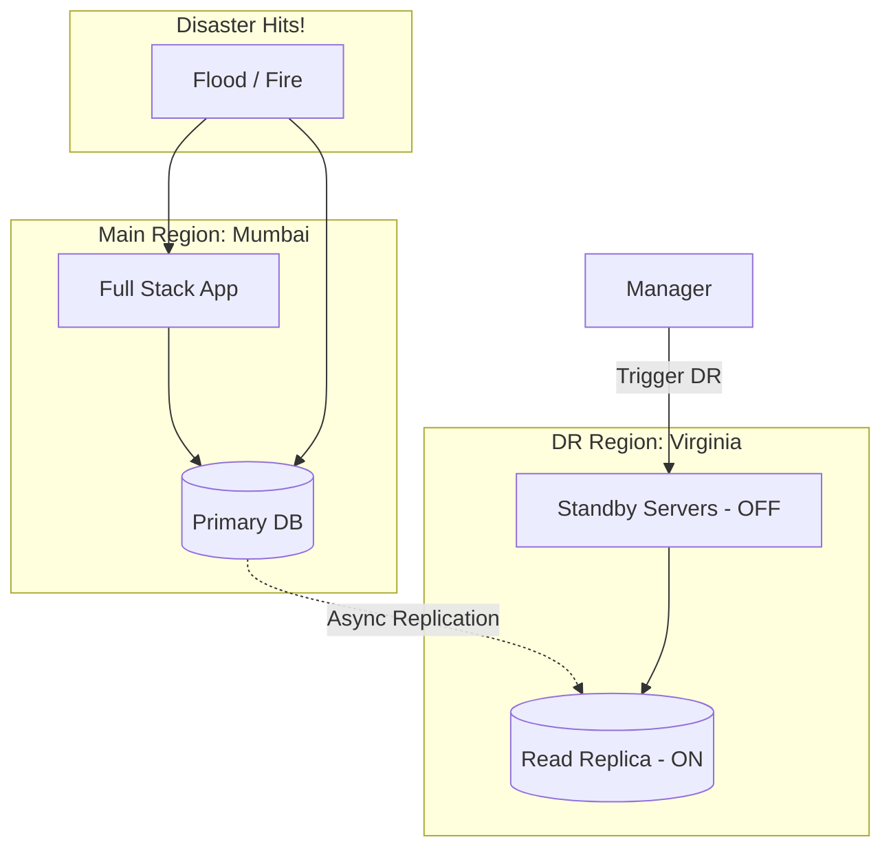

# 🌋 Disaster Recovery Planning: Preparing for the Worst
> **Objective:** Ensure your business survives natural disasters, major hacks, or total data center failures | **Language:** Hinglish | **Standard:** 2026 Expert Framework

---

## 🧭 1. Beginner-Friendly Hinglish Explanation
Disaster Recovery (DR) ka matlab hai "Qayamat (Disaster) ke baad system ko zinda karna".

- **The Problem:** High Availability ek chota engine fail hone se bachata hai. Par agar poora data center flood mein doob jaye, ya koi hacker saara data delete karde, toh kya hoga? 
- **The Solution:** Humein ek "Backup" plan chahiye jo humein dusre sheher (Region) mein setup karne mein help kare.
- **The Concept:** 
  1. **RTO (Recovery Time Objective):** Kitni der mein hum wapas online aayenge? (e.g., 1 ghanta).
  2. **RPO (Recovery Point Objective):** Kitna data loss hum bardasht kar sakte hain? (e.g., 15 minute purana data chalega).
- **Intuition:** Ye ek "Spare Tyre" ki tarah nahi hai, ye "Life Insurance" ki tarah hai. Aap ise roz use nahi karte, par jab gaadi ka accident hota hai, tab yahi aapko bachata hai.

---

## 🧠 2. Deep Technical Explanation
### 1. DR Strategies:
- **Backup & Restore (Cheap & Slow):** Just keep backups in S3. If disaster hits, create new servers and load the data. (RTO: Hours).
- **Pilot Light (Medium):** Keep a tiny version of your DB and core services running in another region. (RTO: Minutes).
- **Warm Standby (Faster):** A fully functional but scaled-down version of your app is always running in the backup region. (RTO: Seconds).
- **Multi-Site Active-Active (Instant):** Users are served from both regions at the same time. If one region dies, nobody even notices. (RTO: Zero).

### 2. Data Replication:
- **Synchronous:** Wait for data to be saved in both regions. (Safe but slow).
- **Asynchronous:** Save in Region A, and it will eventually reach Region B. (Fast but risk of small data loss).

---

## 🏗️ 3. Architecture Diagrams (The Pilot Light Strategy)


---

## 💻 4. Production-Ready Examples (Conceptual DR Trigger)
```typescript
// 2026 Standard: Automated DNS Switch (Route 53)

const triggerFailover = async () => {
  console.log("🚨 Disaster detected in Primary Region!");
  
  // 1. Promote Read Replica to Primary in the backup region
  await rds.promoteReadReplica('db-backup-instance');

  // 2. Update DNS to point to the new region
  await route53.changeResourceRecordSets({
    ChangeBatch: {
      Changes: [{
        Action: 'UPSERT',
        ResourceRecordSet: {
          Name: 'api.susa.com',
          Type: 'A',
          TTL: 60,
          ResourceRecords: [{ Value: 'DR_REGION_LOAD_BALANCER_IP' }]
        }
      }]
    }
  });

  console.log("✅ System restored in Backup Region.");
};
```

---

## 🌍 5. Real-World Use Cases
- **Government Portals:** Ensuring tax/identity data isn't lost if a war or natural disaster happens.
- **Crypto Exchanges:** Protecting private keys and transaction logs across multiple continents.
- **Global Platforms (Google/Meta):** They are always Multi-Site Active-Active.

---

## ❌ 6. Failure Cases
- **The "Stale" Backup:** You have backups, but you haven't tested them in 2 years. When you try to restore, they are corrupted. **Fix: Regularly test your 'DR Drills'.**
- **DNS TTL:** You switched to the new region, but users' browsers have "Cached" the old IP for 2 hours. **Fix: Set a low TTL (60s) for critical records.**
- **Database Divergence:** In a panic, you start writing to both regions at once. Now the data is inconsistent.

---

## 🛠️ 7. Debugging Section
| Metric | Purpose | Tip |
| :--- | :--- | :--- |
| **Recovery Exercise** | Practice | Perform a "Fire Drill" every 6 months where you manually fail over to the DR region. |
| **Backup Integrity** | Safety | Use automated scripts to restore one random backup every week to ensure it works. |

---

## ⚖️ 8. Tradeoffs
- **Instant Recovery (Multi-Site)** vs **Cost (Double the bill).**

---

## 🛡️ 9. Security Concerns
- **Secure Backups:** Hackers often delete backups first before encrypting your main data (Ransomware). **Fix: Use 'S3 Object Lock' (Immutable backups) that even an Admin can't delete.**

---

## 📈 10. Scaling Challenges
- **Data Gravity:** Moving 100TB of data from India to the USA takes a lot of time and bandwidth.

---

## 💸 11. Cost Considerations
- **Storage Tiering:** Use S3 Glacier for DR backups to keep costs low.

---

## ✅ 12. Best Practices
- **Define RTO and RPO clearly.**
- **Automate the DR process as much as possible.**
- **Store backups in a separate account/region.**
- **Use Immutable Backups.**
- **Documentation:** Have a "Runbook" (PDF) that tells engineers exactly what to do even if the internet is slow.

---

## ⚠️ 13. Common Mistakes
- **Assuming 'HA' is 'DR'.** (They are different!).
- **Not having a plan for "Reverse Failover"** (Going back to the main region after the disaster is over).

---

## 📝 14. Interview Questions
1. "What is the difference between RTO and RPO?"
2. "Explain the 'Pilot Light' DR strategy."
3. "How do you protect backups from being deleted by a rogue admin?"

---

## 🚀 15. Latest 2026 Production Patterns
- **Cloud-Native DR (AWS Elastic Disaster Recovery):** Automatically syncing your servers block-by-block to a staging area for instant recovery.
- **Multi-Cloud DR:** Backing up your AWS data to Google Cloud (GCP) so you are safe even if ALL of Amazon goes offline.
- **AI-Managed Failover:** AI that predicts a regional failure before it happens (based on network patterns) and proactively starts moving traffic.
漫
