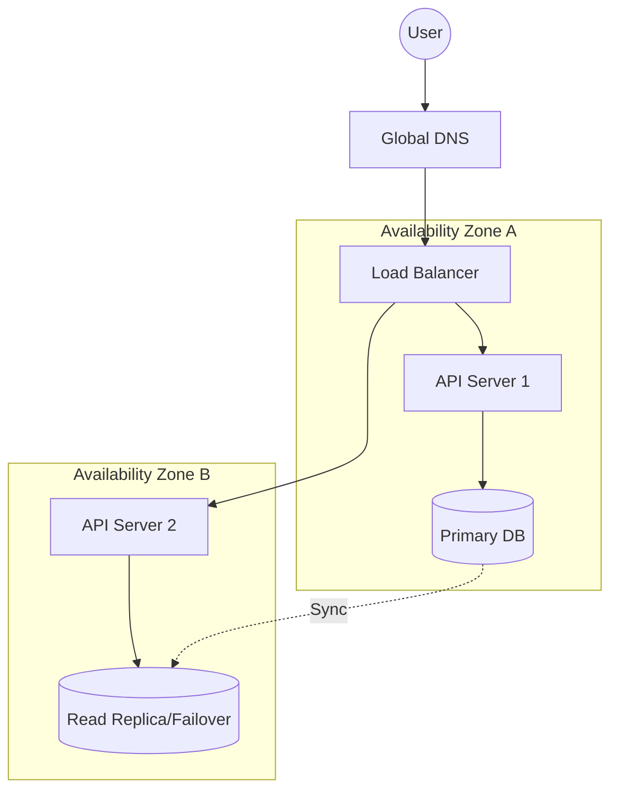

# 🏗️ High Availability Systems: Built to Never Die
> **Objective:** Design systems that remain operational even during hardware or network failures | **Language:** Hinglish | **Standard:** 2026 Expert Framework

---

## 🧭 1. Beginner-Friendly Hinglish Explanation
High Availability (HA) ka matlab hai "Aisa system jo kabhi band na ho".

- **The Problem:** Har machine kabhi na kabhi fail hoti hai (Hard drive jal sakti hai, internet ja sakta hai). Agar aapka app sirf ek server par hai, toh jab wo server marega, aapka business bhi mar jayega.
- **The Solution:** Humein system ko "Redundant" banana hai. Ek ke bajaye do ya teen servers rakho.
- **The Concept:** 
  1. **Redundancy:** Faltu (Extra) parts rakhna.
  2. **Failover:** Jab ek part fail ho, toh dusra apne aap kaam sambhaal le.
  3. **No Single Point of Failure (SPOF):** System mein koi aisi jagah nahi honi chahiye jiske tootne se poora system band ho jaye.
- **Intuition:** Ye ek "Hawai Jahaz" (Airplane) ki tarah hai. Usme do engines hote hain. Agar ek engine kharab ho jaye, toh dusre engine se landing ki ja sakti hai.

---

## 🧠 2. Deep Technical Explanation
### 1. Measuring HA (The Nines):
Availability is measured in percentage:
- **99.9% (Three Nines):** ~9 hours of downtime per year. (Good).
- **99.99% (Four Nines):** ~52 minutes of downtime per year. (Great).
- **99.999% (Five Nines):** ~5 minutes of downtime per year. (NASA/Banking standard).

### 2. Active-Passive vs Active-Active:
- **Active-Passive:** One server works, the other waits. If Active fails, Passive takes over. (Slower but cheaper).
- **Active-Active:** All servers work together. If one fails, others handle the extra load. (Faster, more complex).

### 3. Health Checks:
The Load Balancer constantly pings the servers. If a server doesn't reply in 2 seconds, it is marked as "Dead" and traffic is diverted.

---

## 🏗️ 3. Architecture Diagrams (The HA Stack)


---

## 💻 4. Production-Ready Examples (Conceptual Health Check)
```typescript
// 2026 Standard: Robust Health Check Endpoint

app.get('/health', async (req, res) => {
  try {
    // 1. Check DB Connection
    await prisma.$queryRaw`SELECT 1`;
    
    // 2. Check Redis
    await redis.ping();

    res.status(200).json({ status: 'UP', timestamp: new Date() });
  } catch (err) {
    // If anything fails, return 500 so Load Balancer removes this server
    res.status(500).json({ status: 'DOWN', error: err.message });
  }
});
```

---

## 🌍 5. Real-World Use Cases
- **Netflix:** Using "Chaos Monkey" to randomly kill their own servers to ensure the HA system actually works.
- **WhatsApp:** Delivering messages even if entire data centers go offline.
- **Stock Exchanges:** Where even 1 second of downtime costs millions of dollars.

---

## ❌ 6. Failure Cases
- **Split Brain:** In a cluster, two servers both think they are the "Leader" and start writing conflicting data. **Fix: Use Quorum (Consensus algorithms like Raft).**
- **Thundering Herd:** When a failed server comes back up, everyone hits it at once and it crashes again. **Fix: Use 'Slow Start' in Load Balancer.**
- **Cascading Failure:** Server A fails, Server B gets double load and fails, then Server C fails.

---

## 🛠️ 7. Debugging Section
| Metric | Purpose | Tip |
| :--- | :--- | :--- |
| **MTTR (Mean Time to Recovery)** | Speed | How fast did we get back up after the failure? |
| **MTBF (Mean Time Between Failures)** | Reliability | How often are we crashing? |

---

## ⚖️ 8. Tradeoffs
- **High Availability (Safe)** vs **Cost (Expensive) & Complexity (Very hard to test).**

---

## 🛡️ 9. Security Concerns
- **DDoS and HA:** A DDoS attack can look like high traffic. Your HA system might try to scale up infinitely, costing you thousands of dollars. **Fix: Set a maximum limit on Auto-scaling.**

---

## 📈 10. Scaling Challenges
- **Geographic HA:** Running servers in Mumbai AND Virginia. This is hard because data takes time to travel across the ocean (Latency).

---

## 💸 11. Cost Considerations
- **Idle Capacity:** To have HA, you must pay for servers that might not be doing anything most of the time.

---

## ✅ 12. Best Practices
- **Use Multi-AZ (Availability Zones).**
- **Automate Failover.**
- **Monitor P99 latency.**
- **Regularly test your Failover process** (Don't wait for a real crash).

---

## ⚠️ 13. Common Mistakes
- **Putting all servers in one data center.**
- **Not testing the "Recovery" part.**

---

## 📝 14. Interview Questions
1. "What is a Single Point of Failure (SPOF)?"
2. "Explain Active-Active vs Active-Passive failover."
3. "What are the 'Three Nines' of availability?"

---

## 🚀 15. Latest 2026 Production Patterns
- **Global Load Balancing (GSLB):** Routing users to the nearest healthy data center automatically using the magic of DNS/BGP.
- **Self-Healing Infrastructure:** Kubernetes automatically detecting a dead node and moving all work to a new one in seconds.
- **Database-as-a-Service (DBaaS):** Using Aurora or PlanetScale which handle HA and Failover automatically without you writing a single line of code.
漫
