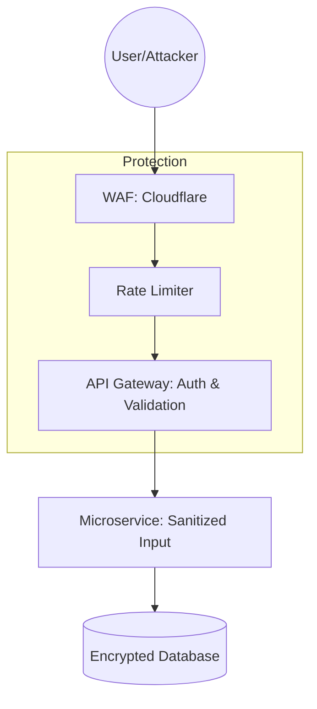

# 🛡️ Advanced Web Security: The Fortress
> **Objective:** Go beyond basic auth to protect against advanced cyber threats | **Language:** Hinglish | **Standard:** 2026 Expert Framework

---

## 🧭 1. Beginner-Friendly Hinglish Explanation
Advanced Web Security ka matlab hai "Apne app ko world-class hackers se bachana".

- **The Problem:** Sirf password lagana kafi nahi hai. Hackers SQL Injection, XSS, CSRF, aur DDoS jaise advanced attacks use karte hain. Ek galti aur aapke 10 lakh users ka data dark web par bik raha hoga.
- **The Solution:** Humein multiple layers of security chahiye (Defense in Depth).
- **The Core Concepts:** 
  1. **Sanitization:** User ke data par kabhi bharosa mat karo.
  2. **Rate Limiting:** Ek user ko 1 second mein 1000 requests mat karne do.
  3. **WAF:** Ek digital guard jo suspicious traffic ko bahar hi rok leta hai.
- **Intuition:** Ye sirf ghar ka "Taala" (Password) lagane jaisa nahi hai. Isme CCTV, Security Guard, Motion Sensors, aur Fire Alarms sab lage hain.

---

## 🧠 2. Deep Technical Explanation
### 1. SQL Injection (SQLi) & NoSQL Injection:
Attackers pass malicious code in input fields (e.g., `admin' OR '1'='1`).
- **Fix:** Use **Parameterized Queries** (ORM/ODM handle this automatically) and never concatenate strings in queries.

### 2. Cross-Site Scripting (XSS):
Injecting malicious JavaScript into your site.
- **Fix:** Use **Content Security Policy (CSP)** headers and escape all user-generated HTML.

### 3. Cross-Site Request Forgery (CSRF):
Trick a user into performing an action on your site while they are logged in elsewhere.
- **Fix:** Use **SameSite=Strict** cookies and CSRF Tokens.

### 4. JWT Security:
- **Problem:** JWTs can be stolen.
- **Fix:** Store them in **HttpOnly, Secure** cookies. Never in `localStorage`. Use short expiration times.

---

## 🏗️ 3. Architecture Diagrams (The Security Layers)


---

## 💻 4. Production-Ready Examples (Security Headers with Helmet)
```typescript
// 2026 Standard: Essential Security Middleware for Express

import express from 'express';
import helmet from 'helmet';
import rateLimit from 'express-rate-limit';

const app = express();

// 1. Add 15+ Security Headers (XSS, HSTS, CSP, etc.)
app.use(helmet());

// 2. Prevent Brute Force / DDoS
const limiter = rateLimit({
  windowMs: 15 * 60 * 1000, // 15 minutes
  max: 100, // Limit each IP to 100 requests per window
  message: "Too many requests, please try again later."
});
app.use("/api/", limiter);

// 3. Data Sanitization (Against NoSQL Injection)
import mongoSanitize from 'express-mongo-sanitize';
app.use(mongoSanitize());
```

---

## 🌍 5. Real-World Use Cases
- **Fintech Apps:** Mandatory MFA (Multi-Factor Authentication) for every transaction.
- **Health Data:** Encryption at rest and in transit (HIPAA compliance).
- **Social Media:** Protecting against automated bots and fake account creation.

---

## ❌ 6. Failure Cases
- **Sensitive Data in Logs:** Logging the user's plain-text password during an error.
- **Open Redirects:** Letting a user redirect to any URL via a query param (e.g., `?next=http://evil.com`).
- **Dependency Vulnerabilities:** Using an old version of `express` that has a known critical bug. **Fix: Run `npm audit` regularly.**

---

## 🛠️ 7. Debugging Section
| Tool | Purpose | Tip |
| :--- | :--- | :--- |
| **OWASP ZAP / Burp Suite** | Pentesting | Tools used by hackers to find holes in your app. Use them yourself first! |
| **Snyk / GitHub Dependabot** | Scanning | Automatically finds and fixes vulnerable libraries in your `package.json`. |

---

## ⚖️ 8. Tradeoffs
- **User Experience (Easy login)** vs **Security (Strict MFA/Timeouts).**

---

## 🛡️ 9. Security Concerns
- **Zero Trust Architecture:** Never trust an internal service just because it's on the same network. Authenticate every call.

---

## 📈 10. Scaling Challenges
- **Distributed Rate Limiting:** If you have 10 servers, you need a shared **Redis** to track how many requests a user has made across all servers.

---

## 💸 11. Cost Considerations
- **Security is Expensive:** WAFs and advanced scanning tools cost money, but a data breach (fines + lost trust) costs $100x$ more.

---

## ✅ 12. Best Practices
- **Use HTTPS everywhere.**
- **Use Secure, HttpOnly Cookies.**
- **Validate ALL input (using Zod/Joi).**
- **Follow the OWASP Top 10 list.**
- **Implement MFA.**

---

## ⚠️ 13. Common Mistakes
- **Hardcoding API Keys in the code.**
- **Assuming 'Private' networks are 100% safe.**

---

## 📝 14. Interview Questions
1. "What is a CSP and how does it prevent XSS?"
2. "Explain the difference between Symmetric and Asymmetric encryption."
3. "How do you protect against a Brute Force attack on the login page?"

---

## 🚀 15. Latest 2026 Production Patterns
- **Passkeys (Biometrics):** Moving away from passwords to Fingerprint/FaceID for 10x better security and UX.
- **Runtime Application Self-Protection (RASP):** Apps that can detect and block attacks from INSIDE the code in real-time.
- **Secret Managers (Vault/AWS Secrets):** Injecting passwords into the app memory at runtime so they are never stored on disk or in env files.
漫
